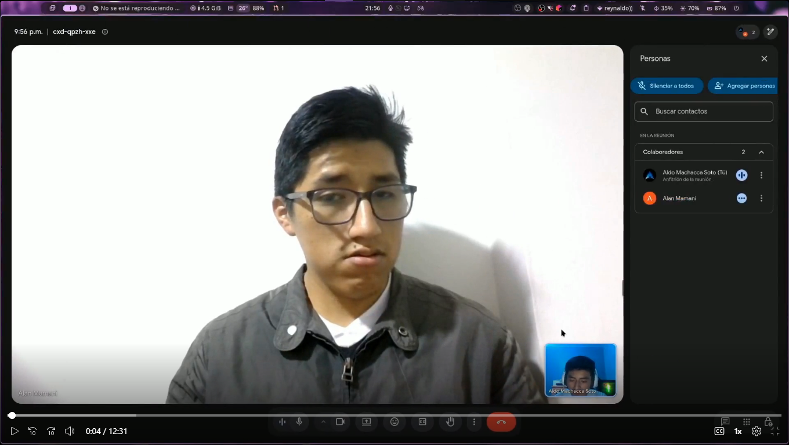
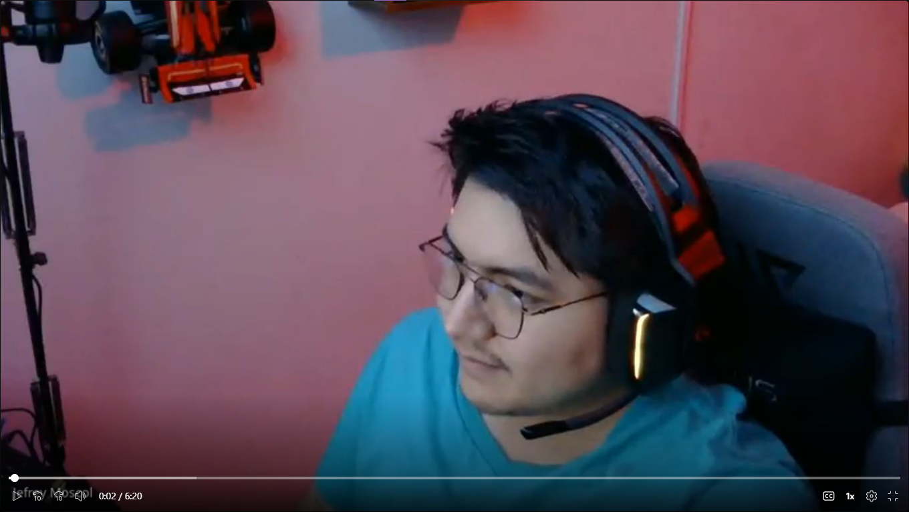
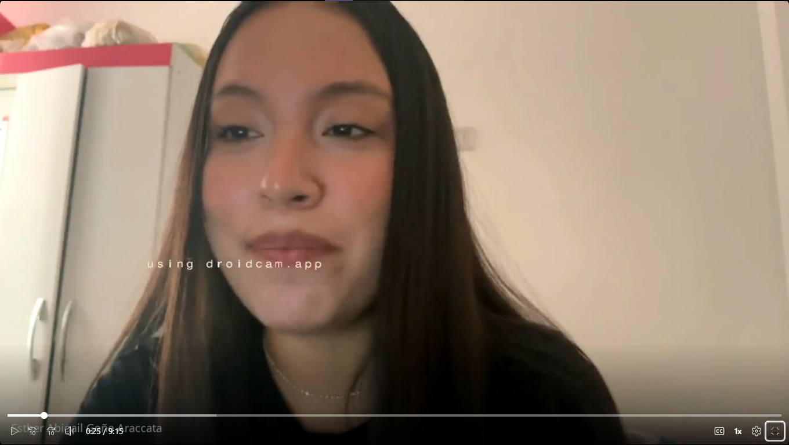
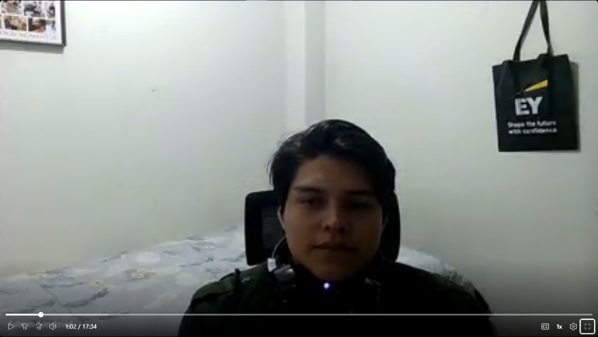
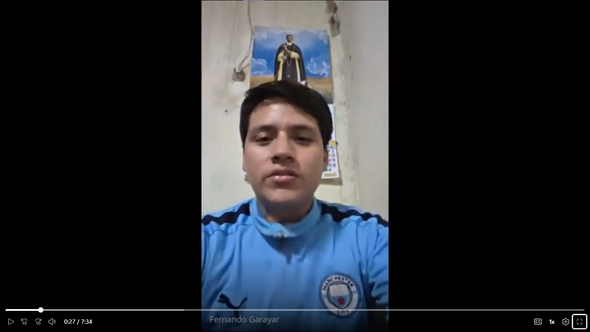

## 2.2. Entrevistas

### 2.2.1. Diseño de entrevistas
Esta sección incluye la relación de preguntas principales y complementarias dirigidas a cada uno de los segmentos. Las entrevistas han sido estructuradas siguiendo buenas prácticas y buscan recolectar la información necesaria para la futura construcción de los arquetipos.

**Segmento 1: Compradores interesados**

* **Información personal y demográfica:**
  * P1. Para comenzar, ¿podrías contarnos un poco sobre ti, cómo te llamas y a qué te dedicas?
  * P2. ¿En qué distrito resides actualmente?
  * P3. ¿Cuál es tu rango de edad?
  * P4. ¿Actualmente tienes algún vehículo? Si es así, ¿qué vehículo tienes y desde hace cuánto tiempo?
* **Proceso de búsqueda:**
  * P5. ¿Prefieres comprar un vehículo nuevo, usado o estás abierto a ambas opciones? ¿Qué te motivaría a comprar un vehículo nuevo o usado en este momento?
  * P6. Cuando buscas comprar un vehículo, ¿por dónde empiezas normalmente a buscar información?
  * P7. ¿Qué características consideras más importantes al momento de elegir un vehículo?
  * P8. ¿Qué presupuesto aproximado considerarías para adquirir un vehículo?
* **Necesidades y frustraciones:**
  * P9. ¿Cuál ha sido o sería la mayor dificultad al momento de buscar un vehículo?
  * P10. ¿Qué es lo que más tiempo te toma durante el proceso de búsqueda y comparación?
  * P11. ¿Alguna vez has encontrado demasiadas opciones y no has sabido cuál elegir? ¿Qué hiciste en esa situación?
* **Comportamiento, influencias y marcas:**
  * P12. ¿Qué personas o fuentes influyen más en tu decisión de compra: familiares, amigos, reseñas, influencers, vendedores, redes sociales u otros?
  * P13. Cuando comparas vehículos, ¿qué factores suelen hacer que descartes una opción?
  * P14. ¿Qué te genera confianza o desconfianza cuando encuentras un vehículo anunciado en Internet?
* **Tecnología y canales digitales:**
  * P15. ¿Qué dispositivo utilizas principalmente para buscar información sobre vehículos?
  * P16. ¿Qué aplicaciones, redes sociales o páginas web utilizas normalmente para buscar vehículos?
  * P17. Cuando encuentras un vehículo que te interesa, ¿qué medio prefieres utilizar para comunicarte con el vendedor o concesionario?
* **Validación de la propuesta:**
  * P18. ¿Qué opinas de una plataforma que reúna vehículos nuevos y usados de diferentes concesionarios en un solo lugar?
  * P19. Si estuvieras buscando un vehículo pero no supieras exactamente cuál comprar, ¿preferirías recibir recomendaciones o investigar por tu cuenta? ¿Por qué?
  * P20. Si ya supieras exactamente qué modelo quieres, ¿preferirías un proceso rápido y directo para encontrarlo y contactar al concesionario?
  * P21. ¿Qué opinas de poder acceder desde la plataforma a una evaluación crediticia realizada por una entidad financiera externa?
  * P22. ¿Qué tendría que ofrecer una plataforma de este tipo para que prefieras utilizarla en lugar de buscar vehículos por diferentes páginas o redes sociales?

**Segmento 2: Concesionarias de vehículos nuevos**

* **Información general y perfil:**
  * P1. Para comenzar, ¿podría contarnos brevemente sobre usted, cómo se llama y cuál es su función dentro del concesionario?
  * P2. ¿En qué distrito reside actualmente?
  * P3. ¿Cuál es su rango de edad?
  * P4. ¿Cuánto tiempo lleva trabajando en el sector automotriz y cuánto tiempo lleva desempeñando su función actual?
* **Proceso actual de comercialización:**
  * P5. ¿Cómo llegan actualmente los compradores interesados al concesionario?
  * P6. ¿Qué canales utilizan actualmente para promocionar y mostrar su inventario de vehículos?
  * P7. Cuando tienen un vehículo disponible, ¿qué dificultades encuentran para conseguir compradores interesados en ese vehículo?
  * P8. ¿Qué factores considera que hacen que un comprador finalmente se decida por un vehículo nuevo?
* **Necesidades y frustraciones:**
  * P9. ¿Cuáles son las principales dificultades que encuentra actualmente para comercializar los vehículos nuevos?
  * P10. ¿Qué información considera importante conocer sobre un comprador antes de contactarlo?
  * P11. Si pudiera mejorar una parte del proceso actual de comercialización mediante una herramienta digital, ¿qué cambiaría y por qué?
* **Tecnología y canales digitales:**
  * P12. ¿Qué dispositivos utiliza normalmente para realizar sus actividades laborales: computadora, laptop, tablet, celular u otros?
  * P13. ¿Qué plataformas, aplicaciones o redes sociales utiliza con mayor frecuencia para comunicarse con clientes?
  * P14. ¿Qué características debería tener una plataforma digital para que usted considere utilizarla para comercializar vehículos?
* **Validación de la propuesta:**
  * P15. ¿Qué opina de una plataforma que reúna vehículos de diferentes concesionarios y permita a los compradores encontrar alternativas según sus necesidades y presupuesto?
  * P16. ¿Consideraría útil que una plataforma pudiera recomendar determinados vehículos a los compradores según sus necesidades, estilo de vida y presupuesto? ¿Por qué?
  * P17. ¿Estaría dispuesto a pagar una membresía por utilizar una plataforma que aumente la exposición de su inventario y genere oportunidades de contacto con compradores?
  * P18. ¿Qué tendría que ofrecer una plataforma de este tipo para que considere que la membresía vale la pena?

**Segmento 3: Concesionarias de vehículos usados**

* **Información general y perfil:**
  * P1. Para comenzar, ¿podría contarnos brevemente sobre usted, cómo se llama y cuál es su función dentro del concesionario? ¿En qué distrito reside actualmente?
  * P2. ¿Cuál es su rango de edad? ¿Cuánto tiempo lleva trabajando en el sector automotriz y cuánto tiempo lleva desempeñando su función actual?
  * P3. ¿Qué tipo de vehículos usados comercializan principalmente y qué características suelen tener los vehículos de su inventario?
* **Proceso actual de comercialización:**
  * P4. ¿Cómo llegan actualmente los compradores interesados en los vehículos usados que tienen disponibles?
  * P5. ¿Qué canales utilizan actualmente para promocionar su inventario?
  * P6. ¿Qué dificultades encuentran para lograr que un vehículo usado permanezca el menor tiempo posible en inventario?
  * P7. ¿Qué características de un vehículo usado suelen ser más importantes para los compradores?
* **Necesidades y frustraciones:**
  * P8. ¿Cuáles son las principales dificultades que encuentra actualmente para comercializar vehículos usados?
  * P9. ¿Qué información considera importante conocer sobre un comprador para identificar qué vehículo de su inventario podría interesarle?
  * P10. ¿Qué situaciones hacen que un vehículo usado sea más difícil de vender?
  * P11. Si pudiera mejorar una parte del proceso actual de comercialización mediante una herramienta digital, ¿qué cambiaría y por qué?
* **Tecnología y canales digitales:**
  * P12. ¿Qué dispositivos utiliza normalmente para realizar sus actividades laborales?
  * P13. ¿Qué plataformas, aplicaciones o redes sociales utiliza con mayor frecuencia para promocionar vehículos o comunicarse con compradores?
  * P14. ¿Qué tan importante sería para usted contar con una plataforma que permita mostrar todo su inventario a compradores interesados?
* **Validación de la propuesta:**
  * P15. ¿Consideraría útil que una plataforma pudiera recomendar vehículos de su inventario a compradores cuyas necesidades sean compatibles con ellos? ¿Por qué?
  * P16. ¿Consideraría que una plataforma de este tipo podría ayudar a mejorar la exposición o rotación de sus vehículos?
  * P17. ¿Estaría dispuesto a pagar una membresía por utilizar una plataforma que permita mostrar su inventario y generar oportunidades de contacto con compradores?
  * P18. ¿Qué tendría que ofrecer la plataforma para que considere que pagar una membresía es conveniente?

### 2.2.2. Registro de entrevistas

**Segmento 1: Compradores interesados**

**Entrevista 1: Andrea Arango**

| Campo | Detalle |
|---|---|
| **Nombre** | Andrea |
| **Apellidos** | Arango |
| **Edad** | 28 años |
| **Distrito** | San Juan de Lurigancho |
| **Evidencia** | 

 |
| **Link** | [Enlace a la grabación (sl1nk)](https://sl1nk.com/shpkq16) |
| **Timing donde inicia la entrevista** | 00:00 |
| **Duración de la entrevista** | 11:53 |
| **Resumen** | • **Perfil:** Asistente administrativa interesada en comprar su primer auto (nuevo o usado) con un presupuesto de $10,000 a $18,000 para movilizarse con mayor comodidad y ahorrar tiempo.  • **Comportamiento y Necesidades:** Su mayor dificultad es comparar opciones y aspectos técnicos al no tener experiencia, por lo que se abruma con la cantidad de modelos. Prefiere recibir recomendaciones guiadas basadas en sus necesidades (presupuesto, uso) antes de investigar por su cuenta. Valora una plataforma centralizada que ofrezca evaluaciones crediticias externas y filtros útiles.  • **Tecnología, Marcas y Canales:** Busca en Google, páginas de concesionarios, Facebook Marketplace e Instagram, principalmente desde su celular. Prefiere el primer contacto vía WhatsApp por la rapidez. Confía en reseñas y recomendaciones de familiares/amigos por encima de los vendedores. |

 

**Entrevista 2: Alan Mamani Vilca**

| Campo | Detalle |
|---|---|
| **Nombre** | Alan |
| **Apellidos** | Mamani Vilca |
| **Edad** | 24 años |
| **Distrito** | Santiago de Surco |
| **Evidencia** | 

 |
| **Link** | [Entrevista Alan (SharePoint)](https://upcedupe-my.sharepoint.com/:v:/g/personal/u20231b120_upc_edu_pe/IQDugpqXHnBeR4qox4TgER-QAZV2yRR0obxcxuOp1KrNCDs?nav=eyJyZWZlcnJhbEluZm8iOnsicmVmZXJyYWxBcHAiOiJTdHJlYW1XZWJBcHAiLCJyZWZlcnJhbFZpZXciOiJTaGFyZURpYWxvZy1MaW5rIiwicmVmZXJyYWxBcHBQbGF0Zm9ybSI6IldlYiIsInJlZmVycmFsTW9kZSI6InZpZXcifX0%3D&e=pjgnJR) |
| **Timing donde inicia la entrevista** | 00:00 |
| **Duración de la entrevista** | 12:31 |
| **Resumen** | • **Perfil:** Estudiante de Ingeniería de Software de 24 años, enfocado en sus estudios. Actualmente se moviliza en transporte público en Lima, pero busca adquirir un vehículo (nuevo o usado) con un presupuesto aproximado de 30,000 a 50,000 soles. Está abierto a utilizar opciones de financiamiento o crédito.  • **Comportamiento y Necesidades:** Su mayor dificultad al buscar autos es la sobrecarga de opciones y la incertidumbre de saber qué vehículo le conviene realmente y si el precio corresponde a su estado. Para decidir, filtra primero por presupuesto y luego evalúa el consumo de combustible, la seguridad, el costo de mantenimiento y la disponibilidad de repuestos. Valora positivamente la idea de una plataforma centralizada que agrupe ofertas de múltiples concesionarias en un solo lugar, ya que le ahorraría tiempo al no tener que visitar distintas webs o locales. Considera muy útil que la plataforma incluya evaluaciones crediticias para conocer sus opciones de financiamiento.  • **Tecnología, Marcas y Canales:** Realiza búsquedas rápidas desde su smartphone y usa su laptop para comparar opciones detalladamente. Sus canales principales son Google, Facebook Marketplace, webs de concesionarias y YouTube (para ver reseñas de otros usuarios). Generan su confianza los anuncios con fotos reales sin edición e información precisa. Desconfía de precios demasiado bajos o anuncios que carecen de detalles. Prefiere guiarse por las recomendaciones de familiares o amigos con experiencia previa antes de aventurarse por su cuenta. |

 

**Entrevista 3: Jefrey Moscol**

| Campo | Detalle |
|---|---|
| **Nombre** | Jefrey |
| **Apellidos** | Moscol |
| **Edad** | 25 años |
| **Distrito** | Santiago de Surco |
| **Evidencia** | 

 |
| **Link** | [Entrevista Jefrey (SharePoint)](https://upcedupe-my.sharepoint.com/:v:/g/personal/u20231b120_upc_edu_pe/IQAXbQBMzEWpQpnA97YU5Y67AeKAiXEKRkhA--MmZ__47bQ?nav=eyJyZWZlcnJhbEluZm8iOnsicmVmZXJyYWxBcHAiOiJTdHJlYW1XZWJBcHAiLCJyZWZlcnJhbFZpZXciOiJTaGFyZURpYWxvZy1MaW5rIiwicmVmZXJyYWxBcHBQbGF0Zm9ybSI6IldlYiIsInJlZmVycmFsTW9kZSI6InZpZXcifX0%3D&e=b34Fzz) |
| **Timing donde inicia la entrevista** | 00:00 |
| **Duración de la entrevista** | 06:19 |
| **Resumen** | • **Perfil:** Joven de 25 años que trabaja en el área de sistemas para una empresa importadora. Actualmente no posee un vehículo, aunque tuvo una moto hace tres años, y busca adquirir un auto (nuevo o usado) con un presupuesto estimado de 30,000 a 35,000 soles. Su principal motivación de compra es agilizar su tiempo en el tráfico y poder acceder a lugares de trabajo más distantes.  • **Comportamiento y Necesidades:** Al momento de evaluar un vehículo, prioriza el kilometraje, el cuidado general y que el auto no presente fallas críticas que representen un gasto extra. Su principal dificultad es dar con un vendedor que sea confiable y que acepte métodos de pago rápidos o brinde opciones de financiamiento. Ante el exceso de opciones, invierte su tiempo en comparar precios y revisar el historial o reseñas del vendedor. Descartaría un vehículo dependiendo del tiempo de uso y el cuidado que haya recibido. Le resulta muy práctica la idea de una plataforma centralizada y considera útil que incluya evaluaciones crediticias para conocer sus opciones de pago en cuotas. Prefiere adquirir modelos de marcas conocidas frente a vehículos de marcas chinas, por temor a la fragilidad de los repuestos.  • **Tecnología, Marcas y Canales:** Su dispositivo principal para la búsqueda es el celular, utilizando una laptop como herramienta secundaria. Su proceso inicia pidiendo recomendaciones a amigos con vehículos y revisando páginas de ofertas en Google o Facebook. Prefiere establecer el contacto directo vía WhatsApp, ya que le permite tener un registro de la conversación y realizar videollamadas. Los anuncios que solo muestran fotos no le generan confianza; para sentirse seguro, exige ver videos del auto o realizar una videollamada en vivo con el vendedor. Para que se decida a usar una plataforma exclusiva, esta debe ofrecer fotos, videos y garantizar que los vendedores estén verificados y tengan un buen historial. |

 

**Segmento 2: Concesionarias de vehículos nuevos**

**Entrevista 1: Angel Pariona**

| Campo | Detalle |
|---|---|
| **Nombre** | Angel |
| **Apellidos** | Pariona |
| **Edad** | 32 años |
| **Distrito** | Pueblo Libre |
| **Evidencia** | 

 |
| **Link** | [Entrevista Angel (SharePoint)](https://upcedupe-my.sharepoint.com/:v:/g/personal/u20231b120_upc_edu_pe/IQAkeU_1dLIjS4duxTRerP3QAUQXakatlKo1AU02Y0MUdvE?nav=eyJyZWZlcnJhbEluZm8iOnsicmVmZXJyYWxBcHAiOiJTdHJlYW1XZWJBcHAiLCJyZWZlcnJhbFZpZXciOiJTaGFyZURpYWxvZy1MaW5rIiwicmVmZXJyYWxBcHBQbGF0Zm9ybSI6IldlYiIsInJlZmVycmFsTW9kZSI6InZpZXcifX0%3D&e=bqHvg2) |
| **Timing donde inicia la entrevista** | 00:00 |
| **Duración de la entrevista** | 08:24 |
| **Resumen** | • **Perfil:** Asesor de ventas de vehículos nuevos con 4 años de experiencia en el rubro automotriz y 2 años trabajando en su actual concesionario.  • **Comportamiento y Necesidades:** Se encarga de la atención en tienda, mostrar los vehículos, realizar pruebas de manejo y acompañar al cliente hasta la entrega del auto. La mayoría de sus clientes llegan físicamente al local o a través de campañas de marketing digital. Sus principales dificultades son lidiar con clientes que buscan colores raros o versiones de entrada que suelen estar agotadas, y la pérdida de tiempo gestionando solicitudes de compradores que finalmente no aprueban el financiamiento por tener un mal historial en Infocorp. Considera sumamente útil una plataforma que precalifique el crédito de los clientes para saber a quién darle prioridad. Además, busca que cualquier herramienta digital sea rápida, fácil de usar desde el celular y que no duplique el trabajo administrativo de los sistemas que ya utilizan.  • **Tecnología, Marcas y Canales:** Usa una computadora de escritorio para cotizaciones formales, pero gestiona el 80% de sus ventas y comunicación a través de WhatsApp en su celular. Su concesionario capta clientes en línea mediante Facebook, Instagram, NeoAuto y MercadoLibre. |

 

**Entrevista 2: Esther Abigail Goñe Araccata**

| Campo | Detalle |
|---|---|
| **Nombre** | Esther Abigail |
| **Apellidos** | Goñe Araccata |
| **Edad** | 20 años |
| **Distrito** | Santiago de Surco |
| **Evidencia** | 

 |
| **Link** | [Entrevista Abigail (SharePoint)](https://upcedupe-my.sharepoint.com/:v:/g/personal/u20231b120_upc_edu_pe/IQBuLVUlGjIuQKRElGfxpT2ZAWnmLm--UB8c2ahiZjgE3ZM?nav=eyJyZWZlcnJhbEluZm8iOnsicmVmZXJyYWxBcHAiOiJTdHJlYW1XZWJBcHAiLCJyZWZlcnJhbFZpZXciOiJTaGFyZURpYWxvZy1MaW5rIiwicmVmZXJyYWxBcHBQbGF0Zm9ybSI6IldlYiIsInJlZmVycmFsTW9kZSI6InZpZXcifX0%3D&e=lHynVs) |
| **Timing donde inicia la entrevista** | 00:00 |
| **Duración de la entrevista** | 09:14 |
| **Resumen** | • **Perfil:** Asesora comercial e impulsadora de ventas de vehículos nuevos en una empresa familiar. Tiene 2 años y medio de experiencia en el sector automotriz y lleva un año y medio desempeñando su función actual.  • **Comportamiento y Necesidades:** Su labor consiste en captar clientes, asesorarlos para que encuentren el modelo que se ajuste a sus necesidades y cerrar las ventas. Sus principales dificultades y frustraciones radican en los largos tiempos de aprobación de créditos vehiculares por parte de los bancos, las altas tasas de interés que desaniman a los compradores y la pérdida de tiempo con clientes "curiosos" que finalmente no califican para un crédito. Le resulta muy necesario contar con una plataforma que automatice el filtro inicial y precalifique crediticiamente a los prospectos, ya que esto reduciría drásticamente las tareas repetitivas de responder las mismas consultas básicas a compradores que no son serios.  • **Tecnología, Marcas y Canales:** Utiliza un celular corporativo para respuestas rápidas y una laptop de escritorio para armar cotizaciones formales. Capta a sus clientes principalmente mediante campañas publicitarias en Facebook, Instagram, TikTok y en la propia página web de la empresa, centralizando el cierre de ventas por WhatsApp Business. |

 

**Entrevista 3: Fabian Sandoval Cueto**

| Campo | Detalle |
|---|---|
| **Nombre** | Fabian |
| **Apellidos** | Sandoval Cueto |
| **Edad** | 22 años |
| **Distrito** | Jesús María |
| **Evidencia** | 

 |
| **Link** | [Entrevista Fabian (SharePoint)](https://upcedupe-my.sharepoint.com/:v:/g/personal/u20231b120_upc_edu_pe/IQDml--HYp8gTaW6HQcYIdJPAbsCnzpXE24KzyPGweZ6Wy0?nav=eyJyZWZlcnJhbEluZm8iOnsicmVmZXJyYWxBcHAiOiJTdHJlYW1XZWJBcHAiLCJyZWZlcnJhbFZpZXciOiJTaGFyZURpYWxvZy1MaW5rIiwicmVmZXJyYWxBcHBQbGF0Zm9ybSI6IldlYiIsInJlZmVycmFsTW9kZSI6InZpZXcifX0%3D&e=eLGEMT) |
| **Timing donde inicia la entrevista** | 00:00 |
| **Duración de la entrevista** | 07:34 |
| **Resumen** | • **Perfil:** Asesor de ventas en un concesionario ubicado en la Av. Argentina. Cuenta con 2 años de experiencia en ventas y previamente trabajó como asistente de mecánico.  • **Comportamiento y Necesidades:** Atiende tanto a clientes que llegan presencialmente a la tienda como a prospectos digitales. Su mayor desafío es la fuerte competencia entre concesionarias en su zona y la gran cantidad de personas que solo entran a mirar o preguntar precios sin una intención real de compra. También señala que a veces sufren de falta de stock cuando ciertos modelos se vuelven virales por tendencias de internet. Valora enormemente una herramienta que le proporcione prospectos precalificados y serios, evitándole perder tiempo con curiosos. Exige que cualquier plataforma digital a utilizar tenga una interfaz gráfica (UI) muy fácil de usar, que no le sume trabajo administrativo extra y que incluya métricas visuales de cuántas personas están viendo su catálogo.  • **Tecnología, Marcas y Canales:** Su principal dispositivo es el celular, el cual utiliza para el contacto constante con los clientes, y usa una computadora solo para trámites de papeleo. El concesionario para el que trabaja capta clientes mediante Meta Ads (Facebook e Instagram), TikTok Ads y Google Ads, y su canal preferido para concretar el contacto es WhatsApp. |

 

**Segmento 3: Concesionarias de vehículos usados**

**Entrevista 1: Yarkin Quispe**

| Campo | Detalle |
|---|---|
| **Nombre** | Yarkin |
| **Apellidos** | Quispe |
| **Edad** | 28 años |
| **Distrito** | Santiago de Surco |
| **Evidencia** | 

 |
| **Link** | [Enlace a la grabación (sl1nk)](https://sl1nk.com/6rcxxop) |
| **Timing donde inicia la entrevista** | 00:00 |
| **Duración de la entrevista** | 11:16 |
| **Resumen** | • **Perfil:** Coordinador Comercial con 3 años de experiencia, encargado de supervisar un inventario de SUVs y sedanes seminuevos (5-7 años de antigüedad, menos de 70,000 km) en un concesionario de Chorrillos.  • **Comportamiento y Necesidades:** Sus principales dificultades son el tiempo invertido en clientes sin intención real de compra y las demoras en las aprobaciones de financiamiento bancario. Además, actualizar el inventario en múltiples plataformas es pesado administrativamente. Necesita una herramienta que precalifique a los prospectos (filtrando por presupuesto, uso y cantidad de pasajeros) para generar *leads* de calidad. Está dispuesto a pagar una membresía si esto mejora la rotación de los vehículos.  • **Tecnología, Marcas y Canales:** Utiliza su smartphone casi todo el día para contestar mensajes (WhatsApp Business) y tomar fotos, y una laptop en oficina para gestión administrativa. Publica en NeoAuto, MercadoLibre, Facebook, Instagram y TikTok. |

 

**Entrevista 2: Fernando Garayar**

| Campo | Detalle |
|---|---|
| **Nombre** | Fernando |
| **Apellidos** | Garayar |
| **Edad** | 24 años |
| **Distrito** | Santiago de Surco |
| **Evidencia** | 

 |
| **Link** | [Entrevista Fernando (SharePoint)](https://upcedupe-my.sharepoint.com/:v:/g/personal/u20231b120_upc_edu_pe/IQA-z6ksNWNtQJd-qzu94VCbAZRxeqLhWc4fXhzsz66-IBU?nav=eyJyZWZlcnJhbEluZm8iOnsicmVmZXJyYWxBcHAiOiJTdHJlYW1XZWJBcHAiLCJyZWZlcnJhbFZpZXciOiJTaGFyZURpYWxvZy1MaW5rIiwicmVmZXJyYWxBcHBQbGF0Zm9ybSI6IldlYiIsInJlZmVycmFsTW9kZSI6InZpZXcifX0%3D&e=kqMNcA) |
| **Timing donde inicia la entrevista** | 00:00 |
| **Duración de la entrevista** | 07:34 |
| **Resumen** | • **Perfil:** Apoya desde hace 4 años en el concesionario de vehículos usados de su padre, encargándose principalmente de las ventas, el manejo de redes sociales y la atención al cliente.  • **Comportamiento y Necesidades:** Comercializan mayormente sedanes familiares con un máximo de 10 años de antigüedad y en buen estado mecánico. Sus principales frustraciones son la alta competencia en la venta de autos de segunda mano, clientes que exigen descuentos irreales y lidiar con meses de bajas ventas. Le resulta indispensable que una plataforma de ventas cuente con filtros automatizados o precalificación para evitar a los "curiosos" y enfocarse en compradores serios; esto le ahorraría el tener que responder el mismo precio decenas de veces sin concretar ventas. Le resulta esencial poder mostrar su inventario de manera sencilla y directa.  • **Tecnología, Marcas y Canales:** Su herramienta principal de trabajo es el celular, ya que le permite tomar fotos rápidas, subir anuncios y responder mensajes al instante. Lo complementa con una laptop para revisar precios y cuadros de Excel. Promociona sus vehículos publicando en Facebook Marketplace, NeoAuto, TikTok y a través de los estados de WhatsApp del negocio. |

 

**Entrevista 3: Lupe De la cruz**

| Campo | Detalle |
|---|---|
| **Nombre** | Lupe |
| **Apellidos** | De la cruz |
| **Edad** | 23 años |
| **Distrito** | El Agustino |
| **Evidencia** | 

 |
| **Link** | [Entrevista Yamile / Lupe (SharePoint)](https://upcedupe-my.sharepoint.com/:v:/g/personal/u20231b120_upc_edu_pe/IQCPC_9hEkEjSa0hunjwnuIuAWr9qRJMK-h4qqHo6wa6Puc?nav=eyJyZWZlcnJhbEluZm8iOnsicmVmZXJyYWxBcHAiOiJTdHJlYW1XZWJBcHAiLCJyZWZlcnJhbFZpZXciOiJTaGFyZURpYWxvZy1MaW5rIiwicmVmZXJyYWxBcHBQbGF0Zm9ybSI6IldlYiIsInJlZmVycmFsTW9kZSI6InZpZXcifX0%3D&e=jdRLjq) |
| **Timing donde inicia la entrevista** | 00:00 |
| **Duración de la entrevista** | 06:05 |
| **Resumen** | • **Perfil:** Joven de 23 años que se dedica a apoyar en el área de ventas de una concesionaria de autos usados, puesto en el que lleva entre 2 a 3 años.  • **Comportamiento y Necesidades:** Comercializan principalmente marcas chinas y vehículos amplios con transmisión automática. Se enfrenta al desconocimiento y la desconfianza del público frente a la calidad y durabilidad de las marcas chinas, así como a las dificultades de vender autos de segunda mano que registran choques o papeletas previas. Otra de sus grandes frustraciones es atender a personas que invierten su tiempo preguntando, pero que en el fondo no cuentan con la capacidad de pago o tienen un mal historial crediticio. Por ello, considera de gran valor una plataforma que le brinde información sobre la capacidad socioeconómica o crediticia del comprador antes de iniciar el contacto.  • **Tecnología, Marcas y Canales:** Para gestionar sus ventas utiliza celulares, laptops y computadoras de escritorio. Capta la atención de los compradores mediante anuncios en redes sociales y finaliza gran parte de su comunicación mediante Instagram, TikTok y WhatsApp. |

 

### 2.2.3. Análisis de entrevistas

El análisis de las entrevistas permitió identificar las características objetivas y subjetivas más frecuentes de cada segmento objetivo. Los porcentajes se calcularon considerando únicamente las entrevistas realizadas dentro de cada segmento y relacionando las características identificadas con los perfiles, comportamientos, necesidades, frustraciones y canales mencionados por los entrevistados.

**Segmento 1: Compradores interesados**

El segmento está conformado por 3 entrevistados: Andrea Arango, Alan Mamani Vilca y Jefrey Moscol. Las entrevistas evidencian patrones relacionados principalmente con la dificultad para comparar alternativas, la búsqueda de información confiable, el interés por opciones de financiamiento y la utilización de canales digitales durante el proceso de compra.

| Característica identificada | Frecuencia | Porcentaje | Sustento en entrevistas |
| :--- | :---: | :---: | :--- |
| Dificultad para comparar las opciones disponibles | 3 de 3 | 100% | Andrea se abruma por la cantidad de modelos y tiene dificultades para comparar aspectos técnicos. Alan señala la sobrecarga de opciones e incertidumbre sobre qué vehículo le conviene. Jefrey también menciona el exceso de opciones y dedica tiempo a comparar precios. |
| Interés por una plataforma centralizada | 3 de 3 | 100% | Andrea valora una plataforma centralizada con filtros y evaluaciones. Alan considera útil reunir ofertas de múltiples concesionarias. Jefrey considera práctica una plataforma que centralice las alternativas. |
| Interés en recomendaciones o filtros según necesidades | 3 de 3 | 100% | Andrea busca recomendaciones según presupuesto y uso. Alan filtra primero por presupuesto y luego evalúa características del vehículo. Jefrey compara precios y evalúa kilometraje, cuidado y tiempo de uso. |
| Interés en información o evaluación crediticia | 3 de 3 | 100% | Andrea valora las evaluaciones crediticias externas. Alan considera útil conocer sus opciones de financiamiento. Jefrey considera útil disponer de evaluaciones crediticias para conocer sus opciones de pago en cuotas. |
| Uso del smartphone como dispositivo principal de búsqueda | 3 de 3 | 100% | Andrea realiza sus búsquedas principalmente desde el celular. Alan utiliza su smartphone para búsquedas rápidas. Jefrey utiliza el celular como dispositivo principal para buscar vehículos. |
| Uso de recomendaciones de familiares o amigos como fuente de confianza | 3 de 3 | 100% | Andrea confía en recomendaciones de familiares y amigos. Alan prefiere recomendaciones de personas cercanas con experiencia. Jefrey inicia su proceso solicitando recomendaciones a amigos que poseen vehículos. |
| Uso de Google y/o Facebook Marketplace durante la búsqueda | 3 de 3 | 100% | Andrea utiliza Google y Facebook Marketplace. Alan utiliza ambos canales. Jefrey también revisa ofertas mediante Google y Facebook. |
| Uso de WhatsApp como canal de contacto | 2 de 3 | 66.7% | Andrea prefiere el primer contacto mediante WhatsApp. Jefrey prefiere establecer contacto directo mediante WhatsApp. En el resumen de Alan no se identifica una preferencia explícita por este canal. |
| Preocupación por la confiabilidad del vendedor o información del vehículo | 3 de 3 | 100% | Andrea prioriza reseñas y recomendaciones frente a vendedores. Alan desconfía de precios demasiado bajos y anuncios con poca información. Jefrey busca vendedores confiables y exige videos, videollamadas y vendedores verificados. |
| Interés por conocer el estado real del vehículo | 2 de 3 | 66.7% | Alan evalúa el estado del vehículo mediante información sobre seguridad, mantenimiento y repuestos. Jefrey prioriza kilometraje, cuidado general y ausencia de fallas críticas, además de solicitar videos o videollamadas. |
| Preferencia por marcas conocidas | 1 de 3 | 33.3% | Jefrey manifiesta preferencia por marcas conocidas debido a su preocupación por la disponibilidad y confiabilidad de los repuestos. |

**Síntesis del segmento:**

Los resultados muestran que el principal patrón del segmento comprador es la dificultad para procesar y comparar la gran cantidad de alternativas disponibles. Esta característica aparece en el 100% de las entrevistas, al igual que el interés por una plataforma centralizada y por filtros o recomendaciones que permitan reducir la complejidad del proceso de búsqueda.

El componente financiero también es transversal, ya que el 100% de los entrevistados considera relevante contar con información relacionada con crédito o financiamiento. Asimismo, los tres entrevistados utilizan principalmente el smartphone durante su búsqueda y recurren a Google y Facebook Marketplace como canales digitales.

La confianza representa otro elemento relevante. El 100% de los entrevistados menciona mecanismos relacionados con la validación de la información, vendedores o recomendaciones de terceros. Andrea prioriza recomendaciones y reseñas, Alan busca información precisa y fotografías reales, mientras que Jefrey solicita videos, videollamadas y vendedores verificados.

Por lo tanto, el arquetipo del segmento puede caracterizarse como un comprador que busca reducir la incertidumbre y el tiempo dedicado a la búsqueda de un vehículo, necesita comparar alternativas de manera sencilla y requiere información confiable sobre el vehículo y el vendedor antes de establecer contacto o tomar una decisión.

 

**Segmento 2: Concesionarias de vehículos nuevos**

El segmento está conformado por 3 entrevistados: Angel Pariona, Esther Abigail Goñe Araccata y Fabian Sandoval Cueto.

| Característica identificada | Frecuencia | Porcentaje | Sustento en entrevistas |
| :--- | :---: | :---: | :--- |
| Problemas con clientes que no tienen una intención real de compra | 3 de 3 | 100% | Angel pierde tiempo con compradores que finalmente no aprueban el financiamiento. Esther menciona clientes "curiosos" que no califican para crédito. Fabian señala que muchas personas solo consultan precios sin intención real de compra. |
| Interés en prospectos precalificados | 3 de 3 | 100% | Angel considera útil precalificar el crédito. Esther solicita un filtro inicial y precalificación crediticia. Fabian valora recibir prospectos precalificados y serios. |
| Problemas relacionados con financiamiento o crédito vehicular | 3 de 3 | 100% | Angel identifica problemas con clientes que no aprueban financiamiento. Esther señala demoras y altas tasas de interés. Fabian busca prospectos más serios y calificados para evitar pérdida de tiempo comercial. |
| Uso del celular como herramienta principal de comunicación | 3 de 3 | 100% | Angel gestiona gran parte de sus ventas mediante WhatsApp en su celular. Esther utiliza un celular corporativo. Fabian utiliza principalmente el celular para mantener contacto con clientes. |
| Uso de WhatsApp como canal comercial o de contacto | 3 de 3 | 100% | Angel utiliza WhatsApp para ventas y comunicación. Esther centraliza el cierre mediante WhatsApp Business. Fabian utiliza WhatsApp como canal preferido para concretar el contacto. |
| Captación de clientes mediante redes sociales o canales digitales | 3 de 3 | 100% | Angel utiliza Facebook, Instagram, NeoAuto y MercadoLibre. Esther utiliza Facebook, Instagram, TikTok y la web empresarial. Fabian utiliza Meta Ads, TikTok Ads y Google Ads. |
| Necesidad de reducir tareas administrativas o repetitivas | 2 de 3 | 66.7% | Angel busca una herramienta que no duplique el trabajo administrativo. Esther busca reducir consultas repetitivas mediante la precalificación. |
| Necesidad de una interfaz fácil de utilizar | 2 de 3 | 66.7% | Angel solicita una herramienta rápida y fácil de usar desde el celular. Fabian exige una interfaz sencilla que no incremente su carga administrativa. |
| Problemas relacionados con disponibilidad de vehículos o stock | 2 de 3 | 66.7% | Angel menciona dificultades con colores o versiones agotadas. Fabian señala falta de stock cuando ciertos modelos se vuelven populares por tendencias. |
| Uso de computadora o laptop para tareas administrativas | 3 de 3 | 100% | Angel utiliza computadora para cotizaciones. Esther utiliza laptop para cotizaciones formales. Fabian utiliza computadora para trámites de papeleo. |

**Síntesis del segmento:**

El principal patrón identificado es la dificultad para diferenciar entre prospectos realmente interesados y personas que únicamente realizan consultas, característica presente en el 100% de los entrevistados. De igual manera, los tres entrevistados muestran interés en mecanismos de precalificación o filtrado de prospectos.

El financiamiento constituye otro aspecto transversal, debido a que las entrevistas evidencian dificultades relacionadas con aprobación crediticia, tasas de interés y calificación de compradores. Además, el 100% utiliza el smartphone como herramienta de trabajo y WhatsApp como canal comercial.

En consecuencia, el arquetipo del segmento corresponde a un asesor comercial que busca optimizar su tiempo y concentrarse en prospectos con mayor potencial de compra, utilizando herramientas digitales sencillas que puedan incorporarse a su flujo de trabajo sin generar tareas administrativas adicionales.

 

**Segmento 3: Concesionarias de vehículos usados**

El segmento está conformado por 3 entrevistados: Yarkin Quispe, Fernando Garayar y Lupe De la Cruz.

| Característica identificada | Frecuencia | Porcentaje | Sustento en entrevistas |
| :--- | :---: | :---: | :--- |
| Problemas con clientes sin intención real de compra | 3 de 3 | 100% | Yarkin menciona el tiempo invertido en clientes sin intención real. Fernando señala a los "curiosos" que preguntan sin concretar. Lupe menciona personas que consultan sin contar con capacidad de pago. |
| Interés en filtros o precalificación de prospectos | 3 de 3 | 100% | Yarkin necesita precalificar por presupuesto, uso y cantidad de pasajeros. Fernando considera indispensable contar con filtros automatizados. Lupe valora conocer previamente la capacidad socioeconómica o crediticia del comprador. |
| Problemas relacionados con capacidad de pago o financiamiento | 2 de 3 | 66.7% | Yarkin identifica demoras en aprobaciones de financiamiento bancario. Lupe señala clientes sin capacidad de pago o con mal historial crediticio. |
| Uso del smartphone como herramienta principal de trabajo | 3 de 3 | 100% | Yarkin utiliza su smartphone casi todo el día. Fernando utiliza principalmente el celular para fotos, anuncios y mensajes. Lupe utiliza celulares para gestionar sus ventas. |
| Uso de redes sociales y plataformas digitales para captar clientes | 3 de 3 | 100% | Yarkin publica en NeoAuto, MercadoLibre, Facebook, Instagram y TikTok. Fernando utiliza Facebook Marketplace, NeoAuto, TikTok y WhatsApp. Lupe utiliza anuncios en redes sociales y comunicación mediante Instagram, TikTok y WhatsApp. |
| Uso de WhatsApp como canal de comunicación comercial | 3 de 3 | 100% | Yarkin utiliza WhatsApp Business. Fernando utiliza WhatsApp para la comunicación y promoción del negocio. Lupe utiliza WhatsApp como uno de sus principales canales. |
| Necesidad de mejorar la gestión o rotación del inventario | 2 de 3 | 66.7% | Yarkin busca mejorar la rotación de los vehículos y reducir el trabajo administrativo de publicar inventario. Fernando considera esencial mostrar su inventario de manera sencilla y directa. |
| Percepción de alta competencia o dificultad para vender | 1 de 3 | 33.3% | Fernando identifica la alta competencia en el mercado de autos de segunda mano como una de sus principales frustraciones. |
| Preocupación por la información o condición previa del vehículo | 1 de 3 | 33.3% | Lupe menciona las dificultades asociadas a vehículos con choques o papeletas previas y la desconfianza hacia determinadas marcas. |

**Síntesis del segmento:**

El principal patrón compartido es la dificultad para identificar compradores realmente interesados y con capacidad para concretar una compra, característica presente en el 100% de los entrevistados. De igual forma, todos muestran interés en utilizar filtros o mecanismos de precalificación.

El uso de herramientas digitales también es transversal: el 100% utiliza el smartphone como herramienta de trabajo, utiliza plataformas o redes sociales para promocionar sus vehículos y emplea WhatsApp como medio de comunicación comercial.

La gestión del inventario aparece en el 66.7% de las entrevistas. Yarkin identifica la publicación del inventario en múltiples plataformas como una carga administrativa, mientras que Fernando considera importante mostrar el inventario de manera sencilla y directa. Esto evidencia una necesidad relacionada con facilitar la exposición y administración de los vehículos disponibles.

Por lo tanto, el arquetipo del segmento puede caracterizarse como un vendedor de vehículos usados que busca mejorar la calidad de sus prospectos, reducir el tiempo dedicado a consultas sin intención de compra y facilitar la exposición de su inventario, utilizando principalmente dispositivos móviles y canales digitales.

 

**Conclusión general del análisis**

El análisis de los **9 entrevistados** permite identificar patrones comunes y diferencias entre los tres segmentos objetivos. En el segmento de compradores, predomina la necesidad de reducir la complejidad y la incertidumbre durante la búsqueda de un vehículo. En los segmentos B2B, tanto de vehículos nuevos como usados, predomina la necesidad de filtrar y precalificar prospectos para optimizar el tiempo comercial.

| Aspecto identificado | Segmento 1 | Segmento 2 | Segmento 3 |
| :--- | :---: | :---: | :---: |
| Principal dificultad | Comparar opciones y validar información | Prospectos no calificados | Prospectos no calificados |
| Interés en filtros/recomendaciones | 100% | 100% | 100% |
| Relevancia del financiamiento | 100% | 100% | 66.7% |
| Uso del smartphone | 100% | 100% | 100% |
| Uso de canales digitales | 100% | 100% | 100% |
| Uso de WhatsApp | 66.7% | 100% | 100% |
| Necesidad de centralización/gestión | 100% | 66.7% | 66.7% |
| Preocupación por confiabilidad/información | 100% | — | 33.3% |

Los resultados proporcionan el sustento estadístico para la construcción de los arquetipos de usuario, ya que permiten identificar las características que se repiten con mayor frecuencia dentro de cada segmento. Las características con porcentajes elevados representan patrones comunes y, por tanto, constituyen elementos centrales para definir las necesidades, comportamientos, frustraciones y objetivos de cada arquetipo. Las características con menor frecuencia funcionan como elementos complementarios que permiten representar particularidades del segmento sin considerarlas necesariamente como rasgos generales.

