## 2.3. Needfinding

### 2.3.1. User Personas

**Segmento 1: Compradores interesados**

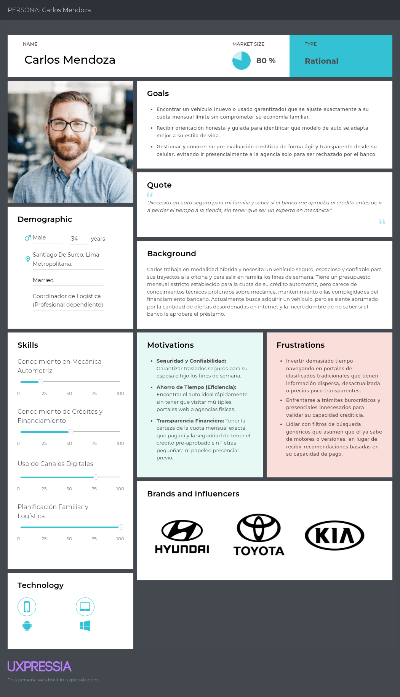{width=65%}

**Segmento 2: Concesionarias de vehículos nuevos**

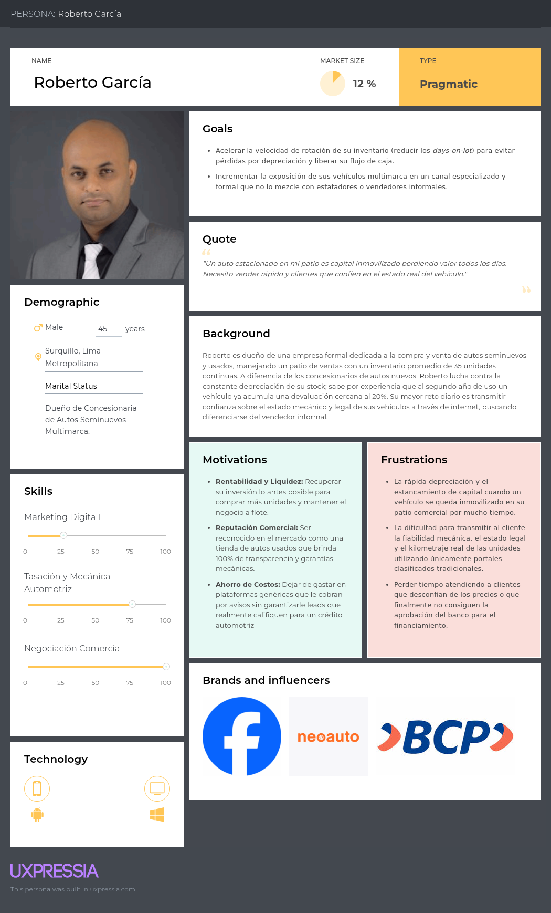{width=65%}

**Segmento 3: Concesionarias de vehículos usados**

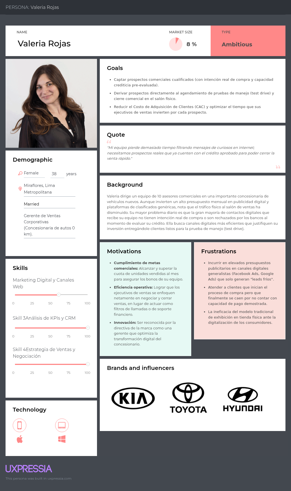{width=65%}

### 2.3.2. User Task Matrix

En esta sección se presenta el User Task Matrix, que concentra las tareas que los User Persona (que representan a cada segmento) realizan para cumplir sus objetivos. Las tareas listadas a continuación son realizadas por los segmentos independientemente de la existencia de la solución de software (SmartFinance Drive). El análisis considera a Carlos Mendoza (Compradores), Valeria Rojas (Concesionaria Nuevos) y Roberto García (Concesionaria Usados).

| Tarea (Task) | Carlos Mendoza (Comprador) | | Valeria Rojas (Concesionaria Nuevos) | | Roberto García (Concesionaria Usados) | |
| :--------------------------------------------------------------------------------- | :--------: | :---------: | :--------: | :---------: | :--------: | :---------: |
| | **Frecuencia** | **Importancia** | **Frecuencia** | **Importancia** | **Frecuencia** | **Importancia** |
| Definir límite de presupuesto mensual y capacidad de endeudamiento. | Alta | Alta | Baja | Baja | Baja | Baja |
| Buscar, comparar y filtrar vehículos según estilo de vida y necesidades. | Alta | Alta | Baja | Baja | Baja | Baja |
| Solicitar opiniones o asesoría a mecánicos, familiares y entorno cercano. | Alta | Alta | Baja | Baja | Baja | Baja |
| Publicar, exhibir y promocionar inventario de vehículos disponibles. | Baja | Baja | Alta | Alta | Alta | Alta |
| Actualizar precios de vehículos según demanda y depreciación del mercado. | Baja | Baja | Media | Media | Alta | Alta |
| Contactar a entidades financieras para someterse a evaluación crediticia. | Media | Alta | Baja | Baja | Baja | Baja |
| Calificar prospectos (*leads*) para identificar intenciones reales de compra. | Baja | Baja | Alta | Alta | Alta | Alta |
| Gestionar la devaluación y rotación de vehículos estancados (*days-on-lot*). | Baja | Baja | Media | Media | Alta | Alta |
| Agendar y concretar visitas al salón de ventas o pruebas de manejo. | Media | Media | Alta | Alta | Alta | Alta |
| Negociar el precio final de compra, términos de crédito o bonos adicionales. | Media | Alta | Alta | Alta | Alta | Alta |
| Evaluar y garantizar el estado mecánico y documentario del vehículo. | Media | Alta | Baja | Media | Alta | Alta |
| Realizar seguimiento post-venta, entrega del vehículo y gestión de garantías. | Baja | Media | Alta | Alta | Media | Alta |

Al analizar la matriz, resaltan diferencias y coincidencias críticas entre lo realizado por los User Personas. Las tareas con mayor frecuencia e importancia para el segmento comprador (Carlos Mendoza) radican en la definición de su presupuesto, la validación externa mediante opiniones y la evaluación crediticia, lo cual confirma la alta fricción que experimentan en su fase de descubrimiento. 

Por otro lado, coinciden las tareas de mayor peso comercial para ambas concesionarias (Nuevos y Usados): la promoción publicitaria del inventario, la calificación estricta de prospectos para no invertir horas en clientes sin capacidad de compra, la negociación del precio final y el agendamiento de visitas físicas. 

La principal diferencia entre las concesionarias radica en la actualización de precios y la gestión de la devaluación; para Roberto (Usados), rotar el inventario y ajustar precios rápidamente es de extrema urgencia e importancia debido a que un auto se devalúa casi 20% al segundo año. Esto también le obliga a evaluar mecánica y legalmente las unidades de manera constante, siendo un factor de presión ligeramente menor en la operatividad diaria para las unidades 0 km de Valeria (Nuevos).

### 2.3.3. User Journey Mapping

**Segmento 1: Compradores interesados**

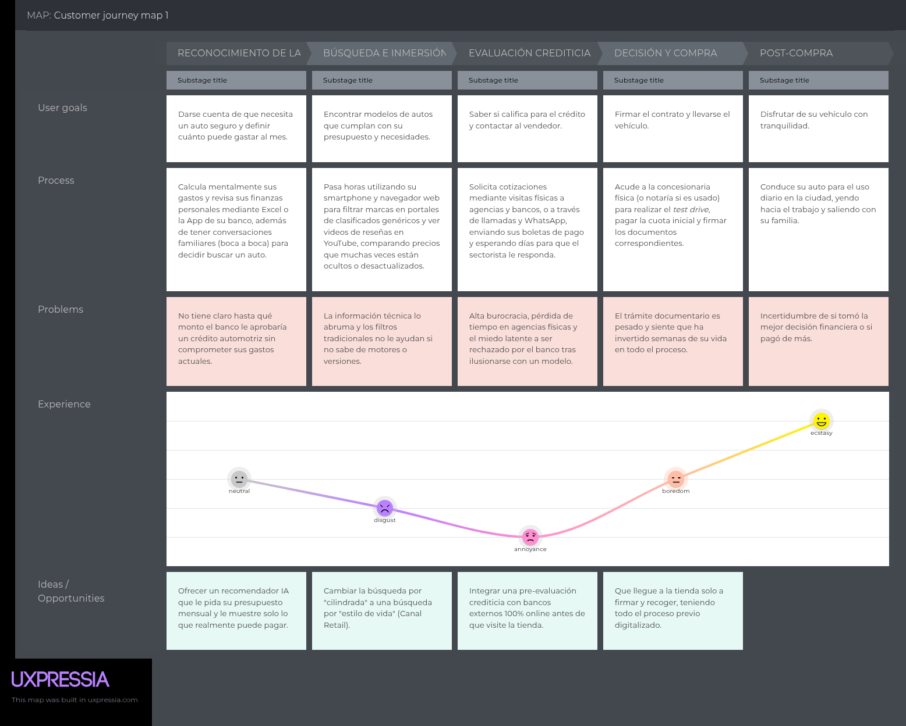

**Segmento 2: Concesionarias de vehículos nuevos**

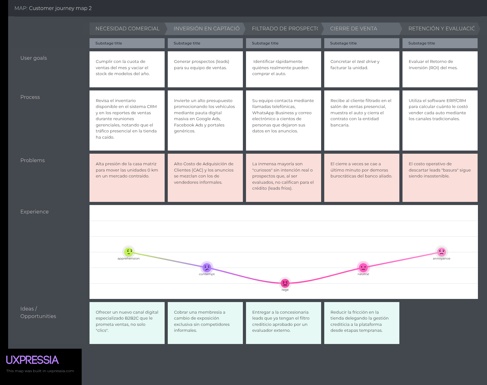

**Segmento 3: Concesionarias de vehículos usados**

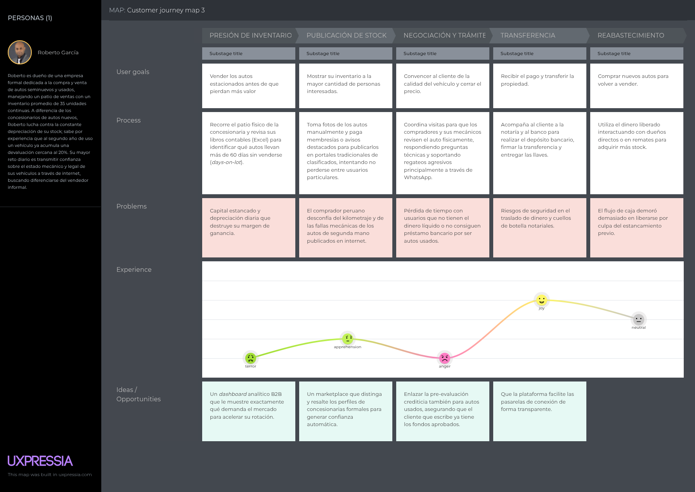

### 2.3.4. Empathy Mapping

**Segmento 1: Compradores interesados**

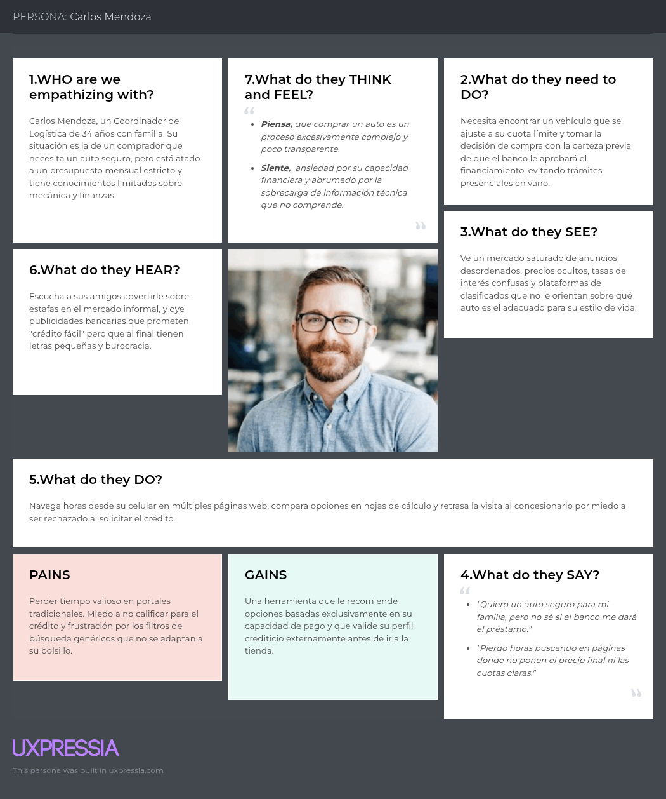

**Segmento 2: Concesionarias de vehículos nuevos**

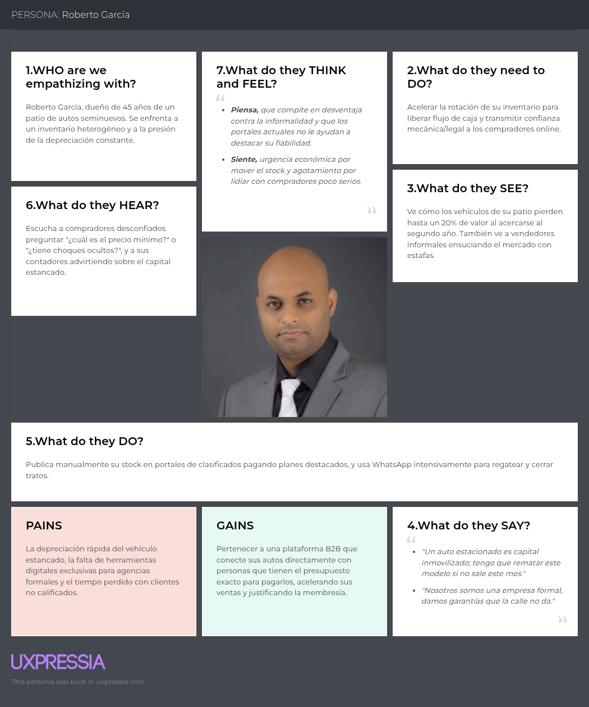

**Segmento 3: Concesionarias de vehículos usados**

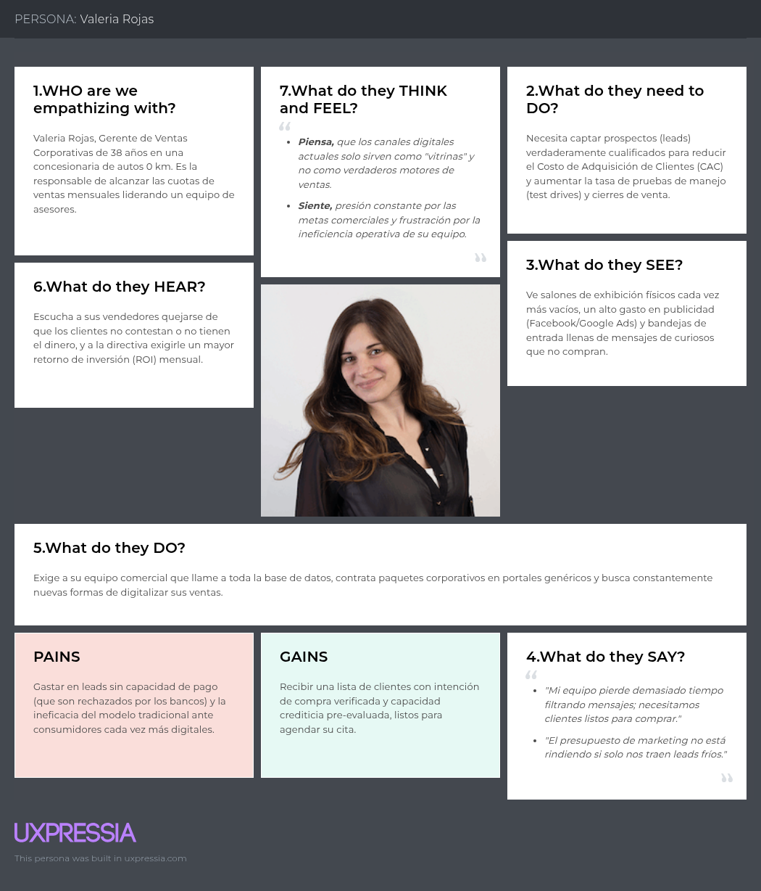

### 2.3.5. As-is Scenario Mapping

**Segmento 1: Compradores interesados**

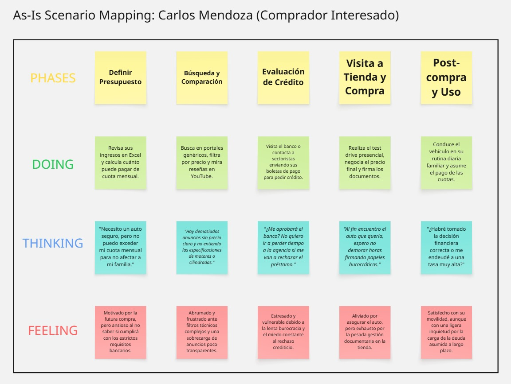

**Segmento 2: Concesionarias de vehículos nuevos**

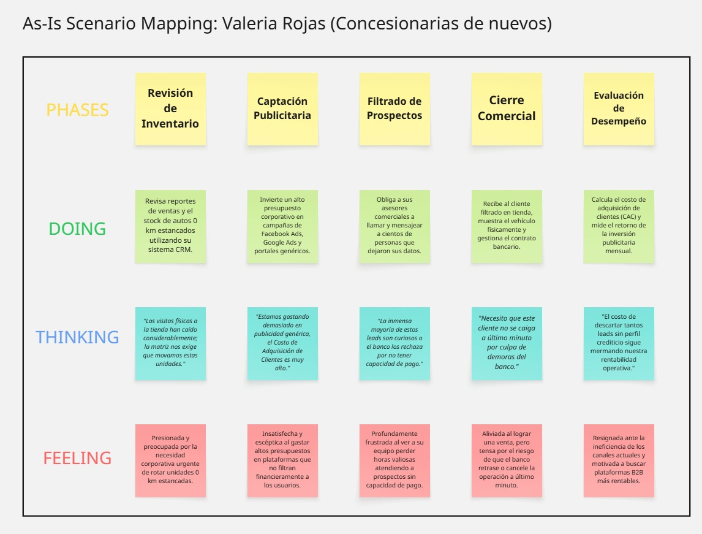

**Segmento 3: Concesionarias de vehículos usados**

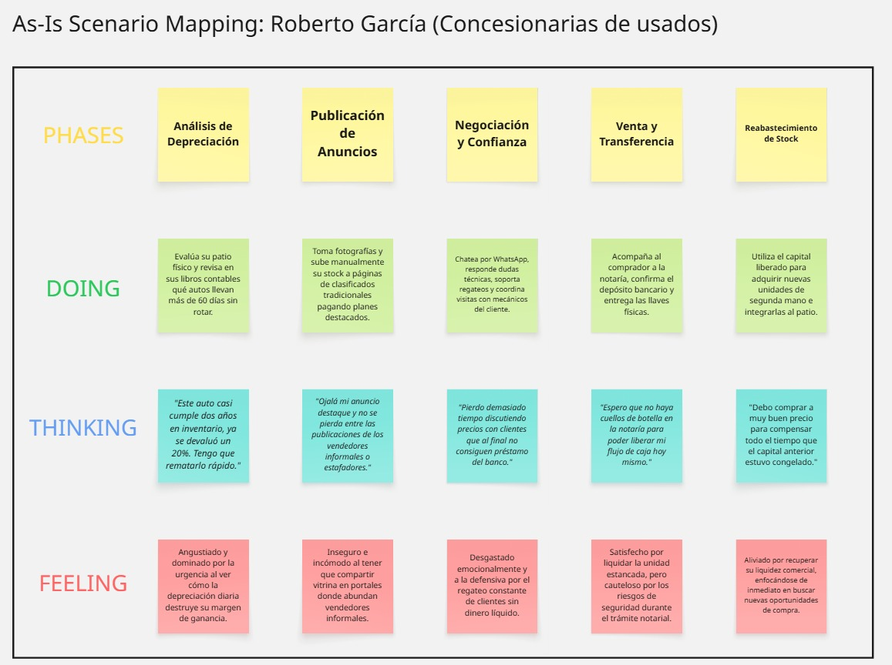

