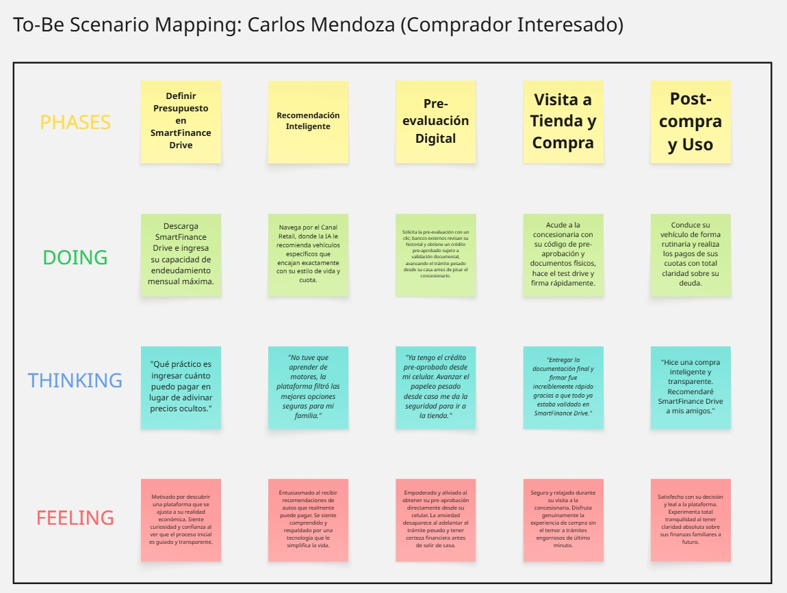
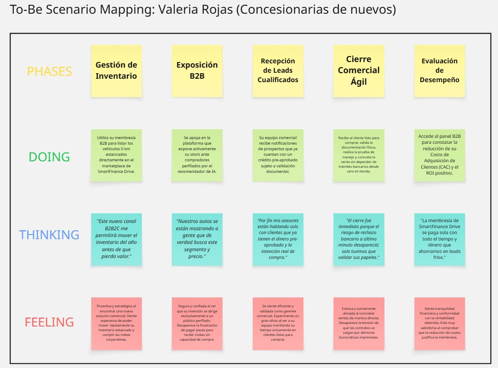
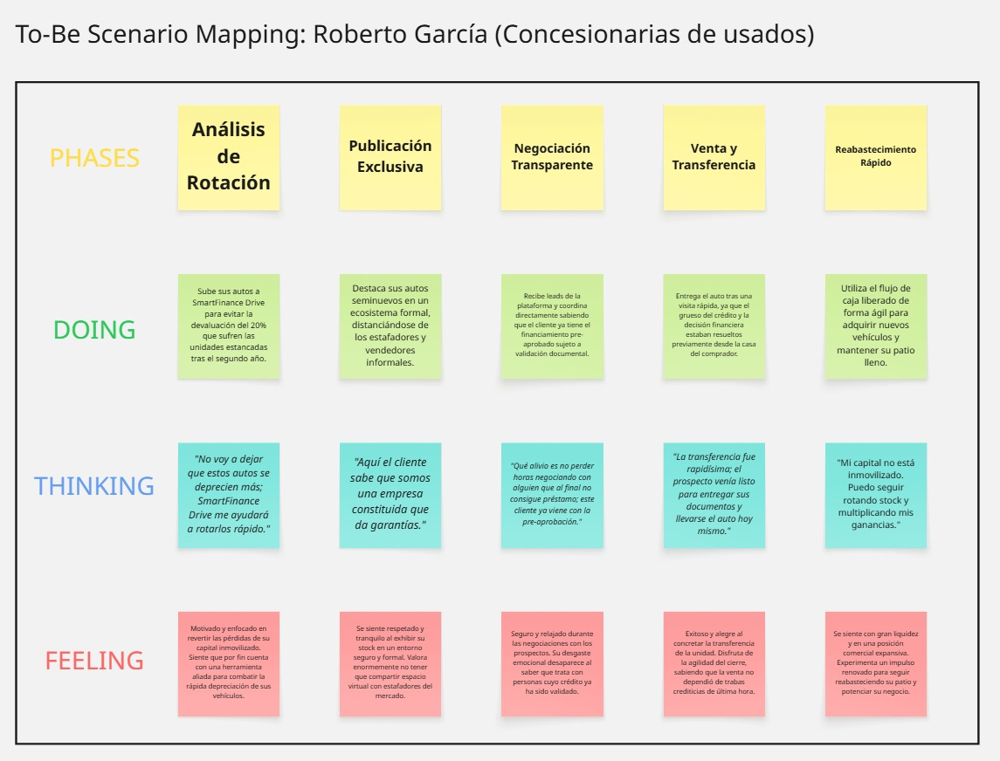
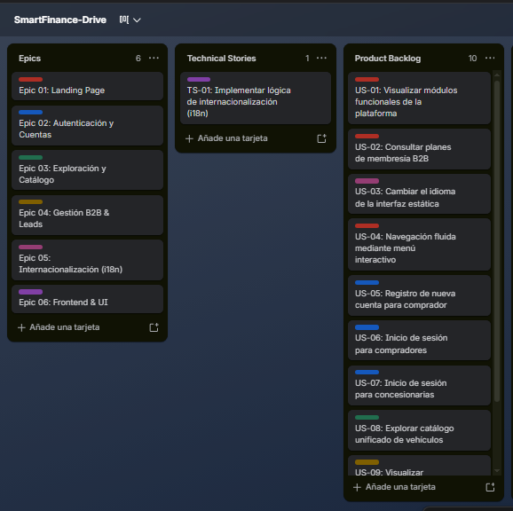
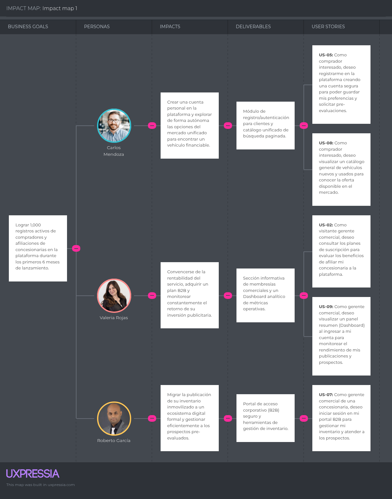

# Capítulo III: Requirements Specification

## 3.1. To-Be Scenario Mapping

**Segmento 1: Compradores interesados**

**Segmento 2: Concesionarias de vehículos nuevos**

**Segmento 3: Concesionarias de vehículos usados**

* **Enlace interactivo del tablero en Miro:** [https://miro.com/app/board/uXjVHpkhWe4=/?share_link_id=221895309503](https://miro.com/app/board/uXjVHpkhWe4=/?share_link_id=221895309503)

## 3.2. User Stories

En esta sección se definen los requisitos funcionales, no funcionales y técnicos de SmartFinance Drive mediante un conjunto estructurado de Epics y User Stories. La redacción contempla los tres segmentos objetivo (Compradores, Concesionarias de nuevos y Concesionarias de usados), así como las historias técnicas necesarias para la viabilidad de la plataforma.

| **US-01** | **Visualizar información de la plataforma** |
| :--- | :--- |
| **User** | Visitante |
| **Priority** | Alta |
| **Epic** | Landing Page y captación |
| **Description** | Como Visitante, quiero visualizar información general de la plataforma, para conocer su propósito, funcionamiento y propuesta de valor antes de registrarme. |
| **Acceptance Criteria** | **Escenario 1 — Visualización de información** **Dado** que el visitante accede a la plataforma, **Cuando** consulta la información general del servicio, **Entonces** puede visualizar información general sobre la plataforma y sus principales funcionalidades.  **Escenario 2 — Navegación de información** **Dado** que el visitante consulta la información de la plataforma, **Cuando** explora sus diferentes contenidos y servicios, **Entonces** puede acceder a la información presentada de manera clara y organizada. |

 

| **US-02** | **Conocer beneficios de la plataforma** |
| :--- | :--- |
| **User** | Visitante |
| **Priority** | Alta |
| **Epic** | Landing Page y captación |
| **Description** | Como Visitante, quiero conocer los beneficios de utilizar la plataforma, para comprender cómo puede facilitar la búsqueda y gestión de opciones de financiamiento vehicular. |
| **Acceptance Criteria** | **Escenario 1 — Visualización de beneficios** **Dado** que el visitante accede a la plataforma, **Cuando** consulta los beneficios de la solución, **Entonces** puede visualizar los principales beneficios ofrecidos por la plataforma.  **Escenario 2 — Información comprensible** **Dado** que el visitante revisa los beneficios, **Cuando** analiza cada propuesta de valor, **Entonces** la información se presenta de forma clara y comprensible. |

 

| **US-03** | **Conocer beneficios de los planes** |
| :--- | :--- |
| **User** | Visitante |
| **Priority** | Alta |
| **Epic** | Landing Page y captación |
| **Description** | Como Visitante, quiero conocer los beneficios de los planes disponibles, para identificar qué opción se adapta a las necesidades de una concesionaria. |
| **Acceptance Criteria** | **Escenario 1 — Visualización de planes** **Dado** que el visitante requiere evaluar las opciones de suscripción, **Cuando** consulta los planes comerciales disponibles, **Entonces** puede visualizar los planes ofrecidos y sus principales características.  **Escenario 2 — Comparación de beneficios** **Dado** que existen diferentes planes de membresía, **Cuando** el visitante compara sus características y coberturas, **Entonces** puede identificar las diferencias entre sus beneficios. |

 

| **US-04** | **Acceder al registro desde la Landing Page** |
| :--- | :--- |
| **User** | Visitante |
| **Priority** | Alta |
| **Epic** | Landing Page y captación |
| **Description** | Como Visitante, quiero acceder al registro desde la plataforma, para crear una cuenta y utilizar sus funcionalidades. |
| **Acceptance Criteria** | **Escenario 1 — Acceso al registro** **Dado** que el visitante no cuenta con una cuenta registrada, **Cuando** solicita registrarse en la plataforma, **Entonces** la plataforma inicia el proceso de registro de cuenta.  **Escenario 2 — Inicio del registro** **Dado** que el visitante inicia el proceso de registro, **Cuando** proporciona los datos requeridos para la creación de cuenta, **Entonces** puede ingresar la información necesaria para registrarse. |

 

| **US-05** | **Registro de cuenta y perfil personal** |
| :--- | :--- |
| **User** | Visitante |
| **Priority** | Alta |
| **Epic** | Gestión de acceso y cuenta |
| **Description** | Como Visitante, quiero registrar una cuenta y completar mi perfil personal, para acceder a las funcionalidades disponibles para usuarios registrados. |
| **Acceptance Criteria** | **Escenario 1 — Registro exitoso** **Dado** que el visitante inicia su registro en la plataforma, **Cuando** completa correctamente los campos obligatorios y confirma su solicitud, **Entonces** la plataforma crea su cuenta y solicita la verificación del correo electrónico.  **Escenario 2 — Datos incompletos** **Dado** que el visitante intenta registrarse, **Cuando** omite información obligatoria o proporciona datos inválidos, **Entonces** la plataforma informa los campos que deben corregirse y no procesa el registro. |

 

| **US-06** | **Verificar correo electrónico** |
| :--- | :--- |
| **User** | Usuario Registrado |
| **Priority** | Alta |
| **Epic** | Gestión de acceso y cuenta |
| **Description** | Como Usuario Registrado, quiero verificar mi correo electrónico, para confirmar la propiedad de mi cuenta y habilitar su uso. |
| **Acceptance Criteria** | **Escenario 1 — Verificación exitosa** **Dado** que el usuario se registró y recibió un código o enlace de verificación, **Cuando** utiliza un mecanismo de verificación válido, **Entonces** la plataforma verifica su correo electrónico y actualiza el estado de la cuenta a activa.  **Escenario 2 — Enlace inválido o vencido** **Dado** que el usuario intenta verificar su correo, **Cuando** utiliza un código o enlace inválido o vencido, **Entonces** la plataforma informa que debe solicitar una nueva verificación. |

 

| **US-07** | **Inicio de sesión** |
| :--- | :--- |
| **User** | Usuario Registrado |
| **Priority** | Alta |
| **Epic** | Gestión de acceso y cuenta |
| **Description** | Como Usuario Registrado, quiero iniciar sesión, para acceder de forma segura a las funcionalidades correspondientes a mi cuenta. |
| **Acceptance Criteria** | **Escenario 1 — Inicio de sesión exitoso** **Dado** que el usuario posee una cuenta activa y verificada, **Cuando** proporciona credenciales válidas para autenticarse, **Entonces** la plataforma inicia su sesión y habilita los permisos correspondientes a su rol.  **Escenario 2 — Credenciales incorrectas** **Dado** que el usuario intenta autenticarse, **Cuando** proporciona credenciales incorrectas, **Entonces** la plataforma rechaza el acceso e informa que las credenciales no son válidas. |

 

| **US-08** | **Recuperar contraseña** |
| :--- | :--- |
| **User** | Usuario Registrado |
| **Priority** | Alta |
| **Epic** | Gestión de acceso y cuenta |
| **Description** | Como Usuario Registrado, quiero recuperar mi contraseña, para volver a acceder a mi cuenta cuando no recuerde mis credenciales. |
| **Acceptance Criteria** | **Escenario 1 — Solicitud de recuperación** **Dado** que el usuario no recuerda su contraseña, **Cuando** solicita recuperar el acceso mediante su correo registrado, **Entonces** la plataforma envía las instrucciones para restablecer la contraseña.  **Escenario 2 — Nueva contraseña** **Dado** que el usuario cuenta con una solicitud de recuperación válida, **Cuando** establece una nueva contraseña que cumple las reglas de seguridad, **Entonces** la plataforma actualiza su contraseña y permite su uso para futuras autenticaciones. |

 

| **US-09** | **Cierre de sesión** |
| :--- | :--- |
| **User** | Usuario Autenticado |
| **Priority** | Alta |
| **Epic** | Gestión de acceso y cuenta |
| **Description** | Como Usuario Autenticado, quiero cerrar mi sesión, para finalizar de forma segura mi acceso a la plataforma. |
| **Acceptance Criteria** | **Escenario 1 — Cierre exitoso** **Dado** que el usuario tiene una sesión activa, **Cuando** solicita cerrar su sesión activa, **Entonces** la plataforma finaliza la sesión activa y revoca el acceso a recursos protegidos.  **Escenario 2 — Acceso posterior** **Dado** que el usuario cerró su sesión activa, **Cuando** intenta acceder a una funcionalidad protegida, **Entonces** la plataforma solicita autenticarse nuevamente. |

 

| **US-10** | **Cambiar contraseña** |
| :--- | :--- |
| **User** | Usuario Autenticado |
| **Priority** | Media |
| **Epic** | Gestión de acceso y cuenta |
| **Description** | Como Usuario Autenticado, quiero cambiar mi contraseña, para mantener segura mi cuenta y actualizar mis credenciales cuando lo considere necesario. |
| **Acceptance Criteria** | **Escenario 1 — Cambio exitoso** **Dado** que el usuario está autenticado en la plataforma, **Cuando** ingresa su contraseña actual y una nueva contraseña válida, **Entonces** la plataforma actualiza la contraseña de la cuenta.  **Escenario 2 — Contraseña actual incorrecta** **Dado** que el usuario intenta cambiar su contraseña, **Cuando** proporciona una contraseña actual que no coincide con la registrada, **Entonces** la plataforma rechaza el cambio e informa el error. |

 

| **US-11** | **Visualizar perfil** |
| :--- | :--- |
| **User** | Usuario Autenticado |
| **Priority** | Media |
| **Epic** | Gestión de perfil y roles |
| **Description** | Como Usuario Autenticado, quiero visualizar mi perfil, para consultar la información asociada a mi cuenta. |
| **Acceptance Criteria** | **Escenario 1 — Visualización del perfil** **Dado** que el usuario está autenticado, **Cuando** consulta la información de su perfil, **Entonces** la plataforma presenta sus datos registrados y roles asociados.  **Escenario 2 — Información actualizada** **Dado** que el usuario posee información personal registrada, **Cuando** consulta los datos de su perfil, **Entonces** visualiza la información almacenada actualmente. |

 

| **US-12** | **Editar perfil** |
| :--- | :--- |
| **User** | Usuario Autenticado |
| **Priority** | Media |
| **Epic** | Gestión de perfil y roles |
| **Description** | Como Usuario Autenticado, quiero editar mis datos personales, para mantener mi perfil actualizado. |
| **Acceptance Criteria** | **Escenario 1 — Edición exitosa** **Dado** que el usuario tiene una sesión activa y puede modificar sus datos personales, **Cuando** modifica datos permitidos y confirma los cambios, **Entonces** la plataforma actualiza la información de su perfil.  **Escenario 2 — Información inválida** **Dado** que el usuario modifica su información personal, **Cuando** proporciona datos que no cumplen las validaciones requeridas, **Entonces** la plataforma informa los errores y no guarda los datos inválidos. |

 

| **US-13** | **Actualizar foto de perfil** |
| :--- | :--- |
| **User** | Usuario Autenticado |
| **Priority** | Baja |
| **Epic** | Gestión de perfil y roles |
| **Description** | Como Usuario Autenticado, quiero actualizar mi foto de perfil, para personalizar la identificación visual de mi cuenta. |
| **Acceptance Criteria** | **Escenario 1 — Foto actualizada** **Dado** que el usuario está autenticado en la plataforma, **Cuando** proporciona un archivo de imagen válido y confirma la actualización, **Entonces** la plataforma actualiza su foto de perfil.  **Escenario 2 — Archivo no válido** **Dado** que el usuario intenta actualizar su foto de perfil, **Cuando** proporciona un archivo que no cumple con el formato o tamaño requerido, **Entonces** la plataforma rechaza el archivo e informa el motivo. |

 

| **US-14** | **Eliminar cuenta** |
| :--- | :--- |
| **User** | Usuario Autenticado |
| **Priority** | Media |
| **Epic** | Gestión de perfil y roles |
| **Description** | Como Usuario Autenticado, quiero eliminar mi cuenta, para dejar de utilizar la plataforma cuando ya no necesite sus servicios. |
| **Acceptance Criteria** | **Escenario 1 — Eliminación confirmada** **Dado** que el usuario solicita eliminar su cuenta, **Cuando** confirma la operación de baja, **Entonces** la plataforma procesa la eliminación de acuerdo con las reglas del negocio y finaliza su acceso.  **Escenario 2 — Eliminación cancelada** **Dado** que el usuario inició la solicitud de eliminación de cuenta, **Cuando** desiste de la operación antes de confirmarla, **Entonces** la cuenta permanece activa sin modificaciones. |

 

| **US-15** | **Solicitar rol de Concesionaria** |
| :--- | :--- |
| **User** | Cliente |
| **Priority** | Media |
| **Epic** | Gestión de perfil y roles |
| **Description** | Como Cliente, quiero solicitar el rol de Concesionaria, para poder acceder a las funcionalidades destinadas a gestionar un negocio de venta de vehículos. |
| **Acceptance Criteria** | **Escenario 1 — Solicitud de rol** **Dado** que el cliente está autenticado y no posee el rol de Concesionaria, **Cuando** solicita el rol de Concesionaria y proporciona los datos empresariales requeridos, **Entonces** la plataforma registra la solicitud para su respectiva evaluación.  **Escenario 2 — Solicitud existente** **Dado** que el cliente ya cuenta con una solicitud de rol en estado pendiente, **Cuando** intenta registrar una nueva solicitud, **Entonces** la plataforma informa que ya existe una solicitud en proceso. |

 

| **US-16** | **Solicitar rol de Entidad Financiera** |
| :--- | :--- |
| **User** | Cliente |
| **Priority** | Media |
| **Epic** | Gestión de perfil y roles |
| **Description** | Como Cliente, quiero solicitar el rol de Entidad Financiera, para acceder a las funcionalidades destinadas a gestionar solicitudes de crédito. |
| **Acceptance Criteria** | **Escenario 1 — Solicitud de rol** **Dado** que el cliente está autenticado y no posee el rol de Entidad Financiera, **Cuando** solicita el rol de Entidad Financiera y proporciona la información requerida, **Entonces** la plataforma registra la solicitud para su evaluación.  **Escenario 2 — Solicitud pendiente** **Dado** que el cliente ya tiene una solicitud pendiente de aprobación, **Cuando** intenta enviar otra solicitud para el mismo rol, **Entonces** la plataforma informa que existe una solicitud en proceso. |

 

| **US-17** | **Consultar resumen financiero del cliente** |
| :--- | :--- |
| **User** | Cliente |
| **Priority** | Media |
| **Epic** | Dashboard y configuración B2B |
| **Description** | Como Cliente, quiero consultar mi resumen financiero, para conocer la información relevante utilizada en la evaluación de mis solicitudes de crédito. |
| **Acceptance Criteria** | **Escenario 1 — Consulta del resumen** **Dado** que el cliente está autenticado en la plataforma, **Cuando** solicita consultar su resumen financiero, **Entonces** la plataforma presenta la información crediticia y financiera registrada para su cuenta.  **Escenario 2 — Sin información disponible** **Dado** que el cliente no posee información financiera registrada, **Cuando** consulta su resumen, **Entonces** la plataforma informa que no existe información disponible para mostrar. |

 

| **US-18** | **Seleccionar plan de membresía** |
| :--- | :--- |
| **User** | Concesionaria |
| **Priority** | Alta |
| **Epic** | Dashboard y configuración B2B |
| **Description** | Como Concesionaria, quiero seleccionar un plan de membresía, para acceder a las funcionalidades y beneficios correspondientes. |
| **Acceptance Criteria** | **Escenario 1 — Selección de plan** **Dado** que la concesionaria está habilitada para contratar una membresía, **Cuando** elige un plan disponible y confirma la suscripción, **Entonces** la plataforma registra el plan seleccionado y actualiza el estado de la membresía.  **Escenario 2 — Plan no disponible** **Dado** que un plan no se encuentra habilitado para contratación, **Cuando** la concesionaria intenta contratarlo, **Entonces** la plataforma impide la contratación e informa su indisponibilidad. |

 

| **US-19** | **Registrar condiciones crediticias de la Entidad Financiera** |
| :--- | :--- |
| **User** | Entidad Financiera |
| **Priority** | Alta |
| **Epic** | Dashboard y configuración B2B |
| **Description** | Como Entidad Financiera, quiero registrar mis condiciones crediticias, para definir los parámetros utilizados en las opciones de financiamiento ofrecidas. |
| **Acceptance Criteria** | **Escenario 1 — Registro exitoso** **Dado** que la entidad financiera está autenticada y habilitada, **Cuando** registra parámetros crediticios válidos, **Entonces** la plataforma guarda las condiciones financieras asociadas a la entidad.  **Escenario 2 — Datos inválidos** **Dado** que la entidad financiera intenta registrar condiciones crediticias, **Cuando** proporciona valores incompletos o fuera de los rangos permitidos, **Entonces** la plataforma informa los campos que deben corregirse y no guarda los cambios. |

 

| **US-20** | **Consultar plan de membresía** |
| :--- | :--- |
| **User** | Concesionaria |
| **Priority** | Media |
| **Epic** | Dashboard y configuración B2B |
| **Description** | Como Concesionaria, quiero consultar mi plan de membresía actual, para conocer sus características, beneficios y estado. |
| **Acceptance Criteria** | **Escenario 1 — Consulta del plan** **Dado** que la concesionaria cuenta con un plan contratado, **Cuando** solicita información sobre su membresía, **Entonces** la plataforma presenta las condiciones, beneficios y vigencia del plan activo.  **Escenario 2 — Sin plan activo** **Dado** que la concesionaria no tiene un plan activo, **Cuando** consulta el estado de su membresía, **Entonces** la plataforma informa que no posee una membresía activa. |

 

| **US-21** | **Cambiar plan de membresía** |
| :--- | :--- |
| **User** | Concesionaria |
| **Priority** | Media |
| **Epic** | Dashboard y configuración B2B |
| **Description** | Como Concesionaria, quiero cambiar mi plan de membresía, para adaptar los beneficios de la plataforma a mis necesidades. |
| **Acceptance Criteria** | **Escenario 1 — Cambio de plan** **Dado** que la concesionaria tiene un plan activo, **Cuando** solicita cambiar a otro plan disponible y confirma la operación, **Entonces** la plataforma registra el nuevo plan conforme a las condiciones acordadas.  **Escenario 2 — Cambio cancelado** **Dado** que la concesionaria inició el proceso de cambio de plan, **Cuando** cancela la operación antes de confirmarla, **Entonces** la plataforma mantiene el plan actual sin modificaciones. |

 

| **US-22** | **Renovar membresía** |
| :--- | :--- |
| **User** | Concesionaria |
| **Priority** | Media |
| **Epic** | Dashboard y configuración B2B |
| **Description** | Como Concesionaria, quiero renovar mi membresía, para mantener activos los beneficios y funcionalidades de mi plan. |
| **Acceptance Criteria** | **Escenario 1 — Renovación exitosa** **Dado** que la membresía de la concesionaria se encuentra próxima a vencer o vencida, **Cuando** confirma la renovación y completa el proceso correspondiente, **Entonces** la plataforma actualiza la vigencia de la membresía.  **Escenario 2 — Renovación no completada** **Dado** que la concesionaria inicia la renovación de su membresía, **Cuando** no culmina el proceso requerido, **Entonces** la membresía conserva su estado anterior. |

 

| **US-23** | **Consultar historial de pagos** |
| :--- | :--- |
| **User** | Concesionaria |
| **Priority** | Media |
| **Epic** | Dashboard y configuración B2B |
| **Description** | Como Concesionaria, quiero consultar mi historial de pagos, para revisar las transacciones realizadas relacionadas con mi membresía. |
| **Acceptance Criteria** | **Escenario 1 — Historial disponible** **Dado** que la concesionaria registra pagos de membresía previos, **Cuando** solicita consultar su historial de pagos, **Entonces** la plataforma presenta el registro detallado de las transacciones efectuadas.  **Escenario 2 — Sin pagos** **Dado** que no existen transacciones de pago registradas, **Cuando** la concesionaria consulta su historial, **Entonces** la plataforma informa que no existen pagos registrados. |

 

| **US-24** | **Listar inventario de vehículos** |
| :--- | :--- |
| **User** | Concesionaria |
| **Priority** | Alta |
| **Epic** | Gestión de inventario de vehículos |
| **Description** | Como Concesionaria, quiero visualizar mi inventario de vehículos, para administrar las unidades disponibles en la plataforma. |
| **Acceptance Criteria** | **Escenario 1 — Inventario disponible** **Dado** que la concesionaria posee vehículos registrados, **Cuando** consulta su inventario de unidades, **Entonces** la plataforma presenta la relación de vehículos asociados a su cuenta.  **Escenario 2 — Inventario vacío** **Dado** que la concesionaria no tiene vehículos registrados en su inventario, **Cuando** realiza la consulta, **Entonces** la plataforma informa que no cuenta con vehículos en inventario. |

 

| **US-25** | **Registrar vehículo** |
| :--- | :--- |
| **User** | Concesionaria |
| **Priority** | Alta |
| **Epic** | Gestión de inventario de vehículos |
| **Description** | Como Concesionaria, quiero registrar un vehículo, para incorporarlo a mi inventario y posteriormente publicarlo en la plataforma. |
| **Acceptance Criteria** | **Escenario 1 — Registro exitoso** **Dado** que la concesionaria cuenta con la información técnica y comercial de un vehículo, **Cuando** ingresa todos los datos obligatorios válidos y confirma el registro, **Entonces** la plataforma almacena el vehículo en su inventario.  **Escenario 2 — Datos incompletos** **Dado** que la concesionaria intenta registrar un vehículo, **Cuando** omite datos obligatorios o proporciona información inválida, **Entonces** la plataforma impide el registro e indica la información faltante. |

 

| **US-26** | **Publicar vehículo** |
| :--- | :--- |
| **User** | Concesionaria |
| **Priority** | Alta |
| **Epic** | Gestión de inventario de vehículos |
| **Description** | Como Concesionaria, quiero publicar un vehículo registrado, para permitir que los clientes puedan visualizarlo y considerarlo para una compra. |
| **Acceptance Criteria** | **Escenario 1 — Publicación exitosa** **Dado** que la concesionaria tiene un vehículo en inventario con información completa, **Cuando** solicita publicar el vehículo, **Entonces** el vehículo cambia a estado publicado y queda disponible para los compradores.  **Escenario 2 — Información incompleta** **Dado** que un vehículo no cumple con los requisitos mínimos de publicación, **Cuando** la concesionaria intenta publicarlo, **Entonces** la plataforma impide la publicación e indica los requisitos pendientes. |

 

| **US-27** | **Editar vehículo publicado** |
| :--- | :--- |
| **User** | Concesionaria |
| **Priority** | Media |
| **Epic** | Gestión de inventario de vehículos |
| **Description** | Como Concesionaria, quiero editar la información de un vehículo publicado, para mantener actualizados sus datos. |
| **Acceptance Criteria** | **Escenario 1 — Edición exitosa** **Dado** que existe un vehículo publicado perteneciente a la concesionaria, **Cuando** modifica campos permitidos con información válida y guarda los cambios, **Entonces** la plataforma actualiza los datos del vehículo.  **Escenario 2 — Datos inválidos** **Dado** que la concesionaria modifica la información de un vehículo, **Cuando** ingresa valores fuera de rango o datos no permitidos, **Entonces** la plataforma rechaza los cambios e informa los errores correspondientes. |

 

| **US-28** | **Cambiar estado del vehículo** |
| :--- | :--- |
| **User** | Concesionaria |
| **Priority** | Media |
| **Epic** | Gestión de inventario de vehículos |
| **Description** | Como Concesionaria, quiero cambiar el estado de un vehículo, para indicar si se encuentra disponible, reservado, vendido u otro estado permitido. |
| **Acceptance Criteria** | **Escenario 1 — Cambio de estado** **Dado** que la concesionaria tiene un vehículo registrado, **Cuando** asigna un estado válido (disponible, reservado, vendido) y confirma la acción, **Entonces** la plataforma actualiza el estado operativo del vehículo.  **Escenario 2 — Estado no permitido** **Dado** que la concesionaria intenta asignar una transición de estado no permitida, **Cuando** confirma la operación, **Entonces** la plataforma rechaza la actualización y mantiene el estado anterior. |

 

| **US-29** | **Eliminar vehículo** |
| :--- | :--- |
| **User** | Concesionaria |
| **Priority** | Media |
| **Epic** | Gestión de inventario de vehículos |
| **Description** | Como Concesionaria, quiero eliminar un vehículo de mi inventario, para retirar unidades que ya no debo gestionar. |
| **Acceptance Criteria** | **Escenario 1 — Eliminación exitosa** **Dado** que existe un vehículo en el inventario que no tiene procesos activos, **Cuando** la concesionaria confirma su eliminación, **Entonces** la plataforma retira el vehículo del inventario y confirma la baja.  **Escenario 2 — Eliminación cancelada** **Dado** que la concesionaria inició la eliminación de un vehículo, **Cuando** cancela la operación antes de confirmarla, **Entonces** el vehículo permanece en el inventario sin modificaciones. |

 

| **US-30** | **Buscar y filtrar vehículos** |
| :--- | :--- |
| **User** | Cliente |
| **Priority** | Alta |
| **Epic** | Exploración y búsqueda de vehículos |
| **Description** | Como Cliente, quiero buscar y filtrar vehículos, para encontrar opciones que se ajusten a mis necesidades y preferencias. |
| **Acceptance Criteria** | **Escenario 1 — Búsqueda de vehículos** **Dado** que existen vehículos publicados en la plataforma, **Cuando** el cliente busca utilizando términos o palabras clave válidas, **Entonces** la plataforma presenta los vehículos que coinciden con los criterios de búsqueda.  **Escenario 2 — Aplicación de filtros** **Dado** que existen vehículos disponibles en la oferta general, **Cuando** el cliente aplica uno o más filtros específicos (precio, marca, año, condición), **Entonces** la plataforma actualiza los resultados mostrando únicamente las unidades que cumplen los filtros. |

 

| **US-31** | **Ordenar resultados de búsqueda** |
| :--- | :--- |
| **User** | Cliente |
| **Priority** | Baja |
| **Epic** | Exploración y búsqueda de vehículos |
| **Description** | Como Cliente, quiero ordenar los resultados de búsqueda, para visualizar primero los vehículos según el criterio que me resulte más conveniente. |
| **Acceptance Criteria** | **Escenario 1 — Ordenamiento exitoso** **Dado** que existen resultados de vehículos para una consulta, **Cuando** el cliente define un criterio de ordenamiento (precio, año o kilometraje), **Entonces** la plataforma reorganiza los vehículos según el criterio solicitado.  **Escenario 2 — Cambio de orden** **Dado** que los resultados se encuentran ordenados por un criterio previo, **Cuando** el cliente indica un criterio diferente, **Entonces** la plataforma actualiza la secuencia de los resultados conforme a la nueva regla. |

 

| **US-32** | **Filtrar catálogo por concesionaria** |
| :--- | :--- |
| **User** | Cliente |
| **Priority** | Media |
| **Epic** | Exploración y búsqueda de vehículos |
| **Description** | Como Cliente, quiero filtrar el catálogo por concesionaria, para consultar vehículos ofrecidos por una empresa específica. |
| **Acceptance Criteria** | **Escenario 1 — Filtro por concesionaria** **Dado** que existen vehículos publicados por distintas concesionarias, **Cuando** el cliente filtra por una concesionaria determinada, **Entonces** la plataforma muestra exclusivamente los vehículos comercializados por dicha empresa.  **Escenario 2 — Sin coincidencias** **Dado** que una concesionaria no dispone de vehículos activos publicados, **Cuando** el cliente consulta la oferta de dicha empresa, **Entonces** la plataforma informa que no existen vehículos disponibles para esa concesionaria. |

 

| **US-33** | **Ver detalle de vehículo** |
| :--- | :--- |
| **User** | Cliente |
| **Priority** | Alta |
| **Epic** | Exploración y búsqueda de vehículos |
| **Description** | Como Cliente, quiero visualizar el detalle de un vehículo, para conocer sus características antes de decidir si deseo solicitar financiamiento o contactar a la concesionaria. |
| **Acceptance Criteria** | **Escenario 1 — Visualización del detalle** **Dado** que existe un vehículo publicado en la plataforma, **Cuando** el cliente consulta la información detallada de la unidad, **Entonces** la plataforma presenta sus especificaciones técnicas, precio, imágenes y condiciones comerciales.  **Escenario 2 — Vehículo no disponible** **Dado** que un vehículo ha dejado de estar publicado o fue dado de baja, **Cuando** el cliente intenta consultar su información, **Entonces** la plataforma informa que el vehículo ya no se encuentra disponible. |

 

| **US-34** | **Ver datos de contacto de la concesionaria** |
| :--- | :--- |
| **User** | Cliente |
| **Priority** | Media |
| **Epic** | Exploración y búsqueda de vehículos |
| **Description** | Como Cliente, quiero visualizar los datos de contacto de la concesionaria, para poder comunicarme directamente con ella respecto al vehículo de mi interés. |
| **Acceptance Criteria** | **Escenario 1 — Datos de contacto disponibles** **Dado** que el cliente consulta información sobre un vehículo publicado, **Cuando** requiere los datos comerciales de la concesionaria vendedora, **Entonces** la plataforma presenta los canales de atención y contacto habilitados.  **Escenario 2 — Contacto no disponible** **Dado** que una concesionaria no tiene canales de atención activos, **Cuando** el cliente solicita sus datos de contacto, **Entonces** la plataforma informa que no existen canales de contacto disponibles temporalmente. |

 

| **US-35** | **Crear simulación de crédito vehicular** |
| :--- | :--- |
| **User** | Cliente |
| **Priority** | Alta |
| **Epic** | Simulación y seguimiento crediticio |
| **Description** | Como Cliente, quiero crear una simulación de crédito vehicular, para conocer las condiciones aproximadas de financiamiento de un vehículo. |
| **Acceptance Criteria** | **Escenario 1 — Simulación exitosa** **Dado** que el cliente vincula un vehículo y define monto inicial, plazo y tasa de interés, **Cuando** solicita el cálculo de la simulación, **Entonces** la plataforma calcula y presenta la cuota estimada, intereses proyectados y costo total del crédito.  **Escenario 2 — Datos insuficientes** **Dado** que el cliente intenta realizar una simulación, **Cuando** omite parámetros financieros obligatorios o introduce valores inconsistentes, **Entonces** la plataforma solicita completar y corregir la información antes de procesar el cálculo. |

 

| **US-36** | **Consultar cronograma detallado de pagos** |
| :--- | :--- |
| **User** | Cliente |
| **Priority** | Media |
| **Epic** | Simulación y seguimiento crediticio |
| **Description** | Como Cliente, quiero consultar el cronograma detallado de pagos de una simulación, para conocer cómo se distribuirían las cuotas durante el periodo de financiamiento. |
| **Acceptance Criteria** | **Escenario 1 — Cronograma disponible** **Dado** que el cliente cuenta con una simulación calculada, **Cuando** solicita el cronograma de pagos, **Entonces** la plataforma presenta el desglose periódico de amortización, intereses y saldos deudores.  **Escenario 2 — Simulación inexistente** **Dado** que no se dispone de una simulación previa válida, **Cuando** el cliente intenta consultar un cronograma, **Entonces** la plataforma informa que no existe información disponible para generar el cronograma. |

 

| **US-37** | **Consultar simulaciones guardadas** |
| :--- | :--- |
| **User** | Cliente |
| **Priority** | Media |
| **Epic** | Simulación y seguimiento crediticio |
| **Description** | Como Cliente, quiero consultar mis simulaciones guardadas, para revisar nuevamente las opciones de financiamiento que evalué anteriormente. |
| **Acceptance Criteria** | **Escenario 1 — Simulaciones disponibles** **Dado** que el cliente posee simulaciones previamente almacenadas en su cuenta, **Cuando** consulta su registro de simulaciones, **Entonces** la plataforma presenta el listado de simulaciones guardadas con sus condiciones estimadas.  **Escenario 2 — Sin simulaciones** **Dado** que el cliente no cuenta con simulaciones guardadas, **Cuando** solicita la consulta de su historial, **Entonces** la plataforma informa que no existen simulaciones registradas. |

 

| **US-38** | **Eliminar simulación guardada** |
| :--- | :--- |
| **User** | Cliente |
| **Priority** | Baja |
| **Epic** | Simulación y seguimiento crediticio |
| **Description** | Como Cliente, quiero eliminar una simulación guardada, para mantener organizada mi lista y retirar simulaciones que ya no necesito consultar. |
| **Acceptance Criteria** | **Escenario 1 — Eliminación exitosa** **Dado** que el cliente tiene una simulación almacenada en su cuenta, **Cuando** confirma la eliminación de dicha simulación, **Entonces** la plataforma retira el registro de su cuenta y confirma la operación.  **Escenario 2 — Eliminación cancelada** **Dado** que el cliente inició la eliminación de una simulación guardada, **Cuando** cancela la operación antes de confirmarla, **Entonces** la simulación permanece almacenada sin alteraciones. |

 

| **US-39** | **Cancelar solicitud de crédito** |
| :--- | :--- |
| **User** | Cliente |
| **Priority** | Media |
| **Epic** | Simulación y seguimiento crediticio |
| **Description** | Como Cliente, quiero cancelar una solicitud de crédito que aún se encuentre en un estado que permita su cancelación, para detener su evaluación cuando ya no deseo continuar con el trámite. |
| **Acceptance Criteria** | **Escenario 1 — Cancelación permitida** **Dado** que el cliente posee una solicitud de crédito en estado cancelable, **Cuando** confirma la cancelación del trámite, **Entonces** la plataforma actualiza el estado de la solicitud a cancelada y notifica a las partes involucradas.  **Escenario 2 — Cancelación no permitida** **Dado** que la solicitud alcanzó un estado definitivo (aprobada o rechazada), **Cuando** el cliente intenta cancelarla, **Entonces** la plataforma impide la operación e informa que el trámite no puede cancelarse en su estado actual. |

 

| **US-40** | **Consultar estado de solicitudes desde la aplicación móvil** |
| :--- | :--- |
| **User** | Cliente |
| **Priority** | Alta |
| **Epic** | Simulación y seguimiento crediticio |
| **Description** | Como Cliente, quiero consultar el estado de mis solicitudes de crédito desde la aplicación móvil, para realizar seguimiento al proceso sin necesidad de ingresar desde otro dispositivo. |
| **Acceptance Criteria** | **Escenario 1 — Consulta de solicitudes** **Dado** que el cliente tiene solicitudes de crédito registradas, **Cuando** consulta el estado de sus trámites mediante el canal móvil, **Entonces** la plataforma presenta la relación de solicitudes y el estado de avance de cada una.  **Escenario 2 — Sin solicitudes** **Dado** que el cliente no cuenta con solicitudes crediticias registradas, **Cuando** solicita la consulta de trámites, **Entonces** la plataforma informa que no existen solicitudes activas o históricas. |

 

| **US-41** | **Gestionar notificaciones** |
| :--- | :--- |
| **User** | Usuario Autenticado |
| **Priority** | Media |
| **Epic** | Simulación y seguimiento crediticio |
| **Description** | Como Usuario Autenticado, quiero gestionar mis preferencias de notificaciones, para controlar qué tipos de avisos deseo recibir de la plataforma. |
| **Acceptance Criteria** | **Escenario 1 — Configuración de preferencias** **Dado** que el usuario está autenticado en la plataforma, **Cuando** consulta sus ajustes de notificación, **Entonces** la plataforma presenta los canales y tipos de avisos configurables.  **Escenario 2 — Guardado de preferencias** **Dado** que el usuario actualiza sus preferencias de comunicación, **Cuando** confirma las nuevas configuraciones, **Entonces** la plataforma guarda las preferencias y las aplica a futuros eventos del sistema. |

 

| **US-42** | **Recibir notificaciones push** |
| :--- | :--- |
| **User** | Cliente |
| **Priority** | Media |
| **Epic** | Simulación y seguimiento crediticio |
| **Description** | Como Cliente, quiero recibir notificaciones push relacionadas con mis solicitudes, para conocer cambios importantes en su estado. |
| **Acceptance Criteria** | **Escenario 1 — Notificación enviada** **Dado** que el cliente tiene activas las notificaciones para su cuenta, **Cuando** se produce un cambio de estado en una de sus solicitudes, **Entonces** la plataforma emite una notificación push informando el evento.  **Escenario 2 — Notificaciones deshabilitadas** **Dado** que el cliente desactivó las notificaciones automáticas, **Cuando** se genera un evento en una solicitud, **Entonces** la plataforma no emite notificaciones push y conserva el registro en el historial interno. |

 

| **US-43** | **Ver lista de solicitudes asignadas** |
| :--- | :--- |
| **User** | Entidad Financiera |
| **Priority** | Alta |
| **Epic** | Evaluación y gestión de solicitudes de crédito |
| **Description** | Como Entidad Financiera, quiero visualizar la lista de solicitudes de crédito asignadas, para identificar los expedientes que debo evaluar. |
| **Acceptance Criteria** | **Escenario 1 — Solicitudes disponibles** **Dado** que existen solicitudes de crédito asignadas a la entidad financiera, **Cuando** consulta la bandeja de expedientes asignados, **Entonces** la plataforma presenta las solicitudes pendientes de atención con sus datos principales.  **Escenario 2 — Sin solicitudes asignadas** **Dado** que no existen solicitudes asignadas a la entidad financiera, **Cuando** consulta su bandeja de trabajo, **Entonces** la plataforma informa que no cuenta con expedientes pendientes de evaluación. |

 

| **US-44** | **Ver detalle del expediente del cliente** |
| :--- | :--- |
| **User** | Entidad Financiera |
| **Priority** | Alta |
| **Epic** | Evaluación y gestión de solicitudes de crédito |
| **Description** | Como Entidad Financiera, quiero consultar el expediente de un cliente, para revisar la información necesaria antes de evaluar su solicitud de crédito. |
| **Acceptance Criteria** | **Escenario 1 — Consulta del expediente** **Dado** que la entidad financiera tiene asignada una solicitud de crédito, **Cuando** solicita el expediente del cliente, **Entonces** la plataforma presenta los antecedentes personales, financieros y del vehículo requeridos para la evaluación.  **Escenario 2 — Acceso no autorizado** **Dado** que una solicitud de crédito corresponde a otra entidad financiera, **Cuando** se intenta acceder a dicho expediente, **Entonces** la plataforma restringe el acceso por políticas de confidencialidad y permisos. |

 

| **US-45** | **Evaluar solicitud de crédito** |
| :--- | :--- |
| **User** | Entidad Financiera |
| **Priority** | Alta |
| **Epic** | Evaluación y gestión de solicitudes de crédito |
| **Description** | Como Entidad Financiera, quiero evaluar una solicitud de crédito, para determinar su resultado de acuerdo con las condiciones y criterios definidos. |
| **Acceptance Criteria** | **Escenario 1 — Evaluación aprobada** **Dado** que la entidad financiera cuenta con un expediente asignado y la documentación conforme, **Cuando** registra el dictamen favorable de la solicitud, **Entonces** la plataforma actualiza el estado del crédito a aprobado y asocia las condiciones acordadas.  **Escenario 2 — Evaluación rechazada** **Dado** que un expediente no cumple con los requisitos crediticios de la entidad, **Cuando** se registra el dictamen desfavorable justificando el motivo, **Entonces** la plataforma actualiza el estado a rechazado y registra las causales correspondientes. |

 

| **US-46** | **Notificar resultado de evaluación** |
| :--- | :--- |
| **User** | Cliente |
| **Priority** | Alta |
| **Epic** | Evaluación y gestión de solicitudes de crédito |
| **Description** | Como Cliente, quiero recibir el resultado de la evaluación de mi solicitud de crédito, para conocer si mi solicitud fue aprobada o rechazada y continuar con el proceso correspondiente. |
| **Acceptance Criteria** | **Escenario 1 — Resultado disponible** **Dado** que la entidad financiera finalizó la evaluación de una solicitud, **Cuando** se emite el dictamen formal, **Entonces** la plataforma comunica el resultado al cliente a través de los canales de contacto configurados.  **Escenario 2 — Resultado no disponible** **Dado** que una solicitud de crédito continúa en proceso de evaluación, **Cuando** el cliente consulta el dictamen, **Entonces** la plataforma informa que la solicitud aún se encuentra en revisión. |

 

| **US-47** | **Consultar usuarios registrados** |
| :--- | :--- |
| **User** | Administrador |
| **Priority** | Alta |
| **Epic** | Administración de usuarios y roles |
| **Description** | Como Administrador, quiero consultar la lista de usuarios registrados, para administrar y supervisar las cuentas existentes en la plataforma. |
| **Acceptance Criteria** | **Escenario 1 — Lista de usuarios** **Dado** que existen cuentas de usuarios creadas en la plataforma, **Cuando** el administrador solicita la consulta de usuarios registrados, **Entonces** la plataforma presenta el listado de cuentas con su información administrativa y estado.  **Escenario 2 — Sin usuarios** **Dado** que no existen cuentas que coincidan con un criterio de búsqueda, **Cuando** el administrador realiza la consulta, **Entonces** la plataforma informa que no se encontraron usuarios disponibles. |

 

| **US-48** | **Modificar roles de usuario** |
| :--- | :--- |
| **User** | Administrador |
| **Priority** | Alta |
| **Epic** | Administración de usuarios y roles |
| **Description** | Como Administrador, quiero modificar los roles de un usuario, para controlar los permisos y funcionalidades a los que puede acceder dentro de la plataforma. |
| **Acceptance Criteria** | **Escenario 1 — Modificación de rol** **Dado** que el administrador cuenta con permisos de gestión de usuarios, **Cuando** asigna un rol permitido a una cuenta y confirma la operación, **Entonces** la plataforma actualiza el rol del usuario y aplica los privilegios correspondientes.  **Escenario 2 — Rol no permitido** **Dado** que el administrador intenta asignar un rol no compatible o restringido, **Cuando** solicita la confirmación del cambio, **Entonces** la plataforma rechaza la asignación e informa que el rol no puede ser asignado. |

 

| **SP-01** | **Investigar el cálculo de simulaciones de crédito vehicular** |
| :--- | :--- |
| **User** | Developer |
| **Priority** | Alta |
| **Epic** | Simulación y seguimiento crediticio |
| **Description** | Como Developer, quiero investigar las variables y fórmulas financieras para el cálculo de cuotas de crédito vehicular, **con el objetivo de** determinar la viabilidad técnica y definir el algoritmo que produzca resultados exactos según las tasas del mercado. |
| **Acceptance Criteria** | **Escenario 1 — Análisis y documentación de reglas de cálculo** **Dado** que se requiere exactitud financiera en la simulación de créditos vehiculares, **Cuando** se investigan y validan las variables, fórmulas y tasas de interés aplicables, **Entonces** se presenta un documento técnico que detalla el algoritmo de cálculo, los datos de entrada requeridos y los casos de uso esperados.  **Escenario 2 — Prototipo funcional de prueba** **Dado** que se cuenta con el algoritmo de cálculo documentado, **Cuando** se ejecuta una prueba de concepto aislada con datos reales de simulación, **Entonces** se entrega un prototipo funcional mínimo (script o test) que valide los resultados obtenidos frente a los valores esperados, adjuntando las conclusiones técnicas. |

 

| **SP-02** | **Investigar servicios de notificaciones por correo y push** |
| :--- | :--- |
| **User** | Developer |
| **Priority** | Media |
| **Epic** | Simulación y seguimiento crediticio |
| **Description** | Como Developer, quiero investigar pasarelas y servicios de mensajería (email y push), **con el objetivo de** seleccionar la herramienta más eficiente y compatible con nuestro backend para automatizar las notificaciones de cambio de estado en los créditos. |
| **Acceptance Criteria** | **Escenario 1 — Matriz comparativa de servicios de notificación** **Dado** que el sistema necesita comunicar eventos en tiempo real a los clientes, **Cuando** se investigan proveedores de notificaciones (ej. SendGrid, Firebase, etc.), **Entonces** se documenta una matriz de evaluación que incluya compatibilidad, cuotas gratuitas, latencia y facilidad de integración con Spring Boot.  **Escenario 2 — Prueba funcional de envío** **Dado** que se ha elegido un proveedor de notificaciones, **Cuando** se configura la credencial de prueba y se simula un evento de solicitud aprobada, **Entonces** se entrega un prototipo funcional mínimo que envía exitosamente un correo o notificación push de prueba, registrando las conclusiones técnicas. |

 

| **TS-01** | **Integrar validación de RUC con SUNAT** |
| :--- | :--- |
| **User** | Developer |
| **Priority** | Alta |
| **Epic** | Gestión de perfil y roles |
| **Description** | Como Developer, quiero integrar el servicio de consulta de RUC de SUNAT, para validar la información de las empresas ingresadas durante el registro o solicitud del rol de Concesionaria. |
| **Acceptance Criteria** | **Escenario 1 — RUC válido** **Dado** que el sistema recibe un número de RUC válido, **Cuando** consulta el servicio de SUNAT, **Entonces** obtiene la información asociada al RUC y confirma que se encuentra registrado.  **Escenario 2 — RUC no encontrado** **Dado** que el sistema recibe un número de RUC que no se encuentra registrado en SUNAT, **Cuando** realiza la consulta, **Entonces** informa que el RUC no pudo ser validado.  **Escenario 3 — Error en el servicio de SUNAT** **Dado** que el servicio de SUNAT no se encuentra disponible, **Cuando** el sistema intenta validar el RUC, **Entonces** registra el error de la consulta e informa que no fue posible realizar la validación, **Y** no considera el RUC como validado. |

 

## 3.3. Product Backlog

En esta sección se presenta el Product Backlog priorizado del proyecto. Siguiendo las directrices del curso, el orden de los elementos se ha determinado estrictamente por el valor que aportan al negocio, colocando en las primeras posiciones las historias relacionadas con el sitio web estático (Landing Page) para asegurar su inclusión desde el primer sprint. Asimismo, se ha evitado el anti-patrón de colocar las historias de seguridad o autenticación al inicio, priorizando antes la visualización del catálogo y la propuesta de valor.

A continuación, se detalla la tabla de estimación utilizando la escala de Story Points (1, 2, 3, 5, 8).

| # Orden | User Story Id | Título | Descripción | Story Points |
| :---: | :---: | :--- | :--- | :--- | :---: |
| 1 | US-01 | Visualizar módulos funcionales de la plataforma | Como visitante, deseo visualizar las funcionalidades principales del producto para entender cómo me ayudará a buscar o vender un vehículo. | 2 |
| 2 | US-02 | Consultar planes de membresía B2B | Como visitante gerente comercial, deseo consultar los planes de suscripción para evaluar los beneficios de afiliar mi concesionaria a la plataforma. | 2 |
| 3 | US-04 | Navegación fluida mediante menú interactivo | Como visitante, deseo utilizar un menú de navegación para saltar directamente a la sección de mi interés sin perder el contexto de la página. | 1 |
| 4 | US-08 | Explorar catálogo unificado de vehículos | Como comprador interesado, deseo visualizar un catálogo general de vehículos nuevos y usados para conocer la oferta disponible en el mercado. | 5 |
| 5 | US-10 | Visualizar ficha detallada del vehículo | Como comprador interesado, deseo revisar las especificaciones completas de un vehículo para analizar sus características técnicas antes de solicitar una pre-evaluación crediticia. | 3 |
| 6 | US-09 | Visualizar Dashboard de métricas comerciales | Como gerente comercial, deseo visualizar un panel resumen (Dashboard) al ingresar a mi cuenta para monitorear el rendimiento de mis publicaciones y prospectos. | 5 |
| 7 | US-05 | Registro de nueva cuenta para comprador | Como comprador interesado, deseo registrarme en la plataforma creando una cuenta segura para poder guardar mis preferencias y solicitar pre-evaluaciones. | 3 |
| 8 | US-06 | Inicio de sesión para compradores | Como comprador registrado, deseo iniciar sesión en mi cuenta para continuar con la búsqueda de mi vehículo y visualizar mis opciones guardadas. | 2 |
| 9 | US-07 | Inicio de sesión para concesionarias | Como gerente comercial de una concesionaria, deseo iniciar sesión en mi portal B2B para gestionar mi inventario y atender a los prospectos. | 2 |
| 10 | TS-01 | Implementar lógica de internacionalización (i18n) | Como desarrollador, deseo implementar un script para el cambio de idioma estático que actualice los textos utilizando atributos de datos sin necesidad de recargar la página web. | 3 |
| 11 | US-03 | Cambiar el idioma de la interfaz estática | Como visitante internacional, deseo cambiar el idioma de la página para leer el contenido corporativo en mi idioma de preferencia. | 1 |

**Evidencia de Product Backlog gestionado en Trello:**

**Enlace público del Product Backlog:**  
[Tablero de Product Backlog en Trello](https://trello.com/invite/b/68cef3b9540a3e849e12d1e2/ATTI55e37783ca94033bfa115ee21378ce0d092EEDDF/smartfinance-drive)

## 3.4. Impact Mapping

En esta sección el equipo explica y presenta el Impact Mapping para el modelo de negocio digital de SmartFinance Drive, elaborado en la herramienta UXPressia. Para su desarrollo, tomamos como base las fichas de los User Personas elaboradas previamente.

El proceso inició con la definición de un objetivo de negocio principal (Business Goal) estructurado bajo criterios SMART para asegurar su medición. A partir de esta meta general, el mapa se ramifica respondiendo a las siguientes interrogantes estratégicas:

* **Actors/Personas:** ¿Quiénes nos ayudarán a lograr la meta? (Alineados directamente con nuestros tres segmentos objetivo).

* **Impacts:** ¿Qué tendrían que hacer o cómo esperamos que cambien su comportamiento para ayudar a lograr la meta?

* **Deliverables:** ¿Qué podemos hacer o construir como negocio digital para provocar esos impactos?

* **User Stories:** ¿Cuáles son las historias de usuario específicas ("Como... deseo... para...") que permitirán al equipo técnico construir los entregables identificados?

A continuación, se presenta la captura del mapa estructurado con todos sus componentes consolidados.

