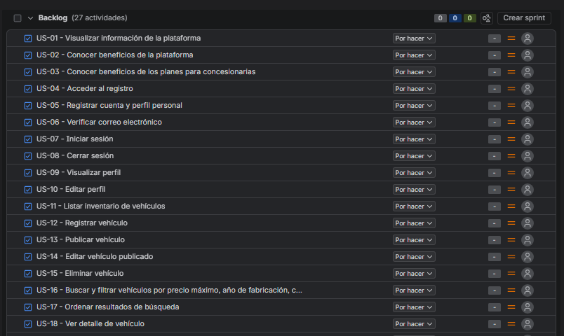
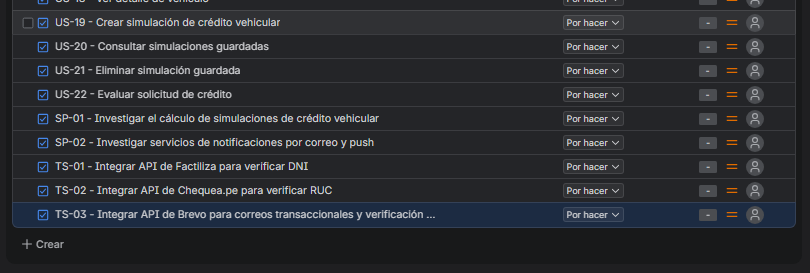

# Capítulo III: Requirements Specification

## 3.1. To-Be Scenario Mapping

**Segmento 1: Compradores interesados**

**Segmento 2: Concesionarias de vehículos nuevos**

**Segmento 3: Concesionarias de vehículos usados**

* **Enlace interactivo del tablero en Miro:** [https://miro.com/app/board/uXjVHpkhWe4=/?share_link_id=221895309503](https://miro.com/app/board/uXjVHpkhWe4=/?share_link_id=221895309503)

## 3.2. User Stories

En esta sección se definen los requisitos funcionales, no funcionales y técnicos de SmartFinance Drive mediante un conjunto estructurado de Epics y User Stories. La redacción contempla los tres segmentos objetivo (Compradores, Concesionarias de nuevos y Concesionarias de usados), así como las historias técnicas necesarias para la viabilidad de la plataforma.

**US-01 — Visualizar información de la plataforma**

+---------------------------+--------------------------------------------------------------------------------------+
| Campo                     | Detalle                                                                              |
+===========================+======================================================================================+
| **User**                  | Visitante                                                                            |
+---------------------------+--------------------------------------------------------------------------------------+
| **Priority**              | Alta                                                                                 |
+---------------------------+--------------------------------------------------------------------------------------+
| **Epic**                  | Landing Page y captación                                                             |
+---------------------------+--------------------------------------------------------------------------------------+
| **Description**           | Como Visitante, quiero visualizar información general de la plataforma, para conocer |
|                           | su propósito, funcionamiento y propuesta de valor antes de registrarme.              |
+---------------------------+--------------------------------------------------------------------------------------+
| **Acceptance Criteria**   | **Escenario 1 — Visualización de información**\                                      |
|                           | **Dado** que el visitante accede a la plataforma,\                                   |
|                           | **Cuando** consulta la información general del servicio,\                            |
|                           | **Entonces** puede visualizar información general sobre la plataforma y sus\         |
|                           | principales funcionalidades.\                                                        |
|                           | \                                                                                    |
|                           | **Escenario 2 — Navegación de información**\                                         |
|                           | **Dado** que el visitante consulta la información de la plataforma,\                 |
|                           | **Cuando** explora sus diferentes contenidos y servicios,\                           |
|                           | **Entonces** puede acceder a la información presentada de manera clara y organizada. |
+---------------------------+--------------------------------------------------------------------------------------+

 

**US-02 — Conocer beneficios de la plataforma**

+---------------------------+--------------------------------------------------------------------------------------+
| Campo                     | Detalle                                                                              |
+===========================+======================================================================================+
| **User**                  | Visitante                                                                            |
+---------------------------+--------------------------------------------------------------------------------------+
| **Priority**              | Alta                                                                                 |
+---------------------------+--------------------------------------------------------------------------------------+
| **Epic**                  | Landing Page y captación                                                             |
+---------------------------+--------------------------------------------------------------------------------------+
| **Description**           | Como Visitante, quiero conocer los beneficios de utilizar la plataforma, para        |
|                           | comprender cómo puede facilitar la búsqueda y gestión de opciones de financiamiento  |
|                           | vehicular.                                                                           |
+---------------------------+--------------------------------------------------------------------------------------+
| **Acceptance Criteria**   | **Escenario 1 — Visualización de beneficios**\                                       |
|                           | **Dado** que el visitante accede a la plataforma,\                                   |
|                           | **Cuando** consulta los beneficios de la solución,\                                  |
|                           | **Entonces** puede visualizar los principales beneficios ofrecidos por la\           |
|                           | plataforma.\                                                                         |
|                           | \                                                                                    |
|                           | **Escenario 2 — Información comprensible**\                                          |
|                           | **Dado** que el visitante revisa los beneficios,\                                    |
|                           | **Cuando** analiza cada propuesta de valor,\                                         |
|                           | **Entonces** la información se presenta de forma clara y comprensible.               |
+---------------------------+--------------------------------------------------------------------------------------+

 

**US-03 — Conocer beneficios de los planes para concesionarias**

+---------------------------+--------------------------------------------------------------------------------------+
| Campo                     | Detalle                                                                              |
+===========================+======================================================================================+
| **User**                  | Visitante                                                                            |
+---------------------------+--------------------------------------------------------------------------------------+
| **Priority**              | Alta                                                                                 |
+---------------------------+--------------------------------------------------------------------------------------+
| **Epic**                  | Landing Page y captación                                                             |
+---------------------------+--------------------------------------------------------------------------------------+
| **Description**           | Como Visitante, quiero conocer los beneficios de los planes disponibles, para        |
|                           | identificar qué opción se adapta a las necesidades de una concesionaria.             |
+---------------------------+--------------------------------------------------------------------------------------+
| **Acceptance Criteria**   | **Escenario 1 — Visualización de planes**\                                           |
|                           | **Dado** que el visitante requiere evaluar las opciones de suscripción,\             |
|                           | **Cuando** consulta los planes comerciales disponibles,\                             |
|                           | **Entonces** puede visualizar los planes ofrecidos y sus principales\                |
|                           | características.\                                                                    |
|                           | \                                                                                    |
|                           | **Escenario 2 — Comparación de beneficios**\                                         |
|                           | **Dado** que existen diferentes planes de membresía,\                                |
|                           | **Cuando** el visitante compara sus características y coberturas,\                   |
|                           | **Entonces** puede identificar las diferencias entre sus beneficios.                 |
+---------------------------+--------------------------------------------------------------------------------------+

 

**US-04 — Acceder al registro**

+---------------------------+--------------------------------------------------------------------------------------+
| Campo                     | Detalle                                                                              |
+===========================+======================================================================================+
| **User**                  | Visitante                                                                            |
+---------------------------+--------------------------------------------------------------------------------------+
| **Priority**              | Alta                                                                                 |
+---------------------------+--------------------------------------------------------------------------------------+
| **Epic**                  | Landing Page y captación                                                             |
+---------------------------+--------------------------------------------------------------------------------------+
| **Description**           | Como Visitante, quiero acceder al registro desde la plataforma, para crear una       |
|                           | cuenta y utilizar sus funcionalidades.                                               |
+---------------------------+--------------------------------------------------------------------------------------+
| **Acceptance Criteria**   | **Escenario 1 — Acceso al registro**\                                                |
|                           | **Dado** que el visitante no cuenta con una cuenta registrada,\                      |
|                           | **Cuando** solicita registrarse en la plataforma,\                                   |
|                           | **Entonces** la plataforma inicia el proceso de registro de cuenta.\                 |
|                           | \                                                                                    |
|                           | **Escenario 2 — Inicio del registro**\                                               |
|                           | **Dado** que el visitante inicia el proceso de registro,\                            |
|                           | **Cuando** proporciona los datos requeridos para la creación de cuenta,\             |
|                           | **Entonces** puede ingresar la información necesaria para registrarse.               |
+---------------------------+--------------------------------------------------------------------------------------+

 

**US-05 — Registrar cuenta y perfil personal**

+---------------------------+--------------------------------------------------------------------------------------+
| Campo                     | Detalle                                                                              |
+===========================+======================================================================================+
| **User**                  | Visitante                                                                            |
+---------------------------+--------------------------------------------------------------------------------------+
| **Priority**              | Alta                                                                                 |
+---------------------------+--------------------------------------------------------------------------------------+
| **Epic**                  | Gestión de acceso y cuenta                                                           |
+---------------------------+--------------------------------------------------------------------------------------+
| **Description**           | Como Visitante, quiero registrar una cuenta y completar mi perfil personal, para     |
|                           | acceder a las funcionalidades disponibles para usuarios registrados.                 |
+---------------------------+--------------------------------------------------------------------------------------+
| **Acceptance Criteria**   | **Escenario 1 — Registro exitoso**\                                                  |
|                           | **Dado** que el visitante inicia su registro en la plataforma,\                      |
|                           | **Cuando** completa correctamente los campos obligatorios y confirma su solicitud,\  |
|                           | **Entonces** la plataforma crea su cuenta y solicita la verificación del correo\     |
|                           | electrónico.\                                                                        |
|                           | \                                                                                    |
|                           | **Escenario 2 — Datos incompletos**\                                                 |
|                           | **Dado** que el visitante intenta registrarse,\                                      |
|                           | **Cuando** omite información obligatoria o proporciona datos inválidos,\             |
|                           | **Entonces** la plataforma informa los campos que deben corregirse y no procesa el\  |
|                           | registro.                                                                            |
+---------------------------+--------------------------------------------------------------------------------------+

 

**US-06 — Verificar correo electrónico**

+---------------------------+--------------------------------------------------------------------------------------+
| Campo                     | Detalle                                                                              |
+===========================+======================================================================================+
| **User**                  | Usuario Registrado                                                                   |
+---------------------------+--------------------------------------------------------------------------------------+
| **Priority**              | Alta                                                                                 |
+---------------------------+--------------------------------------------------------------------------------------+
| **Epic**                  | Gestión de acceso y cuenta                                                           |
+---------------------------+--------------------------------------------------------------------------------------+
| **Description**           | Como Usuario Registrado, quiero verificar mi correo electrónico, para confirmar la   |
|                           | propiedad de mi cuenta y habilitar su uso.                                           |
+---------------------------+--------------------------------------------------------------------------------------+
| **Acceptance Criteria**   | **Escenario 1 — Verificación exitosa**\                                              |
|                           | **Dado** que el usuario se registró y recibió un código o enlace de verificación,\   |
|                           | **Cuando** utiliza un mecanismo de verificación válido,\                             |
|                           | **Entonces** la plataforma verifica su correo electrónico y actualiza el estado de\  |
|                           | la cuenta a activa.\                                                                 |
|                           | \                                                                                    |
|                           | **Escenario 2 — Enlace inválido o vencido**\                                         |
|                           | **Dado** que el usuario intenta verificar su correo,\                                |
|                           | **Cuando** utiliza un código o enlace inválido o vencido,\                           |
|                           | **Entonces** la plataforma informa que debe solicitar una nueva verificación.        |
+---------------------------+--------------------------------------------------------------------------------------+

 

**US-07 — Iniciar sesión**

+---------------------------+--------------------------------------------------------------------------------------+
| Campo                     | Detalle                                                                              |
+===========================+======================================================================================+
| **User**                  | Usuario Registrado                                                                   |
+---------------------------+--------------------------------------------------------------------------------------+
| **Priority**              | Alta                                                                                 |
+---------------------------+--------------------------------------------------------------------------------------+
| **Epic**                  | Gestión de acceso y cuenta                                                           |
+---------------------------+--------------------------------------------------------------------------------------+
| **Description**           | Como Usuario Registrado, quiero iniciar sesión, para acceder de forma segura a las   |
|                           | funcionalidades correspondientes a mi cuenta.                                        |
+---------------------------+--------------------------------------------------------------------------------------+
| **Acceptance Criteria**   | **Escenario 1 — Inicio de sesión exitoso**\                                          |
|                           | **Dado** que el usuario posee una cuenta activa y verificada,\                       |
|                           | **Cuando** proporciona credenciales válidas para autenticarse,\                      |
|                           | **Entonces** la plataforma inicia su sesión y habilita los permisos\                 |
|                           | correspondientes a su rol.\                                                          |
|                           | \                                                                                    |
|                           | **Escenario 2 — Credenciales incorrectas**\                                          |
|                           | **Dado** que el usuario intenta autenticarse,\                                       |
|                           | **Cuando** proporciona credenciales incorrectas,\                                    |
|                           | **Entonces** la plataforma rechaza el acceso e informa que las credenciales no son\  |
|                           | válidas.                                                                             |
+---------------------------+--------------------------------------------------------------------------------------+

 

**US-08 — Cerrar sesión**

+---------------------------+--------------------------------------------------------------------------------------+
| Campo                     | Detalle                                                                              |
+===========================+======================================================================================+
| **User**                  | Usuario Autenticado                                                                  |
+---------------------------+--------------------------------------------------------------------------------------+
| **Priority**              | Alta                                                                                 |
+---------------------------+--------------------------------------------------------------------------------------+
| **Epic**                  | Gestión de acceso y cuenta                                                           |
+---------------------------+--------------------------------------------------------------------------------------+
| **Description**           | Como Usuario Autenticado, quiero cerrar mi sesión, para finalizar de forma segura mi |
|                           | acceso a la plataforma.                                                              |
+---------------------------+--------------------------------------------------------------------------------------+
| **Acceptance Criteria**   | **Escenario 1 — Cierre exitoso**\                                                    |
|                           | **Dado** que el usuario tiene una sesión activa,\                                    |
|                           | **Cuando** solicita cerrar su sesión activa,\                                        |
|                           | **Entonces** la plataforma finaliza la sesión activa y revoca el acceso a recursos\  |
|                           | protegidos.\                                                                         |
|                           | \                                                                                    |
|                           | **Escenario 2 — Acceso posterior**\                                                  |
|                           | **Dado** que el usuario cerró su sesión activa,\                                     |
|                           | **Cuando** intenta acceder a una funcionalidad protegida,\                           |
|                           | **Entonces** la plataforma solicita autenticarse nuevamente.                         |
+---------------------------+--------------------------------------------------------------------------------------+

 

**US-09 — Visualizar perfil**

+---------------------------+--------------------------------------------------------------------------------------+
| Campo                     | Detalle                                                                              |
+===========================+======================================================================================+
| **User**                  | Usuario Autenticado                                                                  |
+---------------------------+--------------------------------------------------------------------------------------+
| **Priority**              | Media                                                                                |
+---------------------------+--------------------------------------------------------------------------------------+
| **Epic**                  | Gestión de perfil y roles                                                            |
+---------------------------+--------------------------------------------------------------------------------------+
| **Description**           | Como Usuario Autenticado, quiero visualizar mi perfil, para consultar la información |
|                           | asociada a mi cuenta.                                                                |
+---------------------------+--------------------------------------------------------------------------------------+
| **Acceptance Criteria**   | **Escenario 1 — Visualización del perfil**\                                          |
|                           | **Dado** que el usuario está autenticado,\                                           |
|                           | **Cuando** consulta la información de su perfil,\                                    |
|                           | **Entonces** la plataforma presenta sus datos registrados y roles asociados.\        |
|                           | \                                                                                    |
|                           | **Escenario 2 — Información actualizada**\                                           |
|                           | **Dado** que el usuario posee información personal registrada,\                      |
|                           | **Cuando** consulta los datos de su perfil,\                                         |
|                           | **Entonces** visualiza la información almacenada actualmente.                        |
+---------------------------+--------------------------------------------------------------------------------------+

 

**US-10 — Editar perfil**

+---------------------------+--------------------------------------------------------------------------------------+
| Campo                     | Detalle                                                                              |
+===========================+======================================================================================+
| **User**                  | Usuario Autenticado                                                                  |
+---------------------------+--------------------------------------------------------------------------------------+
| **Priority**              | Media                                                                                |
+---------------------------+--------------------------------------------------------------------------------------+
| **Epic**                  | Gestión de perfil y roles                                                            |
+---------------------------+--------------------------------------------------------------------------------------+
| **Description**           | Como Usuario Autenticado, quiero editar mis datos personales, para mantener mi       |
|                           | perfil actualizado.                                                                  |
+---------------------------+--------------------------------------------------------------------------------------+
| **Acceptance Criteria**   | **Escenario 1 — Edición exitosa**\                                                   |
|                           | **Dado** que el usuario tiene una sesión activa y puede modificar sus datos\         |
|                           | personales,\                                                                         |
|                           | **Cuando** modifica datos permitidos y confirma los cambios,\                        |
|                           | **Entonces** la plataforma actualiza la información de su perfil.\                   |
|                           | \                                                                                    |
|                           | **Escenario 2 — Información inválida**\                                              |
|                           | **Dado** que el usuario modifica su información personal,\                           |
|                           | **Cuando** proporciona datos que no cumplen las validaciones requeridas,\            |
|                           | **Entonces** la plataforma informa los errores y no guarda los datos inválidos.      |
+---------------------------+--------------------------------------------------------------------------------------+

 

**US-11 — Listar inventario de vehículos**

+---------------------------+--------------------------------------------------------------------------------------+
| Campo                     | Detalle                                                                              |
+===========================+======================================================================================+
| **User**                  | Concesionaria                                                                        |
+---------------------------+--------------------------------------------------------------------------------------+
| **Priority**              | Alta                                                                                 |
+---------------------------+--------------------------------------------------------------------------------------+
| **Epic**                  | Gestión de inventario de vehículos                                                   |
+---------------------------+--------------------------------------------------------------------------------------+
| **Description**           | Como Concesionaria, quiero visualizar mi inventario de vehículos, para administrar   |
|                           | las unidades disponibles en la plataforma.                                           |
+---------------------------+--------------------------------------------------------------------------------------+
| **Acceptance Criteria**   | **Escenario 1 — Inventario disponible**\                                             |
|                           | **Dado** que la concesionaria posee vehículos registrados,\                          |
|                           | **Cuando** consulta su inventario de unidades,\                                      |
|                           | **Entonces** la plataforma presenta la relación de vehículos asociados a su cuenta.\ |
|                           | \                                                                                    |
|                           | **Escenario 2 — Inventario vacío**\                                                  |
|                           | **Dado** que la concesionaria no tiene vehículos registrados en su inventario,\      |
|                           | **Cuando** realiza la consulta,\                                                     |
|                           | **Entonces** la plataforma informa que no cuenta con vehículos en inventario.        |
+---------------------------+--------------------------------------------------------------------------------------+

 

**US-12 — Registrar vehículo**

+---------------------------+--------------------------------------------------------------------------------------+
| Campo                     | Detalle                                                                              |
+===========================+======================================================================================+
| **User**                  | Concesionaria                                                                        |
+---------------------------+--------------------------------------------------------------------------------------+
| **Priority**              | Alta                                                                                 |
+---------------------------+--------------------------------------------------------------------------------------+
| **Epic**                  | Gestión de inventario de vehículos                                                   |
+---------------------------+--------------------------------------------------------------------------------------+
| **Description**           | Como Concesionaria, quiero registrar un vehículo, para incorporarlo a mi inventario  |
|                           | y posteriormente publicarlo en la plataforma.                                        |
+---------------------------+--------------------------------------------------------------------------------------+
| **Acceptance Criteria**   | **Escenario 1 — Registro exitoso**\                                                  |
|                           | **Dado** que la concesionaria cuenta con la información técnica y comercial de un\   |
|                           | vehículo,\                                                                           |
|                           | **Cuando** ingresa todos los datos obligatorios válidos y confirma el registro,\     |
|                           | **Entonces** la plataforma almacena el vehículo en su inventario.\                   |
|                           | \                                                                                    |
|                           | **Escenario 2 — Datos incompletos**\                                                 |
|                           | **Dado** que la concesionaria intenta registrar un vehículo,\                        |
|                           | **Cuando** omite datos obligatorios o proporciona información inválida,\             |
|                           | **Entonces** la plataforma impide el registro e indica la información faltante.      |
+---------------------------+--------------------------------------------------------------------------------------+

 

**US-13 — Publicar vehículo**

+---------------------------+--------------------------------------------------------------------------------------+
| Campo                     | Detalle                                                                              |
+===========================+======================================================================================+
| **User**                  | Concesionaria                                                                        |
+---------------------------+--------------------------------------------------------------------------------------+
| **Priority**              | Alta                                                                                 |
+---------------------------+--------------------------------------------------------------------------------------+
| **Epic**                  | Gestión de inventario de vehículos                                                   |
+---------------------------+--------------------------------------------------------------------------------------+
| **Description**           | Como Concesionaria, quiero publicar un vehículo registrado, para permitir que los    |
|                           | compradores puedan visualizarlo y considerarlo para una compra.                      |
+---------------------------+--------------------------------------------------------------------------------------+
| **Acceptance Criteria**   | **Escenario 1 — Publicación exitosa**\                                               |
|                           | **Dado** que la concesionaria tiene un vehículo en inventario con información\       |
|                           | completa,\                                                                           |
|                           | **Cuando** solicita publicar el vehículo,\                                           |
|                           | **Entonces** el vehículo cambia a estado publicado y queda disponible para los\      |
|                           | compradores.\                                                                        |
|                           | \                                                                                    |
|                           | **Escenario 2 — Información incompleta**\                                            |
|                           | **Dado** que un vehículo no cumple con los requisitos mínimos de publicación,\       |
|                           | **Cuando** la concesionaria intenta publicarlo,\                                     |
|                           | **Entonces** la plataforma impide la publicación e indica los requisitos pendientes. |
+---------------------------+--------------------------------------------------------------------------------------+

 

**US-14 — Editar vehículo publicado**

+---------------------------+--------------------------------------------------------------------------------------+
| Campo                     | Detalle                                                                              |
+===========================+======================================================================================+
| **User**                  | Concesionaria                                                                        |
+---------------------------+--------------------------------------------------------------------------------------+
| **Priority**              | Media                                                                                |
+---------------------------+--------------------------------------------------------------------------------------+
| **Epic**                  | Gestión de inventario de vehículos                                                   |
+---------------------------+--------------------------------------------------------------------------------------+
| **Description**           | Como Concesionaria, quiero editar la información de un vehículo publicado, para      |
|                           | mantener actualizados sus datos.                                                     |
+---------------------------+--------------------------------------------------------------------------------------+
| **Acceptance Criteria**   | **Escenario 1 — Edición exitosa**\                                                   |
|                           | **Dado** que existe un vehículo publicado perteneciente a la concesionaria,\         |
|                           | **Cuando** modifica campos permitidos con información válida y guarda los cambios,\  |
|                           | **Entonces** la plataforma actualiza los datos del vehículo.\                        |
|                           | \                                                                                    |
|                           | **Escenario 2 — Datos inválidos**\                                                   |
|                           | **Dado** que la concesionaria modifica la información de un vehículo,\               |
|                           | **Cuando** ingresa valores fuera de rango o datos no permitidos,\                    |
|                           | **Entonces** la plataforma rechaza los cambios e informa los errores\                |
|                           | correspondientes.                                                                    |
+---------------------------+--------------------------------------------------------------------------------------+

 

**US-15 — Eliminar vehículo**

+---------------------------+--------------------------------------------------------------------------------------+
| Campo                     | Detalle                                                                              |
+===========================+======================================================================================+
| **User**                  | Concesionaria                                                                        |
+---------------------------+--------------------------------------------------------------------------------------+
| **Priority**              | Media                                                                                |
+---------------------------+--------------------------------------------------------------------------------------+
| **Epic**                  | Gestión de inventario de vehículos                                                   |
+---------------------------+--------------------------------------------------------------------------------------+
| **Description**           | Como Concesionaria, quiero eliminar un vehículo de mi inventario, para retirar       |
|                           | unidades que ya no debo gestionar.                                                   |
+---------------------------+--------------------------------------------------------------------------------------+
| **Acceptance Criteria**   | **Escenario 1 — Eliminación exitosa**\                                               |
|                           | **Dado** que existe un vehículo en el inventario que no tiene procesos activos,\     |
|                           | **Cuando** la concesionaria confirma su eliminación,\                                |
|                           | **Entonces** la plataforma retira el vehículo del inventario y confirma la baja.\    |
|                           | \                                                                                    |
|                           | **Escenario 2 — Eliminación cancelada**\                                             |
|                           | **Dado** que la concesionaria inició la eliminación de un vehículo,\                 |
|                           | **Cuando** cancela la operación antes de confirmarla,\                               |
|                           | **Entonces** el vehículo permanece en el inventario sin modificaciones.              |
+---------------------------+--------------------------------------------------------------------------------------+

 

**US-16 — Buscar y filtrar vehículos por precio máximo, año de fabricación, condición y marca**

+---------------------------+--------------------------------------------------------------------------------------+
| Campo                     | Detalle                                                                              |
+===========================+======================================================================================+
| **User**                  | Comprador                                                                            |
+---------------------------+--------------------------------------------------------------------------------------+
| **Priority**              | Alta                                                                                 |
+---------------------------+--------------------------------------------------------------------------------------+
| **Epic**                  | Exploración y búsqueda de vehículos                                                  |
+---------------------------+--------------------------------------------------------------------------------------+
| **Description**           | Como Comprador, quiero buscar vehículos y filtrarlos por precio máximo, año de       |
|                           | fabricación, condición y marca, para encontrar opciones que se ajusten a mis         |
|                           | necesidades y preferencias.                                                          |
+---------------------------+--------------------------------------------------------------------------------------+
| **Acceptance Criteria**   | **Escenario 1 — Búsqueda de vehículos**\                                             |
|                           | **Dado** que existen vehículos publicados en la plataforma,\                         |
|                           | **Cuando** el comprador busca utilizando términos o palabras clave válidas,\         |
|                           | **Entonces** la plataforma presenta los vehículos que coinciden con los criterios\   |
|                           | de búsqueda.\                                                                        |
|                           | \                                                                                    |
|                           | **Escenario 2 — Aplicación de filtros por precio máximo, año de fabricación,\        |
|                           | condición y marca**\                                                                 |
|                           | **Dado** que existen vehículos publicados en la plataforma,\                         |
|                           | **Cuando** el comprador aplica uno o más de los filtros disponibles: precio\         |
|                           | máximo, año de fabricación, condición del vehículo, ya sea nuevo o usado, y marca,\  |
|                           | **Entonces** la plataforma muestra únicamente los vehículos cuyo precio no supera\   |
|                           | el máximo indicado y cuyo año de fabricación, condición y marca coinciden con los\   |
|                           | valores seleccionados.                                                               |
+---------------------------+--------------------------------------------------------------------------------------+

 

**US-17 — Ordenar resultados de búsqueda**

+---------------------------+--------------------------------------------------------------------------------------+
| Campo                     | Detalle                                                                              |
+===========================+======================================================================================+
| **User**                  | Comprador                                                                            |
+---------------------------+--------------------------------------------------------------------------------------+
| **Priority**              | Baja                                                                                 |
+---------------------------+--------------------------------------------------------------------------------------+
| **Epic**                  | Exploración y búsqueda de vehículos                                                  |
+---------------------------+--------------------------------------------------------------------------------------+
| **Description**           | Como Comprador, quiero ordenar los resultados de búsqueda, para visualizar primero   |
|                           | los vehículos según el criterio que me resulte más conveniente.                      |
+---------------------------+--------------------------------------------------------------------------------------+
| **Acceptance Criteria**   | **Escenario 1 — Ordenamiento exitoso**\                                              |
|                           | **Dado** que existen resultados de vehículos para una consulta,\                     |
|                           | **Cuando** el comprador define un criterio de ordenamiento,\                         |
|                           | **Entonces** la plataforma reorganiza los vehículos según el criterio solicitado.\   |
|                           | \                                                                                    |
|                           | **Escenario 2 — Cambio de orden**\                                                   |
|                           | **Dado** que los resultados se encuentran ordenados por un criterio previo,\         |
|                           | **Cuando** el comprador indica un criterio diferente,\                               |
|                           | **Entonces** la plataforma actualiza la secuencia de los resultados conforme a la\   |
|                           | nueva regla.                                                                         |
+---------------------------+--------------------------------------------------------------------------------------+

 

**US-18 — Ver detalle de vehículo**

+---------------------------+--------------------------------------------------------------------------------------+
| Campo                     | Detalle                                                                              |
+===========================+======================================================================================+
| **User**                  | Comprador                                                                            |
+---------------------------+--------------------------------------------------------------------------------------+
| **Priority**              | Alta                                                                                 |
+---------------------------+--------------------------------------------------------------------------------------+
| **Epic**                  | Exploración y búsqueda de vehículos                                                  |
+---------------------------+--------------------------------------------------------------------------------------+
| **Description**           | Como Comprador, quiero visualizar el detalle de un vehículo, para conocer sus        |
|                           | características antes de decidir si deseo solicitar financiamiento o contactar a la  |
|                           | concesionaria.                                                                       |
+---------------------------+--------------------------------------------------------------------------------------+
| **Acceptance Criteria**   | **Escenario 1 — Visualización del detalle**\                                         |
|                           | **Dado** que existe un vehículo publicado en la plataforma,\                         |
|                           | **Cuando** el comprador consulta la información detallada de la unidad,\             |
|                           | **Entonces** la plataforma presenta sus especificaciones técnicas, precio,\          |
|                           | imágenes y condiciones comerciales.\                                                 |
|                           | \                                                                                    |
|                           | **Escenario 2 — Vehículo no disponible**\                                            |
|                           | **Dado** que un vehículo ha dejado de estar publicado o fue dado de baja,\           |
|                           | **Cuando** el comprador intenta consultar su información,\                           |
|                           | **Entonces** la plataforma informa que el vehículo ya no se encuentra disponible.    |
+---------------------------+--------------------------------------------------------------------------------------+

 

**US-19 — Crear simulación de crédito vehicular**

+---------------------------+--------------------------------------------------------------------------------------+
| Campo                     | Detalle                                                                              |
+===========================+======================================================================================+
| **User**                  | Comprador                                                                            |
+---------------------------+--------------------------------------------------------------------------------------+
| **Priority**              | Alta                                                                                 |
+---------------------------+--------------------------------------------------------------------------------------+
| **Epic**                  | Simulación y seguimiento crediticio                                                  |
+---------------------------+--------------------------------------------------------------------------------------+
| **Description**           | Como Comprador, quiero crear una simulación de crédito vehicular, para conocer las   |
|                           | condiciones aproximadas de financiamiento de un vehículo.                            |
+---------------------------+--------------------------------------------------------------------------------------+
| **Acceptance Criteria**   | **Escenario 1 — Simulación exitosa**\                                                |
|                           | **Dado** que el comprador vincula un vehículo y define monto inicial, plazo y tasa\  |
|                           | de interés,\                                                                         |
|                           | **Cuando** solicita el cálculo de la simulación,\                                    |
|                           | **Entonces** la plataforma calcula y presenta la cuota estimada, intereses\          |
|                           | proyectados y costo total del crédito.\                                              |
|                           | \                                                                                    |
|                           | **Escenario 2 — Datos insuficientes**\                                               |
|                           | **Dado** que el comprador intenta realizar una simulación,\                          |
|                           | **Cuando** omite parámetros financieros obligatorios o introduce valores\            |
|                           | inconsistentes,\                                                                     |
|                           | **Entonces** la plataforma solicita completar y corregir la información antes de\    |
|                           | procesar el cálculo.                                                                 |
+---------------------------+--------------------------------------------------------------------------------------+

 

**US-20 — Consultar simulaciones guardadas**

+---------------------------+--------------------------------------------------------------------------------------+
| Campo                     | Detalle                                                                              |
+===========================+======================================================================================+
| **User**                  | Comprador                                                                            |
+---------------------------+--------------------------------------------------------------------------------------+
| **Priority**              | Media                                                                                |
+---------------------------+--------------------------------------------------------------------------------------+
| **Epic**                  | Simulación y seguimiento crediticio                                                  |
+---------------------------+--------------------------------------------------------------------------------------+
| **Description**           | Como Comprador, quiero consultar mis simulaciones guardadas, para revisar nuevamente |
|                           | las opciones de financiamiento que evalué anteriormente.                             |
+---------------------------+--------------------------------------------------------------------------------------+
| **Acceptance Criteria**   | **Escenario 1 — Simulaciones disponibles**\                                          |
|                           | **Dado** que el comprador posee simulaciones previamente almacenadas en su cuenta,\  |
|                           | **Cuando** consulta su registro de simulaciones,\                                    |
|                           | **Entonces** la plataforma presenta el listado de simulaciones guardadas con sus\    |
|                           | condiciones estimadas.\                                                              |
|                           | \                                                                                    |
|                           | **Escenario 2 — Sin simulaciones**\                                                  |
|                           | **Dado** que el comprador no cuenta con simulaciones guardadas,\                     |
|                           | **Cuando** solicita la consulta de su historial,\                                    |
|                           | **Entonces** la plataforma informa que no existen simulaciones registradas.          |
+---------------------------+--------------------------------------------------------------------------------------+

 

**US-21 — Eliminar simulación guardada**

+---------------------------+--------------------------------------------------------------------------------------+
| Campo                     | Detalle                                                                              |
+===========================+======================================================================================+
| **User**                  | Comprador                                                                            |
+---------------------------+--------------------------------------------------------------------------------------+
| **Priority**              | Baja                                                                                 |
+---------------------------+--------------------------------------------------------------------------------------+
| **Epic**                  | Simulación y seguimiento crediticio                                                  |
+---------------------------+--------------------------------------------------------------------------------------+
| **Description**           | Como Comprador, quiero eliminar una simulación guardada, para mantener organizada mi |
|                           | lista y retirar simulaciones que ya no necesito consultar.                           |
+---------------------------+--------------------------------------------------------------------------------------+
| **Acceptance Criteria**   | **Escenario 1 — Eliminación exitosa**\                                               |
|                           | **Dado** que el comprador tiene una simulación almacenada en su cuenta,\             |
|                           | **Cuando** confirma la eliminación de dicha simulación,\                             |
|                           | **Entonces** la plataforma retira el registro de su cuenta y confirma la operación.\ |
|                           | \                                                                                    |
|                           | **Escenario 2 — Eliminación cancelada**\                                             |
|                           | **Dado** que el comprador inició la eliminación de una simulación guardada,\         |
|                           | **Cuando** cancela la operación antes de confirmarla,\                               |
|                           | **Entonces** la simulación permanece almacenada sin alteraciones.                    |
+---------------------------+--------------------------------------------------------------------------------------+

 

**US-22 — Evaluar solicitud de crédito**

+---------------------------+--------------------------------------------------------------------------------------+
| Campo                     | Detalle                                                                              |
+===========================+======================================================================================+
| **User**                  | Entidad Financiera                                                                   |
+---------------------------+--------------------------------------------------------------------------------------+
| **Priority**              | Alta                                                                                 |
+---------------------------+--------------------------------------------------------------------------------------+
| **Epic**                  | Evaluación y gestión de solicitudes de crédito                                       |
+---------------------------+--------------------------------------------------------------------------------------+
| **Description**           | Como Entidad Financiera, quiero evaluar una solicitud de crédito, para determinar su |
|                           | resultado de acuerdo con las condiciones y criterios definidos.                      |
+---------------------------+--------------------------------------------------------------------------------------+
| **Acceptance Criteria**   | **Escenario 1 — Evaluación aprobada**\                                               |
|                           | **Dado** que la entidad financiera cuenta con un expediente asignado y la\           |
|                           | documentación conforme,\                                                             |
|                           | **Cuando** registra el dictamen favorable de la solicitud,\                          |
|                           | **Entonces** la plataforma actualiza el estado del crédito a aprobado y asocia las\  |
|                           | condiciones acordadas.\                                                              |
|                           | \                                                                                    |
|                           | **Escenario 2 — Evaluación rechazada**\                                              |
|                           | **Dado** que un expediente no cumple con los requisitos crediticios de la entidad,\  |
|                           | **Cuando** se registra el dictamen desfavorable justificando el motivo,\             |
|                           | **Entonces** la plataforma actualiza el estado a rechazado y registra las causales\  |
|                           | correspondientes.                                                                    |
+---------------------------+--------------------------------------------------------------------------------------+

 

**SP-01 — Investigar el cálculo de simulaciones de crédito vehicular**

+---------------------------+--------------------------------------------------------------------------------------+
| Campo                     | Detalle                                                                              |
+===========================+======================================================================================+
| **User**                  | Developer                                                                            |
+---------------------------+--------------------------------------------------------------------------------------+
| **Priority**              | Alta                                                                                 |
+---------------------------+--------------------------------------------------------------------------------------+
| **Epic**                  | Simulación y seguimiento crediticio                                                  |
+---------------------------+--------------------------------------------------------------------------------------+
| **Description**           | Como Developer, quiero investigar las variables y fórmulas financieras para el       |
|                           | cálculo de cuotas de crédito vehicular, con el objetivo de determinar la viabilidad  |
|                           | técnica y definir el algoritmo que produzca resultados exactos según las tasas del   |
|                           | mercado.                                                                             |
+---------------------------+--------------------------------------------------------------------------------------+
| **Acceptance Criteria**   | **Escenario 1 — Análisis y documentación de reglas de cálculo**\                     |
|                           | **Dado** que se requiere exactitud financiera en la simulación de créditos\          |
|                           | vehiculares,\                                                                        |
|                           | **Cuando** se investigan y validan las variables, fórmulas y tasas de interés\       |
|                           | aplicables,\                                                                         |
|                           | **Entonces** se presenta un documento técnico que detalla el algoritmo de cálculo,\  |
|                           | los datos de entrada requeridos y los casos de uso esperados.\                       |
|                           | \                                                                                    |
|                           | **Escenario 2 — Prototipo funcional de prueba**\                                     |
|                           | **Dado** que se cuenta con el algoritmo de cálculo documentado,\                     |
|                           | **Cuando** se ejecuta una prueba de concepto aislada con datos reales de\            |
|                           | simulación,\                                                                         |
|                           | **Entonces** se entrega un prototipo funcional mínimo que valide los resultados\     |
|                           | obtenidos frente a los valores esperados, adjuntando las conclusiones técnicas.      |
+---------------------------+--------------------------------------------------------------------------------------+

 

**SP-02 — Investigar servicios de notificaciones por correo y push**

+---------------------------+--------------------------------------------------------------------------------------+
| Campo                     | Detalle                                                                              |
+===========================+======================================================================================+
| **User**                  | Developer                                                                            |
+---------------------------+--------------------------------------------------------------------------------------+
| **Priority**              | Media                                                                                |
+---------------------------+--------------------------------------------------------------------------------------+
| **Epic**                  | Simulación y seguimiento crediticio                                                  |
+---------------------------+--------------------------------------------------------------------------------------+
| **Description**           | Como Developer, quiero investigar pasarelas y servicios de mensajería, con el        |
|                           | objetivo de seleccionar la herramienta más eficiente y compatible con nuestro        |
|                           | backend para automatizar las notificaciones de cambio de estado en los créditos.     |
+---------------------------+--------------------------------------------------------------------------------------+
| **Acceptance Criteria**   | **Escenario 1 — Matriz comparativa de servicios de notificación**\                   |
|                           | **Dado** que el sistema necesita comunicar eventos en tiempo real a los\             |
|                           | compradores,\                                                                        |
|                           | **Cuando** se investigan proveedores de notificaciones,\                             |
|                           | **Entonces** se documenta una matriz de evaluación que incluya compatibilidad,\      |
|                           | cuotas gratuitas, latencia y facilidad de integración con Spring Boot.\              |
|                           | \                                                                                    |
|                           | **Escenario 2 — Prueba funcional de envío**\                                         |
|                           | **Dado** que se ha elegido un proveedor de notificaciones,\                          |
|                           | **Cuando** se configura la credencial de prueba y se simula un evento de solicitud\  |
|                           | aprobada,\                                                                           |
|                           | **Entonces** se entrega un prototipo funcional mínimo que envía exitosamente un\     |
|                           | correo o notificación push de prueba, registrando las conclusiones técnicas.         |
+---------------------------+--------------------------------------------------------------------------------------+

 

**TS-01 — Integrar API de Factiliza para verificar DNI**

+---------------------------+--------------------------------------------------------------------------------------+
| Campo                     | Detalle                                                                              |
+===========================+======================================================================================+
| **User**                  | Developer                                                                            |
+---------------------------+--------------------------------------------------------------------------------------+
| **Priority**              | Alta                                                                                 |
+---------------------------+--------------------------------------------------------------------------------------+
| **Epic**                  | Gestión de acceso y cuenta                                                           |
+---------------------------+--------------------------------------------------------------------------------------+
| **Description**           | Como Developer, quiero integrar la API de Factiliza en el backend para verificar     |
|                           | números de DNI peruanos, para que el sistema pueda obtener información de identidad  |
|                           | y validar los datos proporcionados por el usuario.                                   |
+---------------------------+--------------------------------------------------------------------------------------+
| **Acceptance Criteria**   | **Escenario 1 — Verificación de DNI exitosa**\                                       |
|                           | **Dado** que se cuenta con un número de DNI válido y con la clave de API de\         |
|                           | Factiliza configurada,\                                                              |
|                           | **Cuando** el backend envía la solicitud de verificación a la API de Factiliza,\     |
|                           | **Entonces** el sistema recibe una respuesta exitosa y procesa la información de\    |
|                           | identidad devuelta.\                                                                 |
|                           | \                                                                                    |
|                           | **Escenario 2 — Fallo en la verificación**\                                          |
|                           | **Dado** que el DNI es inválido o inexistente, las credenciales de Factiliza\        |
|                           | faltan o son incorrectas, o la API externa no está disponible o excede el tiempo\    |
|                           | de espera,\                                                                          |
|                           | **Cuando** el backend intenta verificar el DNI,\                                     |
|                           | **Entonces** el sistema maneja el error de forma controlada, no expone las\          |
|                           | credenciales, no registra información de identidad sin verificar y devuelve una\     |
|                           | respuesta de error apropiada.                                                        |
+---------------------------+--------------------------------------------------------------------------------------+

 

**TS-02 — Integrar API de Chequea.pe para verificar RUC**

+---------------------------+--------------------------------------------------------------------------------------+
| Campo                     | Detalle                                                                              |
+===========================+======================================================================================+
| **User**                  | Developer                                                                            |
+---------------------------+--------------------------------------------------------------------------------------+
| **Priority**              | Alta                                                                                 |
+---------------------------+--------------------------------------------------------------------------------------+
| **Epic**                  | Gestión de perfil y roles                                                            |
+---------------------------+--------------------------------------------------------------------------------------+
| **Description**           | Como Developer, quiero integrar la API de Chequea.pe en el backend para verificar    |
|                           | números de RUC peruanos, para que el sistema pueda obtener y validar la información  |
|                           | tributaria de las empresas.                                                          |
+---------------------------+--------------------------------------------------------------------------------------+
| **Acceptance Criteria**   | **Escenario 1 — Verificación de RUC exitosa**\                                       |
|                           | **Dado** que se cuenta con un número de RUC válido y con la clave de API de\         |
|                           | Chequea.pe configurada,\                                                             |
|                           | **Cuando** el backend envía la solicitud de verificación a la API de Chequea.pe,\    |
|                           | **Entonces** el sistema recibe una respuesta exitosa y procesa la información\       |
|                           | empresarial devuelta.\                                                               |
|                           | \                                                                                    |
|                           | **Escenario 2 — Fallo en la verificación**\                                          |
|                           | **Dado** que el RUC es inválido o inexistente, las credenciales de Chequea.pe\       |
|                           | faltan o son incorrectas, o la API externa no está disponible o excede el tiempo\    |
|                           | de espera,\                                                                          |
|                           | **Cuando** el backend intenta verificar el RUC,\                                     |
|                           | **Entonces** el sistema maneja el error de forma controlada, no expone las\          |
|                           | credenciales, no registra información empresarial sin verificar y devuelve una\      |
|                           | respuesta de error apropiada.                                                        |
+---------------------------+--------------------------------------------------------------------------------------+

 

**TS-03 — Integrar API de Brevo para correos transaccionales y verificación de correo**

+---------------------------+--------------------------------------------------------------------------------------+
| Campo                     | Detalle                                                                              |
+===========================+======================================================================================+
| **User**                  | Developer                                                                            |
+---------------------------+--------------------------------------------------------------------------------------+
| **Priority**              | Alta                                                                                 |
+---------------------------+--------------------------------------------------------------------------------------+
| **Epic**                  | Gestión de acceso y cuenta                                                           |
+---------------------------+--------------------------------------------------------------------------------------+
| **Description**           | Como Developer, quiero integrar la API de Brevo en el backend para enviar correos    |
|                           | transaccionales y comunicar los resultados del envío, para que el sistema pueda      |
|                           | entregar notificaciones y mensajes de verificación a los usuarios.                   |
+---------------------------+--------------------------------------------------------------------------------------+
| **Acceptance Criteria**   | **Escenario 1 — Envío de correo exitoso**\                                           |
|                           | **Dado** que se cuenta con un correo de destinatario con formato válido y con las\   |
|                           | credenciales de Brevo configuradas, y un usuario solicita su mensaje de\             |
|                           | verificación de correo,\                                                             |
|                           | **Cuando** el backend envía la solicitud de correo transaccional a Brevo,\           |
|                           | **Entonces** el sistema recibe la respuesta exitosa del proveedor, procesa el\       |
|                           | identificador o estado del mensaje y envía el mensaje de verificación al usuario.\   |
|                           | \                                                                                    |
|                           | **Escenario 2 — Fallo en el envío**\                                                 |
|                           | **Dado** que el correo del destinatario tiene un formato inválido, las\              |
|                           | credenciales de Brevo faltan o son incorrectas, o la API de Brevo no está\           |
|                           | disponible o excede el tiempo de espera,\                                            |
|                           | **Cuando** el backend intenta enviar el correo,\                                     |
|                           | **Entonces** el sistema rechaza las direcciones inválidas sin enviar la solicitud,\  |
|                           | maneja los demás errores de forma controlada sin exponer las credenciales y\         |
|                           | devuelve una respuesta de error apropiada.                                           |
+---------------------------+--------------------------------------------------------------------------------------+

 
## 3.3. Product Backlog

En esta sección se presenta el Product Backlog priorizado del proyecto. Siguiendo las directrices del curso, el orden de los elementos se ha determinado por el valor que aportan al negocio, colocando en las primeras posiciones las historias relacionadas con el sitio web estático (Landing Page) para asegurar su inclusión desde el primer sprint. Asimismo, se prioriza la visualización del catálogo y la propuesta de valor antes de las historias de autenticación.

La estimación utiliza la escala de Story Points (1, 2, 3, 5, 8).

+---------+-----------------+-------------------------------------+----------------------------------------------------------------------------------+----------------+
| \# Orden | User Story Id   | Título                              | Descripción                                                                      | Story Points   |
+=========+=================+=====================================+==================================================================================+================+
| 1       | US-01           | Visualizar información de la        | Como Visitante, quiero visualizar información general de la plataforma, para     | 2              |
|         |                 | plataforma                          | conocer su propósito, funcionamiento y propuesta de valor antes de registrarme.  |                |
+---------+-----------------+-------------------------------------+----------------------------------------------------------------------------------+----------------+
| 2       | US-02           | Conocer beneficios de la plataforma | Como Visitante, quiero conocer los beneficios de utilizar la plataforma, para    | 2              |
|         |                 |                                     | comprender cómo puede facilitar la búsqueda y gestión de opciones de             |                |
|         |                 |                                     | financiamiento vehicular.                                                        |                |
+---------+-----------------+-------------------------------------+----------------------------------------------------------------------------------+----------------+
| 3       | US-03           | Conocer beneficios de los planes    | Como Visitante, quiero conocer los beneficios de los planes disponibles, para    | 2              |
|         |                 | para concesionarias                 | identificar qué opción se adapta a las necesidades de una concesionaria.         |                |
+---------+-----------------+-------------------------------------+----------------------------------------------------------------------------------+----------------+
| 4       | US-04           | Acceder al registro                 | Como Visitante, quiero acceder al registro desde la plataforma, para crear una   | 1              |
|         |                 |                                     | cuenta y utilizar sus funcionalidades.                                           |                |
+---------+-----------------+-------------------------------------+----------------------------------------------------------------------------------+----------------+
| 5       | US-16           | Buscar y filtrar vehículos por      | Como Comprador, quiero buscar vehículos y filtrarlos por precio máximo, año de   | 5              |
|         |                 | precio máximo, año de fabricación,  | fabricación, condición y marca, para encontrar opciones que se ajusten a mis     |                |
|         |                 | condición y marca                   | necesidades y preferencias.                                                      |                |
+---------+-----------------+-------------------------------------+----------------------------------------------------------------------------------+----------------+
| 6       | US-18           | Ver detalle de vehículo             | Como Comprador, quiero visualizar el detalle de un vehículo, para conocer sus    | 3              |
|         |                 |                                     | características antes de decidir si deseo solicitar financiamiento o contactar a |                |
|         |                 |                                     | la concesionaria.                                                                |                |
+---------+-----------------+-------------------------------------+----------------------------------------------------------------------------------+----------------+
| 7       | SP-01           | Investigar el cálculo de            | Como Developer, quiero investigar las variables y fórmulas financieras para el   | 3              |
|         |                 | simulaciones de crédito vehicular   | cálculo de cuotas de crédito vehicular, con el objetivo de determinar la         |                |
|         |                 |                                     | viabilidad técnica y definir el algoritmo que produzca resultados exactos según  |                |
|         |                 |                                     | las tasas del mercado.                                                           |                |
+---------+-----------------+-------------------------------------+----------------------------------------------------------------------------------+----------------+
| 8       | US-19           | Crear simulación de crédito         | Como Comprador, quiero crear una simulación de crédito vehicular, para conocer   | 5              |
|         |                 | vehicular                           | las condiciones aproximadas de financiamiento de un vehículo.                    |                |
+---------+-----------------+-------------------------------------+----------------------------------------------------------------------------------+----------------+
| 9       | TS-01           | Integrar API de Factiliza para      | Como Developer, quiero integrar la API de Factiliza en el backend para verificar | 3              |
|         |                 | verificar DNI                       | números de DNI peruanos, para que el sistema pueda obtener información de        |                |
|         |                 |                                     | identidad y validar los datos proporcionados por el usuario.                     |                |
+---------+-----------------+-------------------------------------+----------------------------------------------------------------------------------+----------------+
| 10      | TS-03           | Integrar API de Brevo para correos  | Como Developer, quiero integrar la API de Brevo en el backend para enviar        | 5              |
|         |                 | transaccionales y verificación de   | correos transaccionales y comunicar los resultados del envío, para que el        |                |
|         |                 | correo                              | sistema pueda entregar notificaciones y mensajes de verificación a los usuarios. |                |
+---------+-----------------+-------------------------------------+----------------------------------------------------------------------------------+----------------+
| 11      | US-05           | Registrar cuenta y perfil personal  | Como Visitante, quiero registrar una cuenta y completar mi perfil personal, para | 3              |
|         |                 |                                     | acceder a las funcionalidades disponibles para usuarios registrados.             |                |
+---------+-----------------+-------------------------------------+----------------------------------------------------------------------------------+----------------+
| 12      | US-06           | Verificar correo electrónico        | Como Usuario Registrado, quiero verificar mi correo electrónico, para confirmar  | 2              |
|         |                 |                                     | la propiedad de mi cuenta y habilitar su uso.                                    |                |
+---------+-----------------+-------------------------------------+----------------------------------------------------------------------------------+----------------+
| 13      | US-07           | Iniciar sesión                      | Como Usuario Registrado, quiero iniciar sesión, para acceder de forma segura a   | 2              |
|         |                 |                                     | las funcionalidades correspondientes a mi cuenta.                                |                |
+---------+-----------------+-------------------------------------+----------------------------------------------------------------------------------+----------------+
| 14      | US-12           | Registrar vehículo                  | Como Concesionaria, quiero registrar un vehículo, para incorporarlo a mi         | 5              |
|         |                 |                                     | inventario y posteriormente publicarlo en la plataforma.                         |                |
+---------+-----------------+-------------------------------------+----------------------------------------------------------------------------------+----------------+
| 15      | US-13           | Publicar vehículo                   | Como Concesionaria, quiero publicar un vehículo registrado, para permitir que    | 3              |
|         |                 |                                     | los compradores puedan visualizarlo y considerarlo para una compra.              |                |
+---------+-----------------+-------------------------------------+----------------------------------------------------------------------------------+----------------+
| 16      | US-11           | Listar inventario de vehículos      | Como Concesionaria, quiero visualizar mi inventario de vehículos, para           | 3              |
|         |                 |                                     | administrar las unidades disponibles en la plataforma.                           |                |
+---------+-----------------+-------------------------------------+----------------------------------------------------------------------------------+----------------+
| 17      | US-22           | Evaluar solicitud de crédito        | Como Entidad Financiera, quiero evaluar una solicitud de crédito, para           | 5              |
|         |                 |                                     | determinar su resultado de acuerdo con las condiciones y criterios definidos.    |                |
+---------+-----------------+-------------------------------------+----------------------------------------------------------------------------------+----------------+
| 18      | US-08           | Cerrar sesión                       | Como Usuario Autenticado, quiero cerrar mi sesión, para finalizar de forma       | 1              |
|         |                 |                                     | segura mi acceso a la plataforma.                                                |                |
+---------+-----------------+-------------------------------------+----------------------------------------------------------------------------------+----------------+
| 19      | US-14           | Editar vehículo publicado           | Como Concesionaria, quiero editar la información de un vehículo publicado, para  | 2              |
|         |                 |                                     | mantener actualizados sus datos.                                                 |                |
+---------+-----------------+-------------------------------------+----------------------------------------------------------------------------------+----------------+
| 20      | US-20           | Consultar simulaciones guardadas    | Como Comprador, quiero consultar mis simulaciones guardadas, para revisar        | 2              |
|         |                 |                                     | nuevamente las opciones de financiamiento que evalué anteriormente.              |                |
+---------+-----------------+-------------------------------------+----------------------------------------------------------------------------------+----------------+
| 21      | US-09           | Visualizar perfil                   | Como Usuario Autenticado, quiero visualizar mi perfil, para consultar la         | 2              |
|         |                 |                                     | información asociada a mi cuenta.                                                |                |
+---------+-----------------+-------------------------------------+----------------------------------------------------------------------------------+----------------+
| 22      | US-10           | Editar perfil                       | Como Usuario Autenticado, quiero editar mis datos personales, para mantener mi   | 2              |
|         |                 |                                     | perfil actualizado.                                                              |                |
+---------+-----------------+-------------------------------------+----------------------------------------------------------------------------------+----------------+
| 23      | US-15           | Eliminar vehículo                   | Como Concesionaria, quiero eliminar un vehículo de mi inventario, para retirar   | 2              |
|         |                 |                                     | unidades que ya no debo gestionar.                                               |                |
+---------+-----------------+-------------------------------------+----------------------------------------------------------------------------------+----------------+
| 24      | US-17           | Ordenar resultados de búsqueda      | Como Comprador, quiero ordenar los resultados de búsqueda, para visualizar       | 1              |
|         |                 |                                     | primero los vehículos según el criterio que me resulte más conveniente.          |                |
+---------+-----------------+-------------------------------------+----------------------------------------------------------------------------------+----------------+
| 25      | US-21           | Eliminar simulación guardada        | Como Comprador, quiero eliminar una simulación guardada, para mantener           | 1              |
|         |                 |                                     | organizada mi lista y retirar simulaciones que ya no necesito consultar.         |                |
+---------+-----------------+-------------------------------------+----------------------------------------------------------------------------------+----------------+
| 26      | TS-02           | Integrar API de Chequea.pe para     | Como Developer, quiero integrar la API de Chequea.pe en el backend para          | 3              |
|         |                 | verificar RUC                       | verificar números de RUC peruanos, para que el sistema pueda obtener y validar   |                |
|         |                 |                                     | la información tributaria de las empresas.                                       |                |
+---------+-----------------+-------------------------------------+----------------------------------------------------------------------------------+----------------+
| 27      | SP-02           | Investigar servicios de             | Como Developer, quiero investigar pasarelas y servicios de mensajería, con el    | 2              |
|         |                 | notificaciones por correo y push    | objetivo de seleccionar la herramienta más eficiente y compatible con nuestro    |                |
|         |                 |                                     | backend para automatizar las notificaciones de cambio de estado en los créditos. |                |
+---------+-----------------+-------------------------------------+----------------------------------------------------------------------------------+----------------+

**Gestión del Product Backlog en Jira**

El Product Backlog del proyecto se gestiona en Jira:

- **Enlace del tablero en Jira:** [https://smartdrive-finance.atlassian.net/jira/software/projects/PB/boards/2/backlog](https://smartdrive-finance.atlassian.net/jira/software/projects/PB/boards/2/backlog)

**Evidencia del Product Backlog en Jira:**

## 3.4. Impact Mapping

En esta sección el equipo explica y presenta el Impact Mapping para el modelo de negocio digital de SmartFinance Drive, elaborado en la herramienta UXPressia. Para su desarrollo, tomamos como base las fichas de los User Personas elaboradas previamente.

El proceso inició con la definición de un objetivo de negocio principal (Business Goal) estructurado bajo criterios SMART para asegurar su medición. A partir de esta meta general, el mapa se ramifica respondiendo a las siguientes interrogantes estratégicas:

* **Actors/Personas:** ¿Quiénes nos ayudarán a lograr la meta? (Alineados directamente con nuestros tres segmentos objetivo).

* **Impacts:** ¿Qué tendrían que hacer o cómo esperamos que cambien su comportamiento para ayudar a lograr la meta?

* **Deliverables:** ¿Qué podemos hacer o construir como negocio digital para provocar esos impactos?

* **User Stories:** ¿Cuáles son las historias de usuario específicas ("Como... deseo... para...") que permitirán al equipo técnico construir los entregables identificados?

A continuación, se presenta la captura del mapa estructurado con todos sus componentes consolidados.

