# Capítulo V: Product Implementation

## 5.1. Software Configuration Management

### 5.1.1. Software Development Environment Configuration

En esta sección se presentan las principales herramientas utilizadas durante el desarrollo de **SmartFinance Drive**, organizadas según las actividades de UX/UI Design, arquitectura, modelado, gestión del producto y desarrollo de software.

#### Product UX/UI Design

Esta área comprende las actividades relacionadas con el análisis de usuarios, definición de experiencias, diseño de interfaces y validación de los flujos de interacción de SmartFinance Drive.

- **Canvas:** herramienta utilizada para desarrollar el **Lean UX Canvas**, permitiendo organizar el problema, los usuarios objetivo, las soluciones propuestas y las hipótesis que orientan el desarrollo del producto.

- **UxPressia:** plataforma utilizada para representar y analizar la experiencia de los usuarios. Se empleó para elaborar:
    - User Personas.
    - User Task Matrix.
    - User Journey Mapping.
    - Empathy Mapping.
    - Impact Mapping.

- **Miro:** herramienta colaborativa utilizada para representar visualmente los escenarios del producto. Se empleó principalmente para:
    - As-is Scenario Mapping.
    - To-Be Scenario Mapping.

- **Figma:** herramienta de diseño colaborativo utilizada para la elaboración de **Wireframes, Mock-ups y Prototypes**. Permitió representar las interfaces de SmartFinance Drive antes de su implementación y validar la estructura visual de las diferentes pantallas.

- **Overflow:** herramienta utilizada para desarrollar **Wireflows y User Flows**, permitiendo representar las rutas de navegación y las interacciones principales que puede realizar un usuario dentro de la plataforma.

#### Software Architecture & Modeling

Esta área comprende las herramientas utilizadas para definir y documentar la arquitectura y estructura interna de SmartFinance Drive.

- **DLS Editor / Structurizr:** herramientas utilizadas para la elaboración de los diagramas de arquitectura de software, incluyendo:
    - Software Architecture Context Diagram.
    - Software Architecture Container Diagrams.
    - Software Architecture Components Diagrams.

- **UML:** utilizado para representar los elementos relacionados con el diseño orientado a objetos y el diseño de la base de datos. Entre los principales artefactos desarrollados se encuentran:
    - Class Diagrams.
    - Class Dictionary.
    - Relational/Non-Relational Database Diagram.

#### Product Management

- **Trello:** herramienta utilizada para administrar el **Product Backlog**, organizar las historias de usuario y realizar el seguimiento de las actividades planificadas para los diferentes Sprints del proyecto.

#### Software Development

El desarrollo de SmartFinance Drive se divide principalmente en la **Landing Page, Frontend Web Application, Backend y Native Mobile Application**, utilizando tecnologías específicas para cada componente.

- **Landing Page:**
    - **HTML5:** utilizado para estructurar el contenido de la página.
    - **CSS3:** utilizado para definir los estilos y presentación visual.
    - **JavaScript:** utilizado para implementar la interacción y comportamiento dinámico.
    - **Material Design:** utilizado como referencia para los principios visuales y de diseño de la interfaz.

- **Frontend Web Application:**
    - **Vue Framework:** utilizado como framework principal para el desarrollo de la aplicación web.
    - **HTML5:** utilizado para la estructura de las interfaces.
    - **CSS3:** utilizado para los estilos y diseño visual.
    - **JavaScript:** utilizado para implementar la lógica e interactividad del frontend.
    - **PrimeVue:** utilizado como biblioteca de componentes de interfaz de usuario.
    - **Material Design:** utilizado como referencia para mantener una interfaz consistente y orientada a la usabilidad.

- **Backend:**
    - **Next.js (App Router):** utilizado como framework principal para la implementación de los servicios y lógica del lado servidor.
    - **TypeScript:** utilizado como lenguaje principal para el desarrollo del backend, proporcionando tipado estático y mayor seguridad durante la implementación.
    - **Clean Architecture:** utilizada como patrón arquitectónico para separar responsabilidades y organizar la lógica del sistema.
    - **Server Actions:** utilizadas para ejecutar operaciones directamente en el servidor mediante las capacidades de Next.js.
    - **Route Handlers:** utilizados para implementar endpoints HTTP tradicionales, principalmente para integraciones y funcionalidades que requieren comunicación mediante API.

- **Native Mobile Application:**
    - **Android / Kotlin:** utilizado para el desarrollo de la aplicación móvil nativa para dispositivos Android.
    - **Jetpack Compose:** utilizado para la construcción de interfaces declarativas y reactivas.
    - **Material 3:** aplicado como sistema visual para mantener consistencia, accesibilidad y diseño moderno en la UI.
    - **Retrofit + OkHttp:** utilizados para la comunicación con la API REST del backend y la gestión de llamadas HTTP.
    - **Gradle / Android Studio:** utilizados para la configuración del proyecto, dependencias y ejecución del entorno de desarrollo móvil.
    - **MVVM / Clean Architecture Style:** utilizado como enfoque estructural para separar la lógica de negocio, los casos de uso y la capa de presentación.
    - **Auth + Catalog + Financing + Profiles + Settings + Messaging:** módulos implementados para cubrir la autenticación de usuarios, catálogo de vehículos, preevaluación crediticia, perfiles, configuración y mensajería interna.

#### Database & Authentication

- **PostgreSQL:** sistema de gestión de bases de datos relacional utilizado para la persistencia de la información de SmartFinance Drive.

- **Prisma:** ORM utilizado para facilitar la interacción entre el backend y PostgreSQL, permitiendo trabajar con los datos mediante modelos y operaciones tipadas.

- **Supabase:** plataforma utilizada principalmente para la autenticación y gestión de sesiones de los usuarios. También se utiliza para almacenar información relacionada con los perfiles de usuario.

#### Development Environment

- **Git:** utilizado para el control de versiones del código fuente y el seguimiento de los cambios realizados durante el desarrollo.

- **GitHub:** plataforma utilizada para alojar los repositorios, gestionar el código fuente y facilitar la colaboración entre los integrantes del equipo.

- **IntelliJ IDEA:** entorno de desarrollo utilizado para trabajar principalmente con los componentes relacionados con el backend y la lógica de programación.

- **Antigravity IDE:** herramienta utilizada como apoyo durante las actividades de desarrollo y programación.

- **GitFlow Helper:** herramienta utilizada para facilitar la gestión del flujo de ramas basado en GitFlow.

### 5.1.2. Source Code Management

Para gestionar el código fuente de **SmartFinance Drive**, el equipo utiliza **Git** para el control de versiones y **GitHub** como plataforma de almacenamiento y colaboración.

**Enlace Organización tux-squad:** [https://github.com/tux-squad](https://github.com/tux-squad)

**Repositorios GitHub:**

* **Backend Services (Spring Boot):** [https://github.com/tux-squad/smartfinance-drive-platform](https://github.com/tux-squad/smartfinance-drive-platform)
* **Web Application (Vue.js):** [https://github.com/tux-squad/smartfinance-drive-webapp](https://github.com/tux-squad/smartfinance-drive-webapp)
* **Landing Page:** [https://github.com/tux-squad/smartfinance-drive-landingpage](https://github.com/tux-squad/smartfinance-drive-landingpage)
* **Native Mobile Application:** [https://github.com/tux-squad/smartfinance-drive-mobile-app](https://github.com/tux-squad/smartfinance-drive-mobile-app)
* **Project Report & Documentación:** [https://github.com/tux-squad/smartfinance-drive-project-report](https://github.com/tux-squad/smartfinance-drive-project-report)

#### GitFlow Workflow

El proyecto utiliza **GitFlow** para organizar el desarrollo mediante diferentes tipos de ramas:

| Rama | Uso |
| :--- | :--- |
| `main` | Versiones estables. |
| `develop` | Integración del desarrollo. |
| `feature/*` | Desarrollo de nuevas funcionalidades. |
| `release/*` | Preparación de nuevas versiones. |
| `hotfix/*` | Correcciones urgentes. |

Las ramas de funcionalidades siguen la estructura:

```text
feature/nombre-de-la-funcionalidad
```

#### Conventional Commits

Los commits siguen **Conventional Commits** para mantener un historial organizado:

| Tipo | Uso |
| :--- | :--- |
| `feat` | Nueva funcionalidad. |
| `fix` | Corrección de errores. |
| `docs` | Documentación. |
| `refactor` | Reestructuración del código. |
| `test` | Pruebas. |
| `chore` | Mantenimiento. |

### 5.1.3. Source Code Style Guide & Conventions

En esta sección, establecemos las convenciones y reglas para el estilo del código y convenciones de programación que usamos para la creación de la landing page y la plataforma web de SmartFinance Drive. Aplicamos estas prácticas con el fin de garantizar la coherencia, legibilidad y calidad del código durante el desarrollo del ecosistema digital.

En este proyecto, empleamos HTML5, CSS3 y Vanilla JavaScript puro para desarrollar la landing page estática, utilizando una arquitectura CSS basada en variables y metodología BEM para el diseño responsivo sin depender de frameworks pesados. Por otro lado, utilizamos **Vue.js** (junto con TypeScript) para la aplicación web principal (el portal B2C y B2B). Utilizamos Gherkin para los casos de prueba del proyecto.

**Nomenclatura y Convenciones Generales**
Los nombres asignados a variables, funciones, clases y elementos se definirán en idioma inglés, procurando que tengan relación directa con las secciones y funcionalidades de la plataforma. Se evitará el uso inconsistente de mayúsculas y minúsculas, priorizando:

* `camelCase` para variables y funciones en JavaScript/TypeScript.
* `PascalCase` para los componentes de Vue (Single-File Components, ej. `VehicleCard.vue`) e interfaces.
* `kebab-case` para CSS.

Ejemplo:

```css
.site-header {} /* Buena práctica para sección principal */
.pricing-card {} /* Buena práctica para tarjetas de membresías */
.feature-slide {} /* Buena práctica para slider de características */
```

**Sangría e Identación**
Utilizamos 4 espacios para la sangría en lugar de tabulaciones en los archivos HTML, CSS y JS de la landing page, y 2 espacios para los componentes `.vue` de la aplicación web, siguiendo la *Vue Style Guide* oficial para mantener consistencia.

**HTML5 - Estructura para Landing Page SmartFinance Drive**

**Document Type:** Utilizamos `<!DOCTYPE html>` para HTML5.

**Etiquetas Semánticas:** Empleamos etiquetas semánticas apropiadas para la estructura de la landing page:

```html
<header class="site-header" data-site-header>
    <div class="site-header__inner">
        <a class="site-header__brand" href="#home" data-hover>
            
            <span class="site-header__wordmark">SmartFinance<em>Drive</em></span>
        </a>
        <nav class="site-header__nav liquid-glass liquid-glass--deep" data-nav>
            <a href="#home" class="site-header__link site-header__link--active" data-hover data-nav-link data-i18n="nav.home">Inicio</a>
            <a href="#producto" class="site-header__link" data-hover data-nav-link data-i18n="nav.how">Cómo funciona</a>
            <a href="#precios" class="site-header__link" data-hover data-nav-link data-i18n="nav.pricing">Membresías</a>
        </nav>
    </div>
</header>
<main class="landing-page">
    <section class="hero" id="home">
        <div class="hero__content">
            <h1 class="hero__title" data-reveal data-i18n="hero.title">Tu próximo auto<br />está más cerca</h1>
            <p class="hero__subtitle" data-reveal data-i18n="hero.subtitle">
                Conectamos compradores con concesionarias de vehículos nuevos y usados en un solo lugar.
            </p>
        </div>
    </section>
</main>
```

**Atributos Semánticos y de Accesibilidad:**

```html
<button class="site-header__burger liquid-glass liquid-glass--deep" 
        type="button" 
        data-drawer-toggle 
        aria-label="Abrir menú" 
        aria-expanded="false">
    <span></span><span></span>
</button>

<a href="#cta" class="site-header__cta liquid-glass liquid-glass--teal" data-hover data-liquid-glass data-i18n="nav.cta">
    Comenzar
</a>
```

**CSS3 - Estilos para Landing Page**

**Variables CSS para Consistencia:**

```css
:root {
    /* Brand palette */
    --color-blue: #1E56A0;
    --color-navy: #0D2149;
    --color-teal: #00A896;
    --color-orange: #F4A261;
    --color-white: #FFFFFF;

    --gradient-warm: linear-gradient(120deg, #F4A261 0%, #ef8c53 100%);
    --font-family-primary: 'Inter', -apple-system, 'Segoe UI', Arial, sans-serif;

    --radius-md: 18px;
    --radius-pill: 999px;
    --transition-fast: 180ms cubic-bezier(.4,0,.2,1);
}
```

**Vanilla JavaScript - Funcionalidades de Landing Page**

**Convenciones para Interactividad:**

```javascript
/* ---------- Smooth anchor scrolling offset for fixed header ---------- */
document.querySelectorAll('a[href^="#"]').forEach((link) => {
    link.addEventListener('click', (e) => {
        const id = link.getAttribute('href');
        if (id.length < 2) return;
        const target = document.querySelector(id);
        if (!target) return;
        e.preventDefault();
        const top = target.getBoundingClientRect().top + window.scrollY - 88;
        window.scrollTo({ top, behavior: 'smooth' });
    });
});
```

**TypeScript y Vue.js - Arquitectura de la Web App**

Para el desarrollo del frontend de la aplicación principal (Dashboard de concesionarias y panel de comprador), nos adherimos a la *Vue Style Guide*. Utilizamos el *Composition API* con `<script setup>` para encapsular la lógica y *Pinia* para la gestión del estado global.

```vue
<script setup lang="ts">
import { ref } from 'vue';
import { useSimulationStore } from '@/stores/simulationStore';

// Nomenclatura camelCase para referencias y funciones
const simulationStore = useSimulationStore();
const downPayment = ref<number>(20);

const submitSimulation = async () => {
    await simulationStore.createCreditSimulation(downPayment.value);
};
</script>

<template>
  <div class="simulation-panel">
    <!-- Vinculación de eventos estándar de Vue -->
    <button @click="submitSimulation" class="btn btn--warm">
      Calcular Cuotas
    </button>
  </div>
</template>
```

**Gherkin - Casos de Prueba para el Proyecto**
Aplicamos las siguientes convenciones para los escenarios de prueba BDD:

```gherkin
#------- Escenario de diseño responsivo de la Landing Page -------
Scenario: Landing page adapta su navegación a dispositivos móviles
  Given que el usuario accede desde un dispositivo móvil con ancho menor a 900px
  When carga la landing page de SmartFinance Drive
  Then la barra de navegación "site-header__nav" debe estar oculta
  And debería ver un botón "site-header__burger" en su lugar
  When el usuario hace clic en el botón burger
  Then debería aparecer una capa oscura "drawer-backdrop"

#------- Escenario de Simulación Crediticia (Vue Web App) -------
Scenario: Cliente pre-evaluado genera simulación con cuota inicial
  Given que el cliente seleccionó el vehículo "Toyota RAV4 2024" valorizado en 34900 USD
  When ingresa una cuota inicial del 20% y un plazo de 36 meses
  And hace clic en el botón de calcular simulación en la interfaz
  Then la aplicación Vue debe enviar la petición a la API de Financing
  And el sistema debe generar el cronograma de pagos y renderizarlo en una tabla
```

### 5.1.4. Software Deployment Configuration

En esta sección presentamos los pasos que seguimos para desplegar los proyectos incluidos en este trabajo:

**Landing Page:**
Para el despliegue de la landing page, escogimos **Vercel**, un servicio de hosting en la nube especializado en experiencias frontend que permite publicar sitios web estáticos directamente desde repositorios de GitHub. Esta alternativa nos permitió centralizar el código fuente (HTML, CSS, JS) en un mismo entorno, facilitando el control de versiones y asegurando que cada actualización realizada en el repositorio se refleje automáticamente en el sitio publicado con tiempos de carga óptimos gracias a su CDN (Content Delivery Network).

**Base de Datos:**
Para el despliegue de la base de datos relacional de la plataforma, optamos por **Supabase** como plataforma. Esta herramienta simplifica considerablemente el proceso de aprovisionamiento, ya que permite crear instancias de bases de datos PostgreSQL en pocos pasos desde su panel de administración. Además, Supabase genera de forma automática las credenciales de acceso y gestiona políticas de seguridad a nivel de fila (RLS), lo que reduce la complejidad de la configuración manual. Asimismo, incorpora funcionalidades como copias de seguridad automáticas y monitoreo integrado, facilitando la protección del inventario vehicular y los perfiles de los usuarios.

**Backend:**
El backend fue desplegado en **Render**, aprovechando la facilidad que ofrece esta plataforma para alojar APIs y Web Services dentro de un entorno escalable y de alta disponibilidad. Para ello, conectamos el repositorio del backend a los Web Services de Render, el cual detecta automáticamente el código, instala las dependencias necesarias y realiza el despliegue correspondiente bajo el dominio `smartfinance-drive-platform.onrender.com`. De este modo, pudimos definir las variables de entorno (como tokens bancarios y cadenas de conexión a Supabase) directamente desde el panel de la plataforma, beneficiándonos de certificados SSL integrados, despliegues continuos (CI/CD) y monitoreo en tiempo real.

**Frontend (Vue.js Web Application):**
Para el despliegue de la aplicación web principal (el portal B2C y B2B desarrollado en **Vue.js**), también elegimos **Vercel**, aprovechando su excelente integración nativa con frameworks de Single Page Applications (SPA). Esta plataforma automatiza el proceso de compilación (`npm run build`) mediante herramientas como Vite, de manera que cada *Pull Request* genera una vista previa, y cada *merge* a la rama principal genera una nueva versión estable de la aplicación en producción. Además, Vercel gestiona automáticamente el enrutamiento del lado del cliente (Vue Router) mediante configuraciones de reescritura (`rewrites`) para asegurar que la navegación entre las vistas (ej. inventario, panel de prospectos) funcione correctamente sin devolver errores 404.

## 5.2. Product Implementation & Deployment

### 5.2.1. Sprint Backlogs

En esta sección se documenta la gestión del tiempo, tareas y recursos mediante la metodología Scrum para el desarrollo del ecosistema SmartFinance Drive.

#### 5.2.1.1. Sprint 1

##### 5.2.1.1.1. Sprint Planning 1

En este primer hito, el equipo definió como objetivo principal sentar las bases arquitectónicas de la plataforma y desarrollar la interfaz responsiva inicial de la Landing Page promocional para presentar el valor del producto al mercado.

| Sprint # | Sprint 1 |
| :--- | :--- |
| **Date** | 2026-09-13 |
| **Time** | 03:00 PM |
| **Location** | Reunión Virtual - Discord |
| **Prepared By** | Machacca Soto, Aldo Jeanfranco |
| **Attendees** | Castillo Yataco, Mauricio Sebastian / Cotrina Siclla, Sofia Alessandra / Jonseck Choque, Oliver / Machacca Soto, Aldo Jeanfranco / Acosta Elera, Abraam Bernabe |
| **Sprint 0 Review Summary** | Configuración inicial de repositorios en GitHub, elección del stack tecnológico (Next.js, Vue, C# .NET, Render, Vercel) y definición preliminar del catálogo B2B. |
| **Sprint 0 Retrospective Summary** | Se identificó la necesidad de automatizar la validación de código (Linters) antes de realizar *Push* a la rama `develop` para evitar conflictos tempranos. |
| **Sprint 1 Goal** | Our focus is on establishing core microservices architecture and a responsive presentation for the landing page. We believe it delivers a solid foundation and clear business scope to potential clients (dealers and buyers). This will be confirmed when a user successfully views the unified catalog structure. |
| **Sprint 1 Velocity** | 29 Story Points |
| **Sum of Story Points** | 29 Story Points |

##### 5.2.1.1.2. Aspects Leader Collaboration

Se estableció la matriz **LACX (Leader, Assistant, Collaborator, Executive)** para delegar responsabilidades técnicas específicas sobre los distintos componentes arquitectónicos del sistema y la documentación. Esto asegura la participación activa y estructurada de todo el equipo de ingeniería.

| **Team Member** | **GitHub Username** | **Backend Services** | **Frontend** | **Native Mobile Application** | **Software Documentation & Reporting** |
| :--- | :--- | :--- | :--- | :--- | :--- |
| Machacca Soto, Aldo Jeanfranco | **\@MarkOne-dev** | Leader (L) | Leader (L) | Collaborator (C) | Collaborator (C) |
| Acosta Elera, Abraam Bernabe | **\@AbraamAcostae** | Collaborator (C) | Collaborator (C) | Leader (L) | Collaborator (C) |
| Cotrina Siclla, Sofia Alessandra | **\@IamAndreek** | Collaborator (C) | Collaborator (C) | Collaborator (C) | Leader (L) |
| Castillo Yataco, Mauricio Sebastian | **\@M4uricioCastillo** | Collaborator (C) | Collaborator (C) | Collaborator (C) | Collaborator (C) |
| Jonseck Choque, Oliver | **\@Olizzy-upc** | Collaborator (C) | Collaborator (C) | Collaborator (C) | Collaborator (C) |

##### 5.2.1.1.3. Sprint Backlog 1

| **User Story Id** | **Title** | **Work-Item / Task Id** | **Title / Description** | **Estimation (Hours)** | **Assigned To** | **Status** |
| :--- | :--- | :--- | :--- | ---: | :--- | :--- |
| US-01 | Visualizar módulos funcionales | TS1-01 | Maquetar estructura HTML5/CSS3 del Hero y sección Solución de la Landing Page | 4 | Castillo Yataco, Mauricio | Done |
| US-02 | Consultar membresías B2B | TS1-02 | Construir componente de Pricing Cards con metodología BEM | 3 | Castillo Yataco, Mauricio | Done |
| US-04 | Navegación fluida | TS1-03 | Implementar script Vanilla JS para Sticky Navbar y Smooth Scroll | 3 | Castillo Yataco, Mauricio | Done |
| US-08 | Explorar catálogo unificado | TS1-04 | Desarrollar página `/vehicles` en Next.js (Grid UI) | 5 | Machacca Soto, Aldo | Done |
| US-08 | Explorar catálogo unificado | TS1-05 | Implementar Server Action `getVehicles` consultando a Supabase | 4 | Machacca Soto, Aldo | Done |
| US-10 | Ficha detallada del vehículo | TS1-06 | Maquetar ruta dinámica `/vehicles/[id]` en Next.js | 4 | Machacca Soto, Aldo | Done |
| US-10 | Ficha detallada del vehículo | TS1-07 | Crear `createSimulationAction` (simulador base de 30 días, sin gastos iniciales) | 6 | Machacca Soto, Aldo | Done |
| US-09 | Dashboard métricas comerciales | TS1-08 | Configurar Sidebar y Layout base del Dashboard B2B en App Router | 4 | Castillo Yataco, Mauricio | To Do |
| US-05 | Registro de nueva cuenta | TS1-09 | Maquetar formulario de Sign Up B2C | 3 | Machacca Soto, Aldo | Done |
| US-05 | Registro de nueva cuenta | TS1-10 | Integrar `signupAction` con Supabase Auth | 4 | Machacca Soto, Aldo | Done |
| US-06 | Inicio de sesión compradores | TS1-11 | Crear vista de Login e integrar `loginAction` para manejo de cookies | 4 | Machacca Soto, Aldo | Done |
| US-07 | Inicio de sesión concesionarias | TS1-12 | Reutilizar `loginAction` y añadir redirección a `/dashboard` por rol | 2 | Machacca Soto, Aldo | Done |
| TS-01 | Lógica de internacionalización | TS1-13 | Desarrollar script `i18n.js` para parseo de JSON local | 4 | Machacca Soto, Aldo | Done |
| US-03 | Cambiar el idioma interfaz | TS1-14 | Asignar atributos `data-i18n` en el HTML de la Landing Page | 3 | Castillo Yataco, Mauricio | Done |
| US-15 | Configuración inicial del proyecto móvil | TS1-15 | Inicializar proyecto Android/Kotlin con Jetpack Compose y estructura modular | 4 | Acosta Elera, Abraam Bernabe | Done |
| US-16 | Autenticación de usuarios | TS1-16 | Implementar flujo de Login y Register IAM en la aplicación móvil | 6 | Acosta Elera, Abraam Bernabe | Done |
| US-17 | Explorar catálogo vehicular | TS1-17 | Desarrollar catálogo de vehículos con filtros y presentación visual | 5 | Acosta Elera, Abraam Bernabe | Done |
| US-18 | Ficha detallada del vehículo | TS1-18 | Crear detalle del vehículo con información de oferta y simulación | 5 | Acosta Elera, Abraam Bernabe | Done |
| US-19 | Pre-evaluación crediticia | TS1-19 | Implementar flujo de pre-evaluación crediticia dentro de la app móvil | 6 | Acosta Elera, Abraam Bernabe | Done |
| US-20 | Perfil, configuración y mensajería | TS1-20 | Desarrollar perfil del usuario, configuración y módulo de mensajes | 4 | Acosta Elera, Abraam Bernabe | Done |

El tablero de control del Sprint 1 se encuentra disponible de manera pública en el siguiente enlace de Trello: [https://trello.com/invite/b/68cef3b9540a3e849e12d1e2/ATTI55e37783ca94033bfa115ee21378ce0d092EEDDF/smartfinance-drive](https://trello.com/invite/b/68cef3b9540a3e849e12d1e2/ATTI55e37783ca94033bfa115ee21378ce0d092EEDDF/smartfinance-drive)

##### 5.2.1.1.4. Development Evidence for Sprint Review

La implementación en los repositorios oficiales del proyecto se rigió por el modelo GitFlow y la nomenclatura de Conventional Commits, dejando la siguiente evidencia técnica en las ramas principales de la Landing Page, Backend y aplicación móvil nativa:

| Repository | Branch | Commit Id | Commit Message | Commit Message Body | Committed on (Date) |
| :--- | :--- | :--- | :--- | :--- | :--- |
| tux-squad/smartfinance-drive-landingpage | main | `9532c56` | feat: initial landing page commit | - | 2026-09-16 |
| tux-squad/smartfinance-drive-platform | main | `ed259bc` | feat(catalog): add hybrid fuzzy search (Levenshtein + Trigram) and Fallback Ampliado to vehicles catalog | - | 2026-09-14 |
| tux-squad/smartfinance-drive-platform | main | `a79803f` | feat(openapi): configure OpenAPI documentation bean with JWT Bearer SecurityScheme for Swagger UI | - | 2026-09-12 |
| tux-squad/smartfinance-drive-platform | main | `d957e21` | feat(db): add Flyway migration dependency and V1 billing schema migration script | - | 2026-09-12 |
| tux-squad/smartfinance-drive-platform | main | `eeb7283` | feat(billing): add Stripe Checkout Session endpoint and document manual invoice payment shortcut | - | 2026-09-12 |
| tux-squad/smartfinance-drive-platform | main | `a0a1f17` | feat(iam): add request financial institution role endpoint with SUNAT CIIU verification | - | 2026-09-12 |
| tux-squad/smartfinance-drive-platform | main | `a6c67d1` | feat(partners): add timeouts, caching and structured error handling to sunat ruc verifier service | - | 2026-09-12 |
| tux-squad/smartfinance-drive-platform | main | `191992e` | feat(shared): enable spring caching and add rate limiting to sunat ruc lookup endpoints | - | 2026-09-12 |
| tux-squad/smartfinance-drive-mobile-app | develop | `f142f42` | Document and prepare SmartFinance Drive mobile app | - | 2026-09-19 |
| tux-squad/smartfinance-drive-mobile-app | develop | `4a7a833` | feat: removal of unnecessary mds | - | 2026-09-19 |

### 5.2.2. Implemented Landing Page Evidence

Durante el Sprint 1, se implementó exitosamente la **Landing Page de SmartFinance Drive** utilizando **HTML5, CSS3 y JavaScript (Vanilla)**, cumpliendo estrictamente con el diseño previamente definido y los requerimientos del proyecto. Este sitio web representa la cara pública del proyecto, desplegado eficientemente a través de **Vercel** para garantizar una alta disponibilidad y tiempos de carga rápidos.

La landing page funciona como el punto de entrada principal, presentando la identidad visual de la marca y explicando de forma interactiva el valor del ecosistema para conectar a compradores con concesionarias de vehículos en un solo lugar.

A continuación, se presentan las capturas de pantalla del producto real en funcionamiento:

#### 1. Home / Hero Section

La pantalla inicial presenta la propuesta de valor principal **"Tu próximo auto está más cerca"**, junto con botones de llamado a la acción claros (**"Explorar vehículos"** y **"Soy concesionaria"**) y una barra de navegación superior (*Sticky Navbar*) que incluye un selector de idioma.

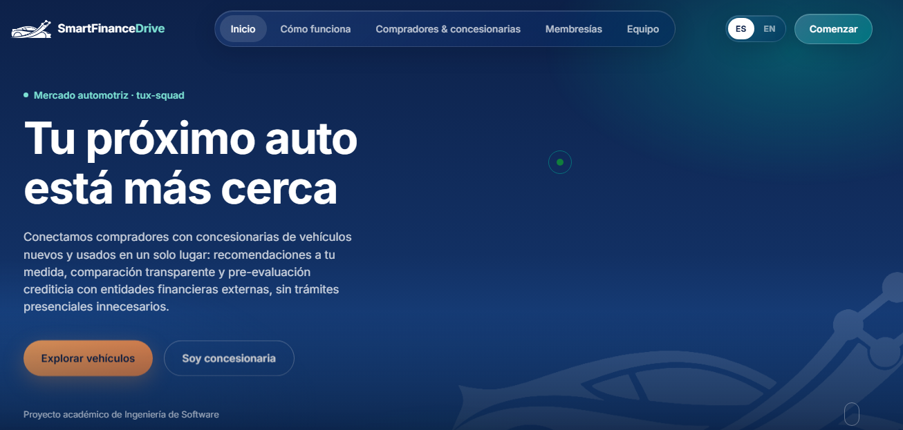

#### 2. Sección del Problema (Acordeón Interactivo)

Se implementó un componente de acordeón interactivo en JavaScript que desglosa las fricciones del proceso actual de búsqueda y comercialización de vehículos, permitiendo al usuario desplegar preguntas como **"Qué problema existe"** o **"Cuándo ocurre"**.

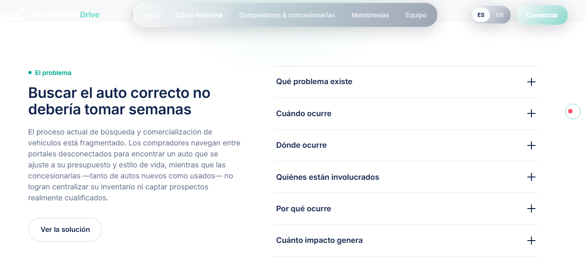

#### 3. Perfiles y Segmentos Objetivo

Se implementó un carrusel interactivo estructurado con botones de navegación que detalla los tres perfiles de la plataforma. En la imagen se aprecia la vista enfocada en la oferta B2B para **"Concesionarias de autos usados"**, detallando sus puntos de dolor y necesidades.

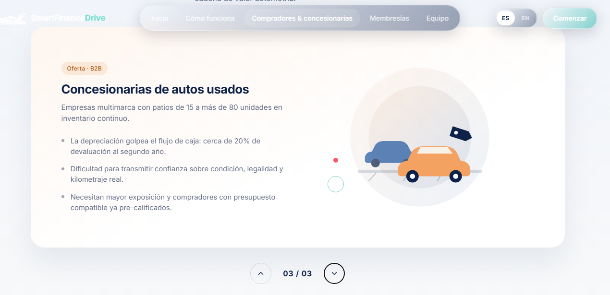

#### 4. Membresías B2B (Pricing)

Se desarrolló una grilla de planes estructurada con **CSS Grid** y metodología **BEM**. Esta sección muestra claramente el modelo de negocio para las concesionarias, resaltando visualmente en el centro la tarjeta del **"Panel de gestión B2B"**, aplicable a ambos planes de venta (**Nueva** y **Usada**).

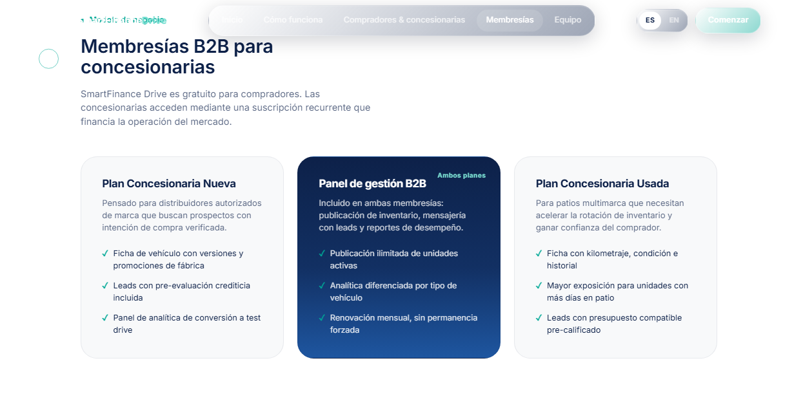

#### 5. Equipo (Team Slider)

Se presenta a los miembros del equipo *tux-squad*. Se implementó un slider horizontal arrastrable (*draggable*) con JavaScript que permite visualizar las fotografías, nombres, códigos universitarios y roles de los estudiantes de Ingeniería de Software involucrados en el desarrollo.

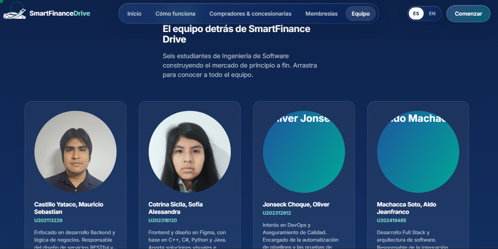

#### URL de Despliegue en Producción

La Landing Page se encuentra desplegada y disponible en producción mediante **Vercel**:

* **Enlace web activo:** [https://smartfinance-drive-landingpage.vercel.app/](https://smartfinance-drive-landingpage.vercel.app/)

### 5.2.3. Implemented Frontend-Web Application Evidence

> **Pendiente:** Evidencia del frontend desplegado de la aplicación web.

### 5.2.4. Acuerdo de Servicio - SaaS

Este acuerdo establece los términos de uso de la plataforma **SmartFinance Drive** para las concesionarias aliadas (**SaaS Agreement**).

* **Propiedad Intelectual:** tux-squad mantiene la propiedad intelectual de la plataforma, otorgando a las concesionarias una licencia de uso mediante suscripción mensual. Se garantiza el acceso al panel B2B, herramientas de simulación y gestión de leads, sin derecho a replicar o extraer el código fuente.
* **Compromiso de Disponibilidad (SLA):** Nos comprometemos a mantener el catálogo y los Web Services operativos un **99.9 % del tiempo**, asegurando que las integraciones con pasarelas (Stripe) y validaciones (SUNAT) funcionen ininterrumpidamente para no perder prospectos comerciales.
* **Seguridad y Resguardo de Datos:** Garantizamos la protección de las credenciales, historiales crediticios de los compradores y datos de inventario mediante protocolos JWT y encriptación.
* **Uso Aceptable:** SmartFinance Drive se reserva el derecho de dar de baja publicaciones de vehículos fraudulentos, con información engañosa o que incumplan las normativas de financiamiento vigentes.

### 5.2.5. Implemented Native-Mobile Application Evidence

Durante el Sprint 1, se desarrolló la primera versión funcional de la aplicación nativa **SmartFinance Drive** para Android, implementada en **Kotlin** con **Jetpack Compose** y una arquitectura modular orientada a separar responsabilidades por dominio y capa de presentación. La app incluye módulos de **IAM, catálogo, financiación, perfiles, configuración, mensajería y navegación principal**. Se incorporó consumo de APIs REST mediante **Retrofit** y **OkHttp**, además de manejo seguro de autenticación con almacenamiento local de tokens. La aplicación está orientada a usuarios compradores y concesionarias, permitiendo explorar vehículos, iniciar sesión, registrar cuentas, consultar detalles, realizar pre-evaluaciones crediticias y gestionar información de perfil.

* **Repositorio GitHub:** [https://github.com/tux-squad/smartfinance-drive-mobile-app](https://github.com/tux-squad/smartfinance-drive-mobile-app)
* **Stack tecnológico:** Kotlin, Jetpack Compose, Material 3, Retrofit, OkHttp, Gradle, Android Studio.
* **Módulos implementados:** IAM, Catalog, Financing, Profiles, Settings, Messaging, Shared, Core.
* **Evidencia de funcionalidades:**
    - Pantalla de Login y Registro de usuarios.
    - Catálogo de vehículos con vista de listado y filtros.
    - Detalle del vehículo con información relevante y acceso a simulación.
    - Pre-evaluación crediticia para clientes.
    - Perfil de usuario, configuración y navegación principal.
    - Módulo de mensajería y gestión de información de concesionarias.

La aplicación móvil fue desarrollada como una solución nativa para Android, priorizando una experiencia visual moderna y un flujo de navegación sencillo e intuitivo para el usuario final. La estructura del proyecto refleja una organización por dominios funcionales, lo que facilita la escalabilidad y la futura integración con nuevos servicios del ecosistema SmartFinance Drive.

#### Evidencia visual de la aplicación móvil


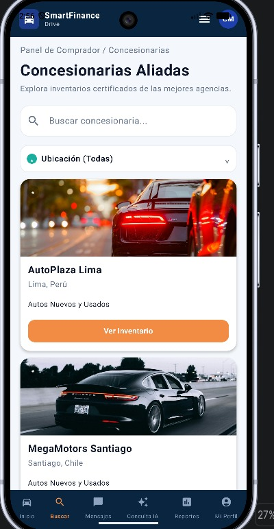
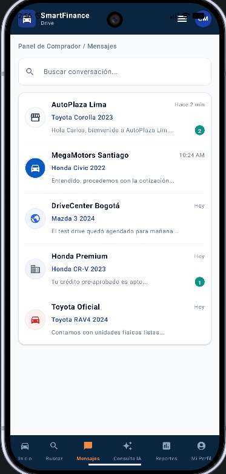


### 5.2.6. Implemented RESTful API and/or Serverless Backend Evidence

El backend de SmartFinance Drive está desarrollado utilizando el framework Spring Boot (Java), estructurado bajo un diseño de Bounded Contexts (IAM, Catalog, Partners, Financing, Billing) y desplegado de manera continua en la plataforma de alojamiento en la nube Render.

* **Persistencia y Migraciones:** Se utiliza PostgreSQL como base de datos relacional para garantizar la consistencia transaccional de los usuarios, el inventario de vehículos y el registro de simulaciones crediticias. El control de versiones y la evolución del esquema de la base de datos se gestionan de forma automatizada mediante scripts de Flyway.
* **Seguridad:** Implementación de Spring Security respaldado por un esquema de tokens JWT (JSON Web Tokens) Bearer. Esto permite la autenticación sin estado (stateless) y una autorización granular basada en los roles del ecosistema (Comprador, Concesionaria, Entidad Financiera y Administrador).
* **Integraciones y Lógica de Negocio:** El servidor cuenta con un motor de búsqueda difusa híbrida (Levenshtein + Trigram) para el catálogo, y se conecta síncronamente con servicios de terceros como la SUNAT para la validación de RUCs (con estrategias de *caching* y *rate limiting*) y Stripe Checkout para la facturación recurrente B2B.
* **Enlace base de la API en Producción:** [https://smartfinance-drive-platform.onrender.com](https://smartfinance-drive-platform.onrender.com)

### 5.2.7. RESTful API documentation

Aquí se presenta el backend del proyecto completamente desplegado y documentado siguiendo el estándar de especificación OpenAPI (v3) a través de la interfaz gráfica de Swagger UI. Esta herramienta permite visualizar, comprender y probar de forma interactiva todos los endpoints de la API RESTful directamente desde el navegador web.

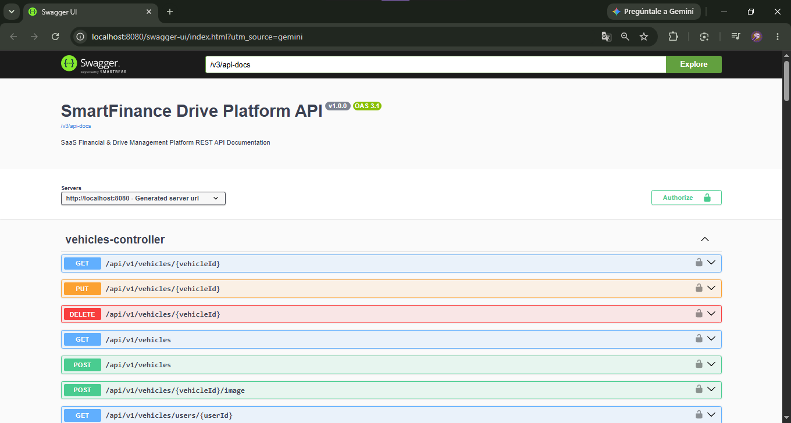

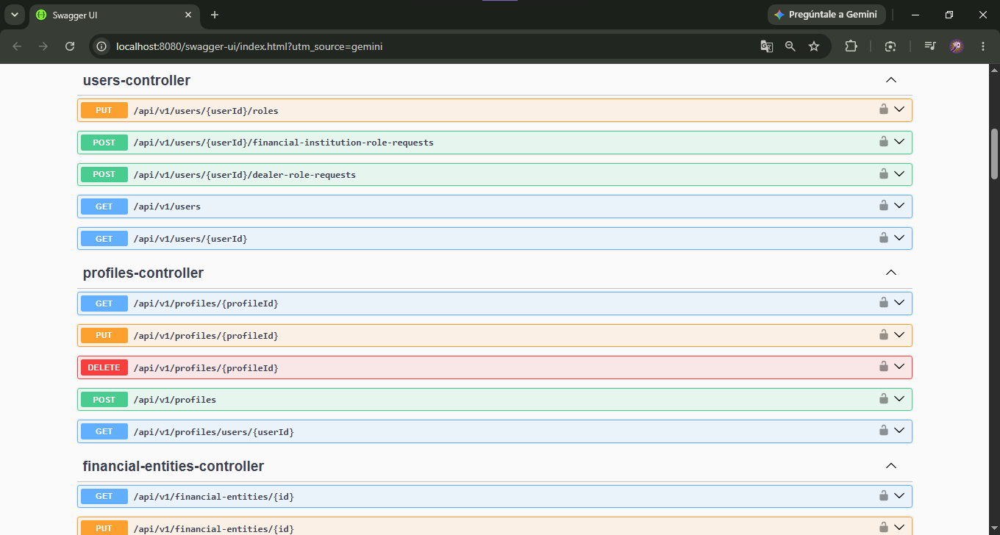

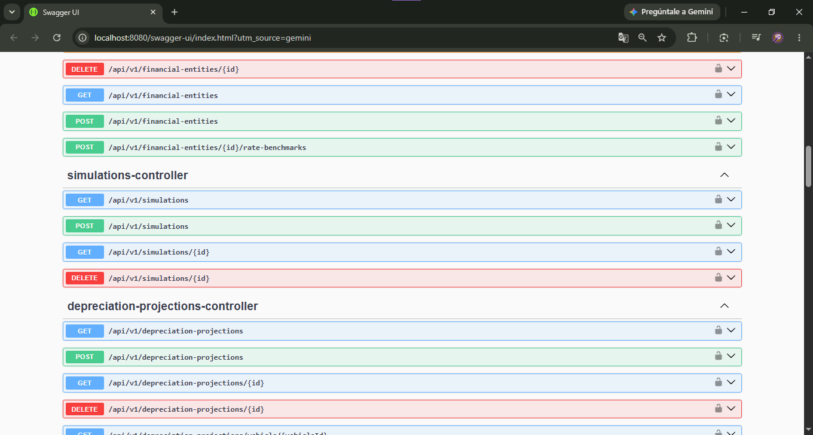

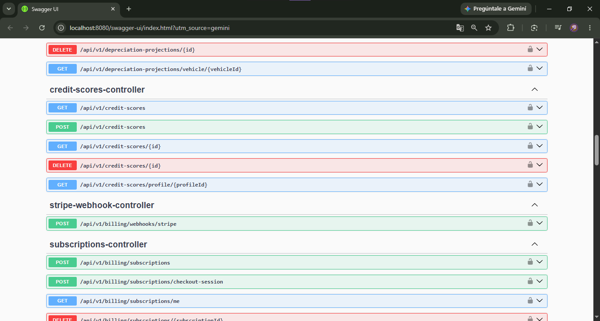

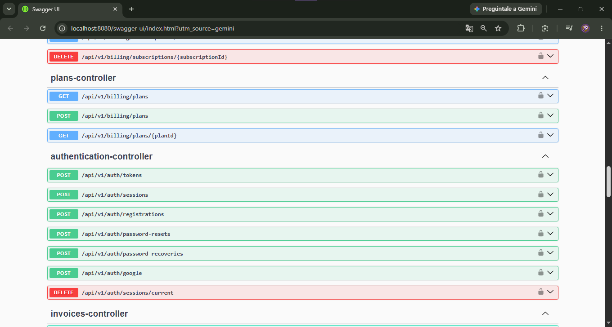

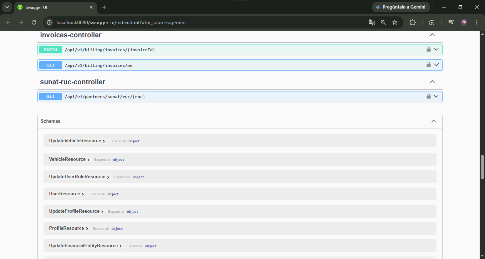

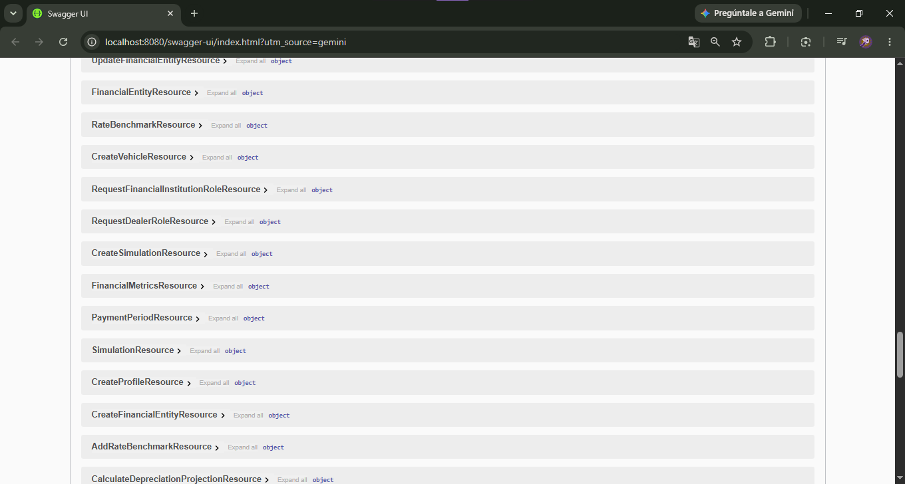

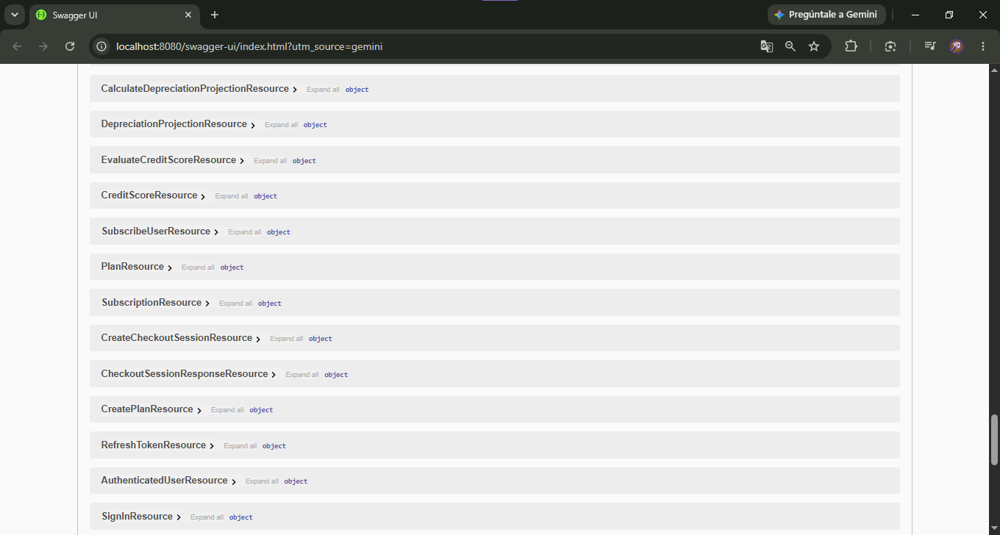

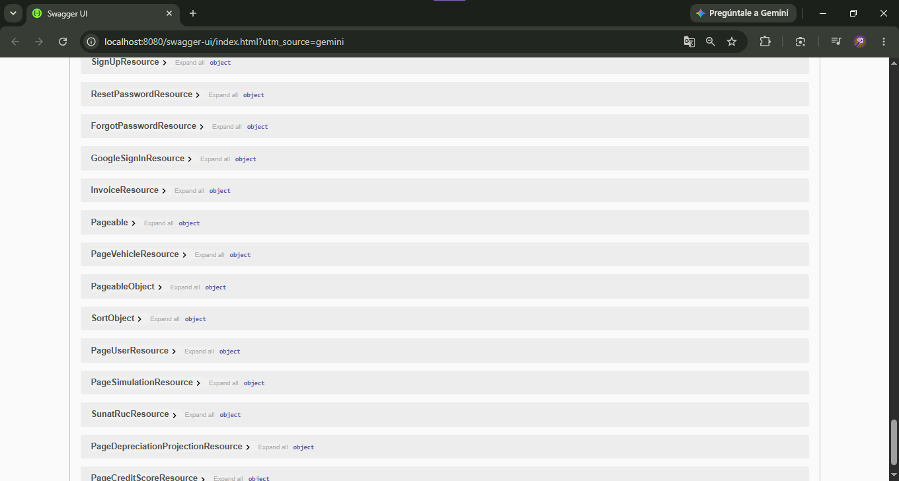

### 5.2.8. Team Collaboration Insights

* **Landing Page**

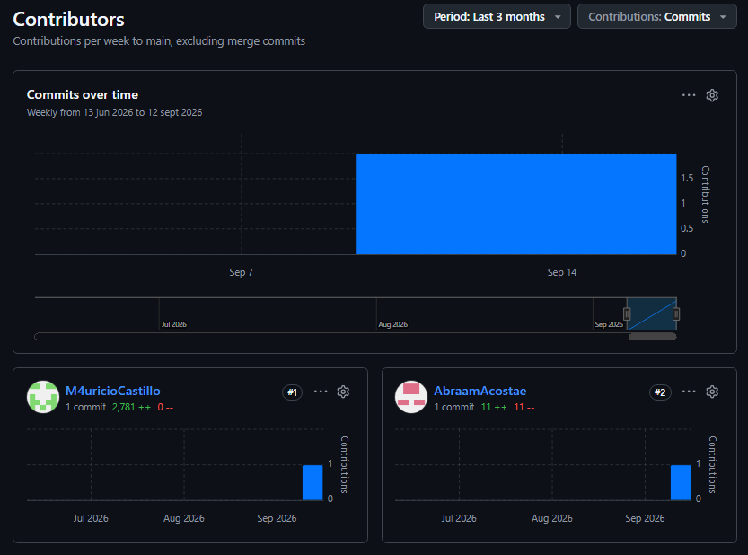

* **Backend**

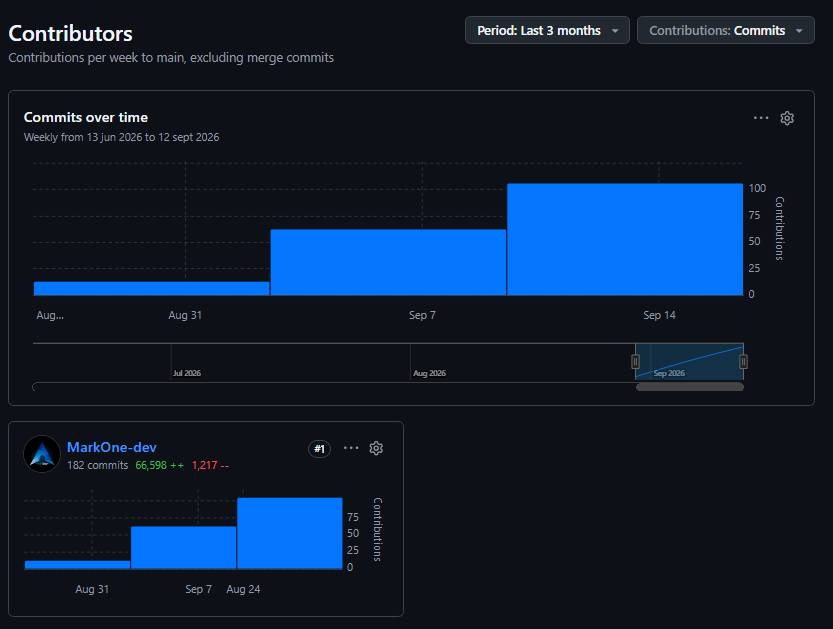

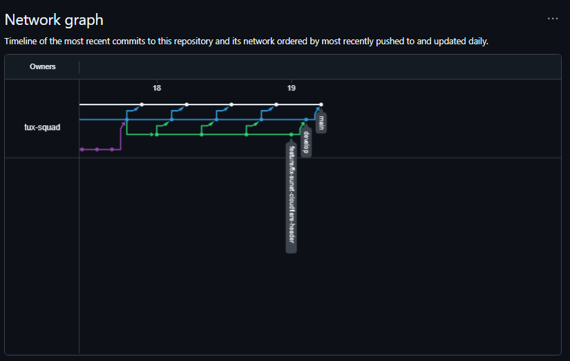

* **Frontend**

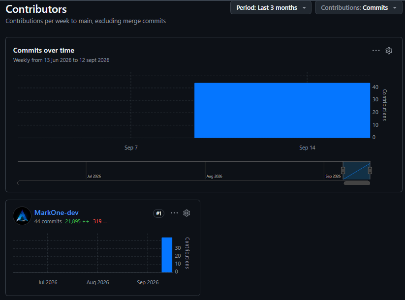

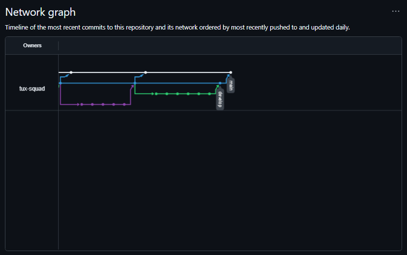

## 5.3. Video About-the-Product
Enlace y presentación del video demostrativo del producto.
